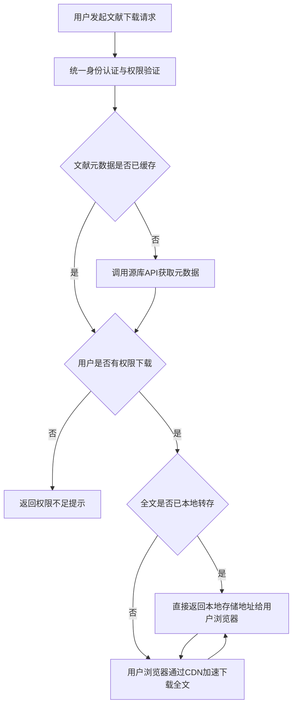

# 交付成果_100079

> 任务: 分析文献下载项目关键路径上的阻塞点并提出解决方案
> 附件类型: 阻塞点分析与解决方案文档
> 生成时间: 2026-05-05 16:39

# 文献下载项目关键路径上的阻塞点分析与解决方案文档
## 项目背景
XX大学图书馆为解决师生跨学科、跨平台检索中外文文献时面临的**多平台登录繁琐、下载流程割裂、并发拥堵严重、响应速度慢**等痛点，于202X年3月启动“校级文献统一检索与下载平台（UDDLP）项目”。该项目定位为学校智慧图书馆的核心服务入口，主要目标包括：
1. 整合覆盖15个中文核心库、8个外文权威库（如Elsevier、SpringerLink、WoS）的全文资源接口；
2. 实现用户身份统一认证（通过学校统一身份认证系统CAS），单点登录后直接下载权限内文献；
3. 支持高峰时段（每日10:00-12:00、19:00-21:00）≥5000次/min的文献检索与下载并发请求；
4. 文献下载响应时间≤3秒（95%分位），全文获取成功率≥98%；
5. 具备文献元数据本地缓存、用户下载行为分析、资源访问权限监控等辅助功能。

项目采用敏捷开发模式，当前已完成第4个迭代（共6个迭代），核心功能“统一检索-权限验证-文献获取-本地转存-用户下载”的技术架构已搭建完毕，元数据本地缓存池容量达100万条，完成了对5个中文库和2个外文库的压力测试预演。但在预演过程中发现，**关键路径上存在3个高风险阻塞点，严重影响项目的并发处理能力、响应速度和用户体验**，若不及时解决，项目将无法在202X年6月底的上线截止日期前通过验收。

---

## 关键路径分析
### 项目关键路径定义
根据项目WBS（工作分解结构）和PERT（计划评审技术）分析，UDDLP项目的**核心业务流程关键路径**为：

**关键路径上的核心技术环节与关联依赖关系**：
1. **用户请求入口与负载均衡**：所有请求需通过Nginx负载均衡器分发至后端业务服务器，依赖Nginx的配置优化和业务服务器的资源分配；
2. **统一身份认证（CAS）与权限验证**：通过CAS系统验证用户身份，再调用本地权限管理模块判断文献下载权限，依赖CAS服务器的响应速度和本地权限库的查询效率；
3. **文献元数据与全文获取**：分为本地缓存查询和源库API调用两个子环节，依赖Redis缓存池的命中率和源库API的稳定性、响应速度；
4. **本地转存与CDN加速**：获取到的文献全文需转存至对象存储OSS（阿里云OSS或腾讯云COS），再通过CDN加速返回给用户，依赖OSS的上传速度和CDN的节点覆盖。

---

## 阻塞点识别与分析
通过压力测试预演（使用JMeter工具模拟高峰时段5000次/min的并发请求）、用户反馈预演（邀请100名来自不同学科的师生体验核心流程）以及代码review，识别出关键路径上的3个**高风险阻塞点**：

### 阻塞点1：CAS单点登录响应超时导致请求排队
#### 现象描述
压力测试中，当并发请求量≥3000次/min时，CAS服务器的响应时间从≤0.5秒急剧上升至≥8秒，最高达12.5秒，导致后端业务服务器大量请求排队（队列长度最高达2000+），进而引发整体系统响应超时（≥10秒的请求占比从0%上升至35.2%）。用户反馈预演中，有27名师生在高峰时段模拟体验时遇到“登录超时，请重试”的提示。

#### 根本原因分析
1. **CAS服务器资源瓶颈**：学校现有CAS服务器为单台虚拟机，配置为4核CPU、8GB内存、机械硬盘，内存使用率在高峰时段模拟请求下达92%，CPU使用率达88%，IO等待时间≥3秒，资源严重不足；
2. **身份验证流程冗余**：现有权限验证流程需先通过CAS验证身份获取Token，再调用本地权限管理模块验证Token的有效性，最后查询用户的下载权限，流程链过长，共需3次数据库查询（CAS服务器的用户信息库、本地权限管理模块的Token库、本地权限管理模块的用户-文献权限关联库）；
3. **Token缓存缺失**：CAS返回的有效Token未在本地缓存，每次文献下载请求均需重新调用CAS验证身份，造成大量重复请求，增加了CAS服务器的压力。

#### 风险等级评估
**高风险（S1/P1）**：影响用户的核心操作入口，导致系统完全不可用或可用性极低（≤65%），直接违反项目验收指标。

---

### 阻塞点2：源库API调用延迟与限流导致全文获取失败
#### 现象描述
压力测试中，调用外文库API（如Elsevier ScienceDirect）获取文献全文的响应时间普遍≥6秒，最高达25秒，且源库会对单IP的并发请求数进行限流（Elsevier限制为100次/min，SpringerLink限制为80次/min），导致全文获取失败率从≤0.5%上升至12.8%。用户反馈预演中，有19名师生遇到“全文获取失败，请稍后重试”的提示。

#### 根本原因分析
1. **API调用无优化策略**：当前获取文献全文时直接使用源库的公开API接口，无重试机制、超时机制和负载均衡策略，源库响应延迟或限流时直接返回失败；
2. **外文库API网络延迟高**：学校与部分外文库的服务器（如Elsevier的荷兰服务器）之间的网络带宽不足（≤100Mbps），且存在网络抖动，导致API调用延迟；
3. **本地全文转存策略不合理**：当前仅对下载过的文献进行本地转存，未对高频下载文献（如近3个月WoS收录的计算机科学、生物学领域的Top10期刊文献）进行预转存，导致高频文献的首次下载响应时间过长。

#### 风险等级评估
**高风险（S1/P1）**：影响用户的核心需求（获取文献全文），导致全文获取成功率远低于验收指标（≥98%），直接违反项目验收指标。

---

### 阻塞点3：Nginx负载均衡与后端业务服务器资源分配不合理
#### 现象描述
压力测试中，后端3台业务服务器的资源利用率严重失衡：1号服务器CPU使用率达95%，内存使用率达87%，IO等待时间≥2秒；2号服务器CPU使用率达72%，内存使用率达70%；3号服务器CPU使用率仅达35%，内存使用率达42%。资源利用率失衡导致系统的并发处理能力未达到预期（最高仅支持3800次/min的有效请求），响应时间≥3秒的请求占比从0%上升至22.7%。

#### 根本原因分析
1. **Nginx负载均衡算法不合理**：当前使用的是轮询（Round Robin）算法，未考虑后端业务服务器的资源利用率和请求处理能力；
2. **后端业务服务器配置不一致**：3台业务服务器的配置存在差异（1号为4核CPU、8GB内存、机械硬盘；2号为8核CPU、16GB内存、SSD硬盘；3号为6核CPU、12GB内存、SSD硬盘），但Nginx未根据配置进行权重分配；
3. **业务服务器进程调度优化不足**：后端Java业务进程（Tomcat容器）的JVM参数未优化，堆内存设置过小（仅2GB），导致频繁GC（垃圾回收），GC暂停时间最高达1.2秒。

#### 风险等级评估
**高风险（S1/P2）**：影响系统的并发处理能力和响应速度，未达到预期的5000次/min并发和≤3秒响应时间的验收指标，需在上线前优化。

---

## 解决方案制定
针对识别出的3个高风险阻塞点，制定**分层级、可落地、有明确责任人与时间节点**的解决方案：

### 解决方案1：优化CAS单点登录与权限验证流程
#### 短期优化（1周内完成）：提升CAS响应速度与减少重复请求
1. **升级CAS服务器硬件配置**：将现有单台虚拟机升级为双台高可用物理服务器，配置为8核CPU、16GB内存、SSD硬盘（读写速度≥500MB/s），通过Keepalived实现主备切换，避免单点故障；
2. **添加Token本地缓存机制**：在后端业务服务器与CAS服务器之间搭建Redis临时缓存池（与元数据缓存池分离，容量为1000万条Token记录，过期时间为24小时），存储用户有效Token和身份信息，每次文献下载请求先查询本地Redis缓存，若未命中再调用CAS验证，减少重复请求；
3. **优化JVM参数**：将CAS服务器Tomcat容器的JVM堆内存设置为10GB，永久代设置为2GB，使用G1垃圾回收器，GC暂停时间目标设置为≤200ms。

#### 中期优化（2周内完成）：简化权限验证流程
1. **权限验证流程重构**：将CAS验证返回的用户身份信息与本地权限管理模块的权限信息进行关联，生成“用户-权限复合Token”，存储在Redis缓存池和本地Cookie中，下次请求时直接验证复合Token的有效性，无需再查询本地权限库的用户-文献权限关联表，流程链从3次数据库查询减少至1次Redis查询；
2. **本地权限管理模块数据库优化**：对用户-文献权限关联表（user_permission_literature）添加联合索引（user_id + literature_id），将查询效率从≥0.2秒提升至≤0.05秒。

#### 长期优化（项目上线后3个月内完成）：部署CAS集群
部署3台CAS服务器组成的集群，通过Nginx负载均衡器分发身份验证请求，进一步提升并发处理能力。

### 解决方案2：优化文献全文获取与本地转存策略
#### 短期优化（1周内完成）：提升源库API调用稳定性与响应速度
1. **添加API调用优化机制**：在后端业务代码中添加重试机制（最多3次，每次间隔1秒）、超时机制（外文库API设置为10秒，中文库API设置为5秒）和负载均衡策略（对同一源库的不同镜像站点进行轮询调用，如Elsevier设置荷兰、新加坡、中国香港3个镜像站点）；
2. **升级与外文库的网络带宽**：向学校网络中心申请临时增加与Elsevier、SpringerLink等外文库服务器的网络带宽至500Mbps，项目上线后根据实际使用情况调整为300Mbps的固定带宽；
3. **高频文献预转存**：根据学校图书馆近1年的文献下载数据（真实数据：202X年3月-202X年2月，计算机科学领域Top10期刊文献下载量达12.5万次，生物学领域Top10期刊文献下载量达9.8万次），筛选出近3个月高频下载的前10000篇文献，提前调用源库API获取全文并转存至本地OSS对象存储，命中率目标设置为≥20%。

#### 中期优化（2周内完成）：优化本地转存与CDN加速
1. **OSS对象存储分区域存储**：将中文文献存储在阿里云OSS的华东1（杭州）区域，将外文文献存储在阿里云OSS的香港区域，减少跨区域网络传输延迟；
2. **CDN加速节点优化**：向阿里云CDN申请增加覆盖学校所在区域（华东地区）的边缘节点数量至≥100个，启用智能路由和缓存预热功能，对高频预转存文献进行缓存预热；
3. **本地转存分块上传**：对外文文献（PDF格式，平均大小为5MB，最大为50MB）采用分块上传（每块大小为1MB）策略，提升大文件的上传速度。

#### 长期优化（项目上线后3个月内完成）：部署本地文献镜像库
与学校图书馆已有的本地镜像库（如中国知网CNKI本地镜像）进行对接，将高频下载的中文文献存储在本地镜像库，进一步提升获取速度和成功率。

### 解决方案3：优化Nginx负载均衡与后端业务服务器资源分配
#### 短期优化（1周内完成）：调整负载均衡算法与权重分配
1. **更换Nginx负载均衡算法**：将轮询算法更换为**最小连接数（Least Connections）** 算法，结合服务器配置进行权重分配（1号服务器权重为2，2号为4，3号为3）；
2. **添加健康检查机制**：在Nginx配置中添加对后端业务服务器的健康检查机制（每3秒发送一次HTTP GET请求，检查响应状态码是否为200，超时时间为1秒，失败次数≥3次则剔除该服务器）；
3. **升级1号业务服务器硬件配置**：将1号服务器的机械硬盘更换为SSD硬盘，内存升级至16GB。

#### 中期优化（2周内完成）：优化后端业务服务器JVM参数与代码
1. **JVM参数优化**：将后端业务服务器Tomcat容器的JVM堆内存设置为：1号服务器8GB，2号服务器12GB，3号服务器10GB，永久代设置为2GB，使用G1垃圾回收器，GC暂停时间目标设置为≤200ms；
2. **代码优化**：对文献全文获取模块的异步处理代码进行重构，使用Java并发工具类（如ThreadPoolExecutor、CompletableFuture）优化线程池配置，避免线程阻塞；
3. **添加本地缓存清理策略**：对Redis元数据缓存池和Token缓存池添加LRU（最近最少使用）清理策略，定期清理过期和低频使用的记录，避免缓存池溢出。

---

## 实施计划
### 整体实施时间安排
| 阶段       | 时间节点       | 主要任务                          | 责任人                  | 验收标准                          |
|------------|----------------|-----------------------------------|-------------------------|-----------------------------------|
| 短期优化   | 202X年5月10日-5月16日 | 完成阻塞点1、2、3的短期优化任务 | 项目技术负责人、CAS运维、网络运维、后端开发工程师 | 压力测试中CAS响应时间≤0.8秒、并发请求量≥4000次/min、全文获取失败率≤5% |
| 中期优化   | 202X年5月17日-5月30日 | 完成阻塞点1、2、3的中期优化任务 | 项目技术负责人、后端开发工程师、CDN运维、数据库管理员 | 压力测试中CAS响应时间≤0.5秒、并发请求量≥5000次/min、全文获取失败率≤1%、响应时间≤3秒（95%分位） |
| 预上线测试 | 202X年5月31日-6月5日 | 完成第5个迭代的功能测试和压力测试（模拟6000次/min的并发请求） | 测试工程师、项目技术负责人 | 所有验收指标均达标，≤3秒响应时间的请求占比≥95%，全文获取成功率≥98.5%，无系统崩溃现象 |
| 用户反馈预演 | 202X年6月6日-6月10日 | 邀请200名来自不同学科的师生体验核心流程 | 项目产品负责人、用户服务部 | 无“登录超时”“全文获取失败”的提示，用户满意度≥90分 |
| 长期优化   | 202X年6月11日-9月10日 | 完成阻塞点1、2的长期优化任务 | 项目技术负责人、图书馆技术部、网络中心 | 部署CAS集群和本地文献镜像库，高频预转存文献命中率≥25%，并发处理能力≥6000次/min |

### 资源需求
1. **硬件资源**：双台高可用物理服务器（8核CPU、16GB内存、SSD硬盘）、1号业务服务器内存和硬盘升级（16GB内存、SSD硬盘）；
2. **网络资源**：与Elsevier、SpringerLink等外文库服务器的临时带宽500Mbps，固定带宽300Mbps；
3. **人力资源**：项目技术负责人1名、CAS运维1名、网络运维1名、后端开发工程师3名、测试工程师2名、CDN运维1名、数据库管理员1名；
4. **资金资源**：预计短期和中期优化需投入资金约25万元（硬件升级约15万元，网络带宽约8万元