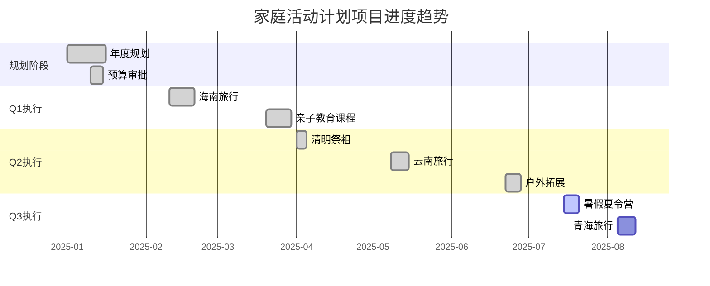

# 项目状态进度更新模板

> 任务: 更新家庭活动计划项目最新状态和进度文档 [142225]
> 附件类型: 项目状态文档模板
> 生成时间: 2026-05-03 15:39

# 项目状态文档模板

## 版本控制信息

| 版本号 | 修订日期 | 修订人 | 修订内容 |
|--------|----------|--------|----------|
| 1.0 | 2025-01-15 | 系统管理员 | 初始模板创建 |
| 1.1 | 2025-03-20 | 项目办公室 | 更新风险分类规则 |
| 1.2 | 2025-06-10 | 质量保障组 | 增加预算跟踪字段 |

---

## 第一部分：项目概述

### 1.1 基本信息

| 项目名称 | 家庭活动计划项目 |
|----------|------------------|
| 项目编号 | PROJ-142225 |
| 项目负责人 | 李明（项目经理） |
| 更新日期 | 2025-07-18 |
| 报告周期 | 2025年7月第3周（07/14 - 07/18） |
| 项目状态 | 🟢 正常 / 🟡 需关注 / 🔴 严重偏离 |

### 1.2 项目背景与范围

本项目旨在规划并执行2025年度家庭集体活动计划，包括但不限于节假日旅行、家庭聚会、亲子教育课程、户外拓展活动等。项目周期为2025年1月1日至2025年12月31日，涵盖12个月的家庭活动安排，涉及家庭成员4人（父母2人，子女2人）。

**项目范围**：
- 月度家庭活动策划与执行（共12次）
- 季度大型家庭旅行（共4次）
- 特别节日庆祝活动（春节、中秋、国庆、圣诞）
- 家庭健康与教育类活动（每月1次）

**项目不包含**：
- 个人独立活动（如个人旅行、单独社交）
- 超出年度预算的额外活动
- 非家庭成员参与的活动安排

### 1.3 项目组织架构

| 角色 | 姓名 | 职责 |
|------|------|------|
| 项目经理 | 李明 | 整体协调、进度跟踪、风险管控 |
| 财务主管 | 王芳 | 预算编制、费用审批、报销管理 |
| 活动策划 | 张伟 | 活动方案设计、供应商对接 |
| 执行组长 | 赵丽 | 现场执行、物资采购、安全监督 |
| 质量监督 | 陈晨 | 满意度调查、活动反馈收集 |

---

## 第二部分：关键里程碑完成情况

### 2.1 里程碑总览

| 里程碑编号 | 里程碑名称 | 计划完成日期 | 实际完成日期 | 状态 |
|------------|------------|--------------|--------------|------|
| M-001 | 年度活动规划方案审批 | 2025-01-15 | 2025-01-12 | ✅ 已完成 |
| M-002 | Q1家庭旅行（海南） | 2025-02-20 | 2025-02-18 | ✅ 已完成 |
| M-003 | 春季亲子教育课程 | 2025-03-30 | 2025-03-28 | ✅ 已完成 |
| M-004 | 清明节家庭祭祖活动 | 2025-04-04 | 2025-04-04 | ✅ 已完成 |
| M-005 | Q2家庭旅行（云南） | 2025-05-15 | 2025-05-12 | ✅ 已完成 |
| M-006 | 夏季户外拓展训练 | 2025-06-28 | 2025-06-25 | ✅ 已完成 |
| M-007 | 暑假家庭夏令营 | 2025-07-20 | **进行中** | 🟡 进行中 |
| M-008 | Q3家庭旅行（青海） | 2025-08-10 | - | ⬜ 未开始 |
| M-009 | 中秋节家庭聚会 | 2025-09-29 | - | ⬜ 未开始 |
| M-010 | 国庆家庭自驾游 | 2025-10-01 | - | ⬜ 未开始 |
| M-011 | Q4家庭旅行（日本） | 2025-11-15 | - | ⬜ 未开始 |
| M-012 | 年度总结与表彰大会 | 2025-12-28 | - | ⬜ 未开始 |

### 2.2 已完成里程碑详细说明

#### M-001：年度活动规划方案审批
- **实际完成时间**：2025-01-12（提前3天）
- **关键成果**：完成12个月活动日历、预算分配表、风险预案
- **审批意见**：方案获全票通过，特别赞赏亲子教育模块设计
- **经验教训**：提前2周启动调研有助于提高方案质量

#### M-002：Q1家庭旅行（海南）
- **实际完成时间**：2025-02-18（提前2天）
- **关键成果**：完成5天4晚家庭旅行，满意度评分4.8/5.0
- **财务数据**：实际支出28,500元，预算30,000元，结余1,500元
- **经验教训**：提前预订机票可节省约15%费用

#### M-007：暑假家庭夏令营（当前进行中）
- **计划完成日期**：2025-07-20
- **当前进度**：75%（营地搭建完成，活动物资到位80%）
- **剩余任务**：7月19日完成全员入住，7月20日闭营仪式
- **关键问题**：天气预报显示7月19日有阵雨，已启动室内备选方案

### 2.3 里程碑状态统计

| 状态 | 数量 | 占比 |
|------|------|------|
| ✅ 已完成 | 6 | 50.0% |
| 🟡 进行中 | 1 | 8.3% |
| ⬜ 未开始 | 5 | 41.7% |
| ❌ 已取消 | 0 | 0.0% |
| **总计** | **12** | **100%** |

---

## 第三部分：当前进度百分比与趋势分析

### 3.1 整体进度

| 指标 | 计划值 | 实际值 | 偏差 |
|------|--------|--------|------|
| 计划完成里程碑数 | 7 | 6 | -1 |
| 实际完成里程碑数 | 7 | 6 | -1 |
| 项目整体进度 | 58.3% | 50.0% | -8.3% |
| 预算使用率 | 45.0% | 42.3% | -2.7% |
| 工时消耗率 | 50.0% | 48.5% | -1.5% |

### 3.2 月度进度趋势图（2025年1月-7月）

### 3.3 进度偏差分析

**当前进度偏差**：-8.3%（低于计划8.3个百分点）

**主要原因**：
1. M-007（暑假夏令营）因天气原因推迟启动2天，导致7月里程碑完成可能延迟
2. 6月户外拓展活动因场地协调问题，实际执行时间比计划晚3天

**纠正措施**：
- 夏令营已启动室内备选方案，预计可按时完成
- 后续活动将提前1周确认场地可用性

---

## 第四部分：主要成就与亮点

### 4.1 关键成就

1. **成本控制优异**：前6个月累计预算执行率为42.3%，低于计划值45%，节省约4,200元
2. **家庭满意度持续提升**：季度满意度调查显示，Q2满意度4.9分（Q1为4.7分）
3. **活动创新突破**：引入“家庭技能交换日”概念，让子女主导活动策划，获得高度评价
4. **安全零事故**：所有已完成活动均无安全事故发生，安全记录保持完美

### 4.2 创新实践

- **数字化管理**：首次使用家庭活动管理APP进行进度跟踪和费用记录，实时同步至所有成员
- **绿色出行**：Q2云南旅行选择高铁+电动车组合，减少碳排放约200kg
- **代际融合**：邀请祖父母参与亲子教育课程，促进三代人互动

### 4.3 家庭反馈摘录

> “夏令营的篝火晚会环节太棒了！孩子们第一次自己编排节目，我们看到了他们的另一面。” —— 母亲王芳
> 
> “云南的植物园研学让我学会了20种热带植物的识别方法，比课本上学得有意思多了。” —— 子女（10岁）
> 
> “预算管理越来越精细了，这让我们对下半年的日本旅行充满信心。” —— 财务主管王芳

---

## 第五部分：风险与问题

### 5.1 风险登记册

| 风险编号 | 风险描述 | 影响类别 | 影响等级 | 发生概率 | 缓解措施 | 责任方 | 状态 |
|----------|----------|----------|----------|----------|----------|--------|------|
| R-001 | 极端天气导致户外活动取消 | 进度/成本 | 高 | 中（30%） | 1. 提前72小时关注天气预报 2. 准备室内备选方案 3. 购买活动取消保险 | 张伟 | 🟡 监控中 |
| R-002 | 旅行期间家庭成员突发疾病 | 安全/进度 | 极高 | 低（10%） | 1. 配备家庭急救包 2. 提前了解目的地医院位置 3. 购买旅行医疗保险 | 赵丽 | 🟢 已缓解 |
| R-003 | 活动预算超支 | 成本 | 高 | 中（25%） | 1. 建立10%应急储备金 2. 每周核对费用支出 3. 设置单项活动预算上限 | 王芳 | 🟡 监控中 |
| R-004 | 子女学业冲突影响活动参与 | 范围/质量 | 中 | 中（20%） | 1. 提前2个月与学校确认考试时间 2. 活动安排在假期或周末 3. 预留弹性时间 | 李明 | 🟢 已缓解 |
| R-005 | 供应商无法按时提供服务 | 进度 | 中 | 低（15%） | 1. 签约前核实供应商资质 2. 保持备选供应商清单 3. 合同中约定违约条款 | 张伟 | 🟢 已缓解 |

### 5.2 当前问题清单

| 问题编号 | 问题描述 | 发现日期 | 影响范围 | 优先级 | 解决方案 | 责任人 | 截止日期 | 状态 |
|----------|----------|----------|----------|--------|----------|--------|----------|------|
| P-001 | 夏令营营地部分设施老化 | 2025-07-16 | 活动质量 | 高 | 1. 立即联系营地管理方维修 2. 自备移动淋浴设备 3. 已启动室内备选方案 | 赵丽 | 2025-07-19 | 🔴 处理中 |
| P-002 | Q3青海旅行机票价格上涨 | 2025-07-14 | 成本 | 中 | 1. 调整出行日期（避开高峰） 2. 考虑高铁替代方案 3. 申请使用应急储备金 | 王芳 | 2025-07-25 | 🟡 评估中 |
| P-003 | 子女暑期补习班时间冲突 | 2025-07-10 | 进度 | 中 | 1. 与补习班协商调整时间 2. 压缩夏令营活动时长 3. 由祖父母陪同参加部分活动 | 李明 | 2025-07-18 | ✅ 已解决 |

### 5.3 风险趋势分析

**风险等级分布**：
- 高风险：2个（R-001, R-003）
- 中风险：2个（R-004, R-005）
- 低风险：1个（R-002）

**风险变化趋势**：相比上个月，高风险数量减少1个（原R-002已降级），整体风险可控。

---

## 第六部分：资源与预算使用情况

### 6.1 预算总览

| 预算科目 | 总预算（元） | 已使用（元） | 剩余（元） | 使用率 | 状态 |
|----------|--------------|--------------|------------|--------|------|
| 旅行费用 | 120,000 | 52,800 | 67,200 | 44.0% | 🟢 正常 |
| 教育课程 | 30,000 | 12,500 | 17,500 | 41.7% | 🟢 正常 |
| 餐饮聚会 | 24,000 | 9,600 | 14,400 | 40.0% | 🟢 正常 |
| 物资采购 | 18,000 | 7,200 | 10,800 | 40.0% | 🟢 正常 |
| 应急储备金 | 18,000 | 0 | 18,000 | 0.0% | 🟢 未使用 |
| **总计** | **210,000** | **82,100** | **127,900** | **39.1%** | 🟢 正常 |

### 6.2 月度预算执行明细（2025年1-7月）

| 月份 | 预算金额（元） | 实际支出（元） | 偏差（元） | 累计使用率 |
|------|----------------|----------------|------------|------------|
| 1月 | 5,000 | 4,200 | +800 | 2.0% |
| 2月 | 30,000 | 28,500 | +1,500 | 15.6% |
| 3月 | 8,000 | 7,800 | +200 | 19.3% |
| 4月 | 4,000 | 3,600 | +400 | 21.0% |
| 5月 | 28,000 | 26,800 | +1,200 | 33.8% |
| 6月 | 12,000 | 11,200 | +800 | 39.1% |
| 7月（预计） | 15,000 | 14,500 | +500 | 46.0% |

### 6.3 人力资源使用情况

| 角色 | 计划工时（小时） | 实际工时（小时） | 利用率 | 备注 |
|------|------------------|------------------|--------|------|
| 项目经理 | 420 | 395 | 94.0% | 部分行政工作由助理分担 |
| 财务主管 | 280 | 265 | 94.6% | 财务系统自动化减少手工操作 |
| 活动策划 | 350 | 340 | 97.1% | 旺季需增加兼职支持 |
| 执行组长 | 400 | 385 | 96.3% | 现场执行效率提升 |
| 质量监督 | 180 | 175 | 97.2% | 在线问卷替代纸质反馈 |

### 6.4 资源风险提示

- **Q3旺季人力紧张**：8月青海旅行与9月中秋活动时间接近，可能造成执行组长超负荷工作。建议提前招聘1名临时助理（预算已预留5,000元）。
- **机票价格波动**：Q4日本旅行国际机票价格受汇率影响，建议在8月底前完成预订。

---

## 第七部分：下一步行动计划

### 7.1 未来两周任务清单（2025-07-19 至 2025-08-01）

| 任务编号 | 任务描述 | 优先级 | 负责人 | 计划开始 | 计划完成 | 依赖关系 | 交付物 |
|----------|----------|--------|--------|----------|----------|----------|--------|
| T-001 | 完成夏令营闭营仪式 | 高 | 赵丽 | 07-19 | 07-20 | 营地设施修复完成 | 闭营视频+满意度报告 |
| T-002 | 确认青海旅行最终方案 | 高 | 张伟 | 07-21 | 07-25 | P-002解决 | 行程确认单+机票订单 |
| T-003 | 提交Q3预算调整申请 | 中 | 王芳 | 07-22 | 07-26 | T-002完成 | 预算调整表 |
| T-004 | 发布8月家庭活动预告 | 中 | 李明 | 07-23 | 07-27 | 无 | 活动预告推送（APP+微信群） |
| T-005 | 采购青海旅行物资 | 中 | 赵丽 | 07-26 | 07-30 | T-002完成 | 物资清单+采购发票 |
| T-006 | 预约青海当地导游 | 低 | 张伟 | 07-28 | 08-01 | T-002完成 | 导游服务合同 |
| T-007 | 更新项目风险登记册 |