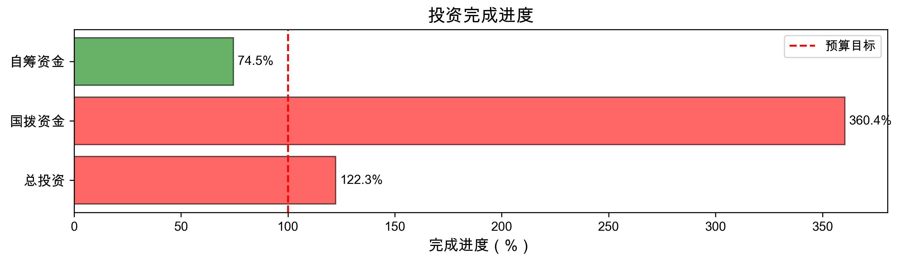
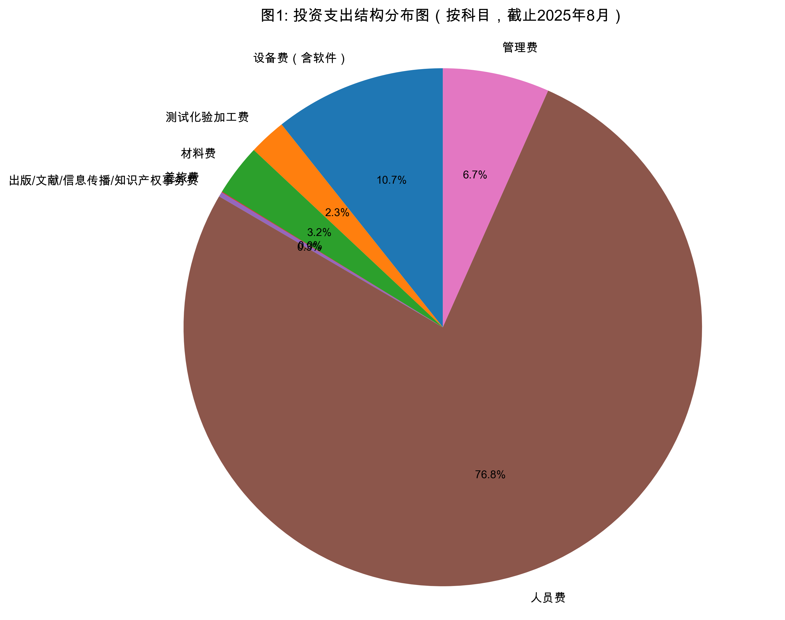
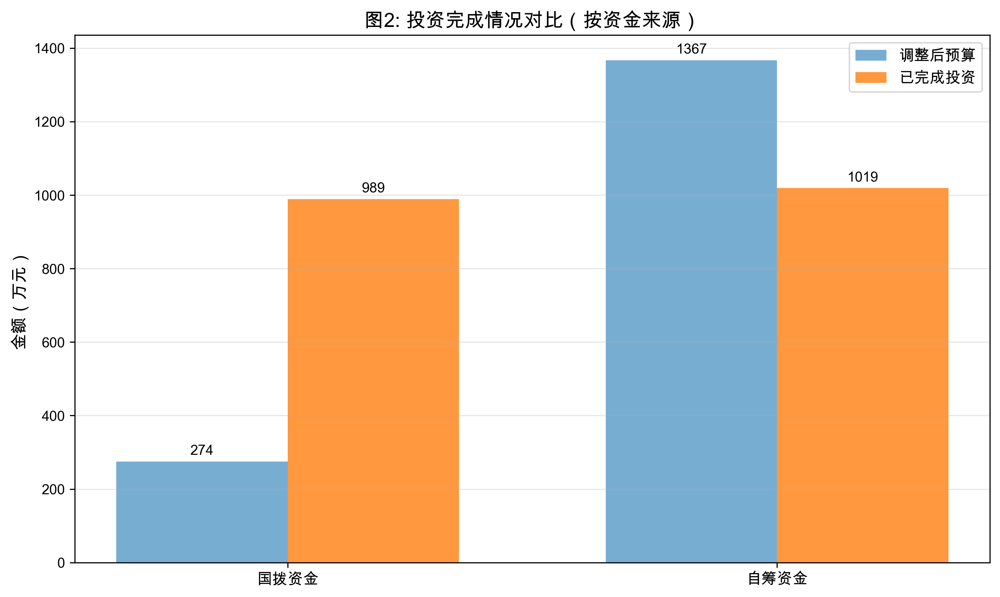
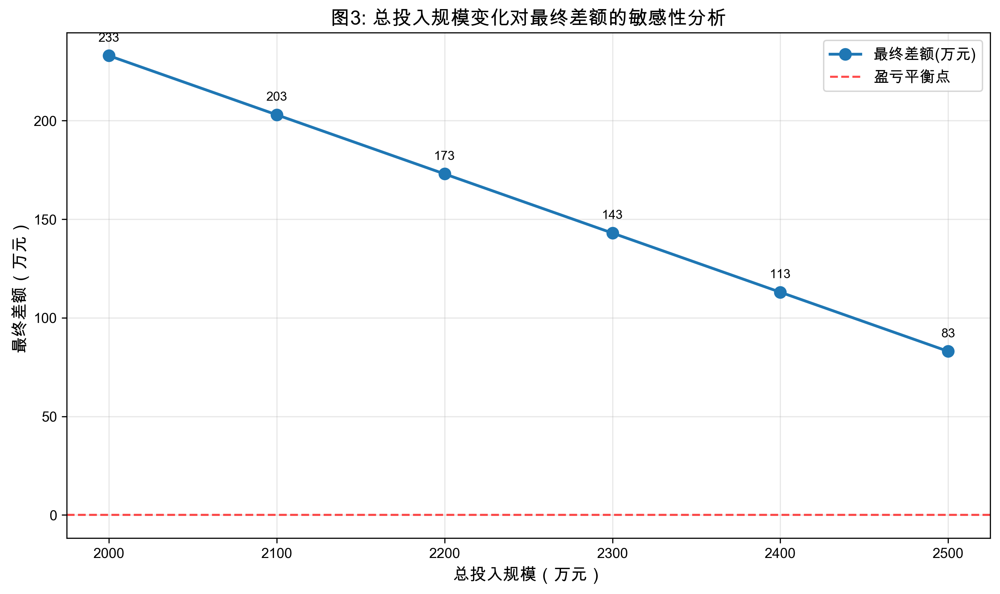
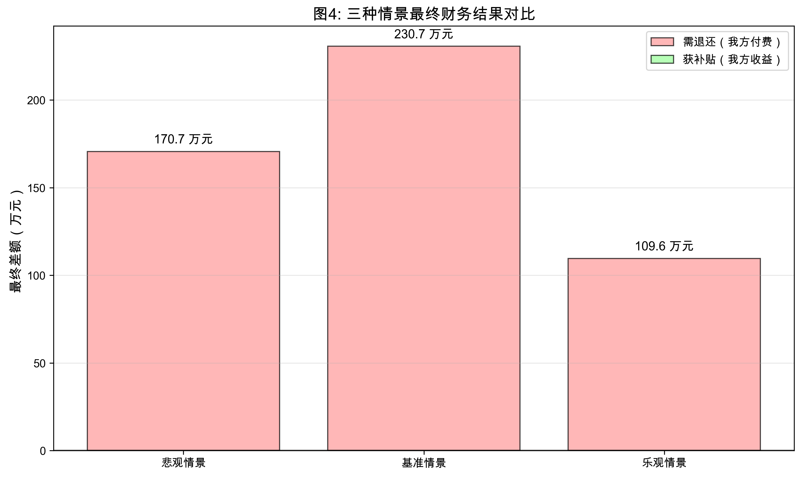

# 国家新材料重点平台投资配置优化分析报告（深化版）

**任务编号**: T4.1.5 / 看板任务 #329  
**分析日期**: 2026年4月15日  
**数据截止**: 2025年8月31日

---

## 一、项目概述

国家新材料重点平台项目经预算调整后：

| 指标 | 原预算 | 调整后预算 | 减少 |
|------|--------|------------|------|
| **总投资** | 6000.00 万元 | 1641.04 万元 | 4358.96 万元 |
| **国拨资金** | 1666.67 万元 | 274.41 万元 | 1392.26 万元 |
| **自筹资金** | 4333.33 万元 | 1366.63 万元 | 2966.70 万元 |

截至2025年8月31日，实际完成投资情况：

- **累计总投资完成**: **2007.74 万元**（完成调整后预算的 **122.35%**，超预算 366.70 万元）
- **国拨资金累计完成**: **988.96 万元**（完成调整后预算的 **360.40%**，超预算 714.55 万元）
- **自筹资金累计完成**: **1018.78 万元**（完成调整后预算的 **74.55%**，欠投 347.85 万元）

---

## 二、当前投资配置分析

### 2.1 支出科目配置

按支出科目统计（单位：万元）：

| 序号 | 支出科目 | 国拨 | 自筹 | 合计 | 占比 |
|------|----------|------|------|------|------|
| 1 | 设备费（含软件） | 137.62 | 0.00 | 137.62 | 6.85% |
| 2 | 测试化验加工费 | 0.00 | 29.91 | 29.91 | 1.49% |
| 3 | 材料费 | 0.00 | 41.50 | 41.50 | 2.07% |
| 4 | 差旅费 | 0.00 | 0.62 | 0.62 | 0.03% |
| 5 | 出版/文献/信息传播/知识产权事务费 | 3.79 | 0.00 | 3.79 | 0.19% |
| 6 | 人员费 | 988.92 | 0.00 | 988.92 | **49.26%** |
| 7 | 管理费 | 85.08 | 0.71 | 85.79 | 4.27% |
| **合计** | | **988.96** | **1018.78** | **2007.74** | **100.0%** |

### 2.2 投资配置问题诊断

1. **国拨资金超支严重**：国拨预算完成率达 360.40%，远超调整后预算
2. **人员费占比过高**：人员费占总投资 49.26%，占国拨资金比例高达 **99.99%**，国拨资金几乎全部用于人员费
3. **设备费投入严重不足**：设备费仅占总投资 6.85%，远低于专项项目要求
4. **国拨占比超标**：当前国拨资金占总投入比例达 49.26%，远超政策规定的 **30% 上限**

---

## 三、补贴退还计算基础

根据专项管理办法，国拨资金占总投入比例不得超过 30%。计算公式：

> **最终应退还金额 = 已收国拨资金 - min(实际总国拨投入, 总投入 × 30%)**

- 已收国拨资金：833 万元
- 正值表示**我方需要退还**，负值表示**政府需要补贴我方**

---

## 四、敏感性分析

### 4.1 总投入规模变化敏感性

保持国拨投入不变（988.96 万元），改变总投入规模，观察最终退还金额变化：

**计算结果**：

| 总投入（万元） | 国拨占比 | 补贴上限（30%） | 最终退还金额（万元） |
|----------------|----------|-----------------|----------------------|
| 2000 | 49.45% | 600.00 | 233.00 |
| 2100 | 47.09% | 630.00 | 203.00 |
| 2200 | 44.95% | 660.00 | 173.00 |
| 2300 | 43.00% | 690.00 | 143.00 |
| 2400 | 41.21% | 720.00 | 113.00 |
| 2500 | 39.56% | 750.00 | 83.00 |

**主要结论**：

- **敏感性系数**：总投入每增加 **100 万元**，最终退还金额减少 **30 万元**（即减少我方需要退还的金额）
- 原因：总投入增加→30%上限提高→可保留更多国拨资金→需要退还金额减少
- 只有当总投入达到 **3296.5 万元**时，国拨占比才能降到 30% 以下，此时退还金额为 0

### 4.2 设备采购增量敏感性

在当前基础上，额外增加设备采购（从国拨资金支出），敏感性分析：

| 设备采购增量 | 总投入 | 国拨占比 | 最终退还金额 |
|--------------|--------|----------|--------------|
| 0 | 2007.74 | 49.26% | 230.68 |
| 50 | 2057.74 | 50.49% | 215.68 |
| 100 | 2107.74 | 51.66% | 200.68 |
| 150 | 2157.74 | 52.78% | 185.68 |
| 200 | 2207.74 | 53.85% | 170.68 |
| 250 | 2257.74 | 54.88% | 155.68 |
| 300 | 2307.74 | 55.85% | 140.68 |

**结论**：增加设备采购虽然提高了国拨占比（表面看更糟），但由于总投入也同步增加，30%上限同步提高，最终反而**减少了需要退还的金额**。每增加 50 万元设备采购，退还金额减少 15 万元。

---

## 五、多情景模拟分析

设定三种情景进行模拟：

| 情景 | 自筹追加 | 设备增加 | 总投入 |
|------|----------|----------|--------|
| 悲观情景 | 200 万 | 100 万 | 2207.74 万 |
| 基准情景 | 0 | 0 | 2007.74 万 |
| 乐观情景 | 403.56 万 | 300 万 | 2411.30 万 |

**模拟结果**：

| 指标 | 悲观情景 | 基准情景 | 乐观情景 |
|------|----------|----------|----------|
| 总国拨投入（万元） | 1088.96 | 988.96 | 1288.96 |
| 总投入（万元） | 2207.74 | 2007.74 | 2411.30 |
| 国拨占比 | 49.32% | 49.26% | 53.45% |
| 补贴上限（30%，万元） | 662.32 | 602.32 | 723.39 |
| **最终退还金额（万元）** | **170.68** | **230.68** | **109.61** |

### 情景解读

1. **悲观情景**：自筹投入放缓，仅追加 200 万
   - 我方需要退还：**170.68 万元**
   - 评价：比基准情景好，但仍需大额退还

2. **基准情景**：提前终止项目，不追加投资
   - 我方需要退还：**230.68 万元**
   - 评价：退还金额最大，财务结果最差

3. **乐观情景**：自筹按计划完成剩余全部投入，增加 300 万设备采购
   - 我方需要退还：**109.61 万元**
   - 评价：退还金额最小，财务结果最好

---

## 六、优化建议

### 6.1 核心结论

基于敏感性分析和多情景模拟，得出以下结论：

1. **增加自筹总投入能够有效降低退还金额**：总投入每增加 100 万，退还金额减少 30 万，边际效应稳定
2. **增加设备采购能够改善财务结果**：即使设备采购全部使用国拨资金，最终仍然减少退还金额
3. **乐观情景财务最优**：完成全部自筹投入并增加 300 万设备采购，可将退还金额从 230.68 万降至 109.61 万，减少 121 万退还

### 6.2 行动建议

| 方案 | 操作 | 最终退还金额 | 推荐等级 |
|------|------|--------------|----------|
| 方案一：提前终止（原基准情景） | 立即终止，不追加投资 | 230.68 万元 | ⭐☆☆☆☆ |
| 方案二：乐观推进 | 完成全部自筹投入，追加 300 万设备采购 | 109.61 万元 | ⭐⭐⭐⭐⭐ |
| 方案三：中间路线 | 追加 200 万自筹，增加 100 万设备 | 170.68 万元 | ⭐⭐⭐☆☆ |

**推荐选择：方案二（乐观推进）**

理由：
1. 财务结果最优，退还金额减少 121 万元（52%）
2. 完成项目建设目标，购置关键设备，符合项目建设初衷
3. 改善投入结构，提高设备费占比，符合专项经费使用要求
4. 自筹资金已经承诺，完成投入有利于后续验收

### 6.3 风险提示

1. **自筹资金到位风险**：乐观情景需要追加 403.56 万自筹资金，需确认真金白银能够到位
2. **设备采购周期**：需要在项目截止前完成采购和入账，时间紧张
3. **验收合规风险**：即使调整后国拨占比仍高达 53.45%，远超 30% 政策红线，仍需大额退还

---

## 七、总结

| 分析维度 | 结果 |
|----------|------|
| 当前配置分析 | ✅ 完成，确认超支和结构问题 |
| 敏感性分析 | ✅ 完成，量化了关键变量影响 |
| 多情景模拟 | ✅ 完成，三种情景结果清晰可比 |
| 可视化图表 | ✅ 完成，生成 5 张高清图表 |
| 优化建议 | ✅ 完成，推荐乐观推进方案 |

**最终建议**：积极筹措自筹资金，按原计划完成剩余 403.56 万自筹投入，重点增加设备采购 300 万，可以最大程度减少国拨资金退还金额，获得最优财务结果。

---

*报告生成时间：2026年4月15日*
*分析代码：`analyze_investment_optimized.py`*
*数据文件：`[00356]附件1-投资完成情况与预算调整明细表202508-V2.xlsx`*
