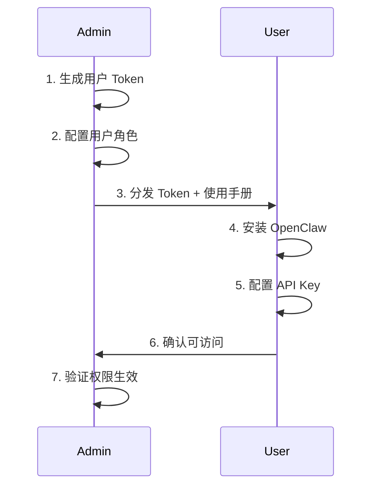

# OpenClaw 团队部署标准操作程序 (SOP)

> 版本: v1.0 | 日期: 2026-04-23 | 适用对象: Admin/技术负责人

---

## 1. 环境要求

### 1.1 硬件要求

| 组件 | 最低配置 | 推荐配置 |
|------|---------|---------|
| CPU | 4核 | 8核+ (Apple Silicon M系列) |
| 内存 | 8GB | 16GB+ |
| 存储 | 20GB可用 | 50GB+ (SSD) |
| 网络 | 10Mbps | 100Mbps+ (稳定外网) |
| OS | macOS 14+ | macOS 15+ / Ubuntu 22.04+ |

### 1.2 软件依赖

```bash
# 核心依赖
- Node.js >= 18.0.0 (推荐 v20 LTS)
- npm >= 9.0.0
- Python >= 3.10 (用于部分技能脚本)
- Git >= 2.30

# 可选依赖（按需安装）
- pnpm 或 yarn (包管理)
- Docker (隔离运行环境)
- Redis (可选，用于缓存加速)
```

---

## 2. 部署步骤

### 2.1 安装 Node.js (macOS)

```bash
# 使用 Homebrew 安装 Node.js LTS
brew install node@20
node -v  # 确认版本 >= 20.x
npm -v   # 确认版本 >= 9.x
```

### 2.2 安装 OpenClaw

```bash
# 全局安装 OpenClaw CLI
npm install -g openclaw

# 验证安装
openclaw --version
openclaw help
```

### 2.3 初始化工作空间

```bash
# 创建工作空间目录
mkdir -p ~/.openclaw/workspace
cd ~/.openclaw/workspace

# 创建工作空间基础文件
# AGENTS.md, SOUL.md, USER.md, TOOLS.md 等内容
```

### 2.4 配置 OpenClaw

```bash
# 查看默认配置
openclaw status

# 编辑配置文件
# ~/.openclaw/openclaw.json — 主配置文件
# ~/.openclaw/.env — 敏感信息配置

# 启动 Gateway 服务
openclaw gateway start
openclaw gateway status

# 确认服务正常运行
# 默认监听: http://localhost:18789
```

---

## 3. 配置文件详解

### 3.1 主配置 openclaw.json

核心配置项说明（已存在的配置）:

```json
{
  // Agent 配置
  "agents": {
    "defaults": {
      "workspace": "/Users/mettlyz/.openclaw/workspace",
      "model": {
        "primary": "alicodingplan/qwen3.6-plus",
        "fallbacks": ["alicodingplan/kimi-k2.5", "..."]
      }
    }
  },
  
  // Gateway 服务配置
  "gateway": {
    "mode": "local",         // local (本地) 或 network (网络)
    "auth": { "mode": "token" },
    "port": 18789,
    "bind": "loopback"       // loopback (仅本地) 或 0.0.0.0 (网络)
  },
  
  // 会话配置
  "session": {
    "dmScope": "per-channel-peer"  // 用户间会话隔离
  },
  
  // 模型 Provider 配置
  "models": {
    "providers": {
      "moonshot": { ... },
      "deepseek": { ... },
      ...
    }
  }
}
```

### 3.2 环境变量 .env

```bash
# ~/.openclaw/.env
# API Keys (加密存储，不可提交至版本控制)
MOONSHOT_API_KEY=sk-xxxx
DEEPSEEK_API_KEY=sk-xxxx
HUOSHAN_API_KEY=xxxx
TAVILY_API_KEY=tvly-xxxx

# 数据库配置
DB_HOST=rm-xxxx.mysql.rds.aliyuncs.com
DB_USER=kanban
DB_PASSWORD=xxxx
```

---

## 4. 安全配置

### 4.1 Token 认证配资

```bash
# 生成用户 Token
openssl rand -hex 32
# 输出: 56edf29f10e25430770af3b7fefe9cb65196ddb9338dde4b...

# 将 Token 配置到 openclaw.json
```

### 4.2 网络安全

```bash
# 方案A: 仅本地使用 (loopback)
# bind: "loopback" — 最安全，仅本机可访问
# 通过 SSH 隧道或 Tailscale 远程访问

# 方案B: 局域网使用
# bind: "0.0.0.0" + 防火墙规则限制来源 IP

# 方案C: 通过 Tailscale 组网 (推荐)
# tailscale mode: on — 安全组网，无需公网暴露
```

### 4.3 Git 仓库安全

```bash
# .gitignore 必须包含
~/.openclaw/.env
~/.openclaw/openclaw.json  # (如果含密钥)
**/node_modules/
*.log

# 使用 git-crypt 或 SOPS 加密敏感文件
```

### 4.4 备份策略

```bash
# 自动备份脚本建议
#!/bin/bash
BACKUP_DIR=~/openclaw-backups/$(date +%Y%m%d)
mkdir -p $BACKUP_DIR
cp ~/.openclaw/openclaw.json $BACKUP_DIR/
cp ~/.openclaw/.env $BACKUP_DIR/
cp -r ~/.openclaw/workspace $BACKUP_DIR/
# 加密备份
tar czf $BACKUP_DIR.tar.gz $BACKUP_DIR/
gpg --symmetric $BACKUP_DIR.tar.gz
# 清理 30 天前的备份
find ~/openclaw-backups -name "*.gz.gpg" -mtime +30 -delete
```

---

## 5. 新用户入职流程

### 5.1 第一天：账号创建



**详细步骤：**

```bash
# Step 1: Admin 生成用户 Token
openssl rand -hex 16
# 输出: a3b8c9d1e2f4...

# Step 2: 配置用户到 openclaw.json
# 在 agents 段添加用户配置

# Step 3: 分发 Token 给用户（通过安全渠道）
# 使用 1Password / 面对面 / 加密聊天

# Step 4: 用户安装 OpenClaw
npm install -g openclaw

# Step 5: 用户配置
mkdir -p ~/.openclaw/workspace
# 编辑 ~/.openclaw/openclaw.json
# 配置 gateway 地址和自己的 token
```

### 5.2 用户端 openclaw.json 示例

```json
{
  "agents": {
    "defaults": {
      "workspace": "/Users/username/.openclaw/workspace",
      "model": { "primary": "alicodingplan/qwen3.6-plus" }
    }
  },
  "gateway": {
    "serviceUrl": "http://gateway-host:18789",
    "auth": {
      "token": "user-token-here"
    }
  }
}
```

### 5.3 次日：技能配置

```bash
# 用户可见的技能列表
ls ~/.openclaw/workspace/skills/

# 按需激活技能
# 管理员可远程安装技能到用户环境
```

### 5.4 第一周：实战演练

1. 完成 3 个预设任务（文献下载、论文摘要、数据分析）
2. 熟悉 SOP 流程
3. 反馈问题给 Admin

---

## 6. 监控与维护

### 6.1 健康检查

```bash
# Gateway 状态
openclaw gateway status

# 查看日志
tail -f ~/.openclaw/logs/*.log

# 性能监控
watch -n 60 'openclaw status --json | jq .'
```

### 6.2 更新流程

```bash
# 更新 OpenClaw
npm update -g openclaw

# 更新后重启 Gateway
openclaw gateway restart

# 验证版本
openclaw --version
```

### 6.3 故障恢复

| 问题 | 排查命令 | 解决方案 |
|------|---------|---------|
| Gateway 无法启动 | `openclaw gateway status` | 检查端口占用、配置语法 |
| 模型调用失败 | `openclaw models list` | 检查 API Key 是否过期/欠费 |
| 用户无法连接 | `curl localhost:18789/health` | 检查 Token 和网络配置 |
| 技能加载失败 | `ls -la ~/.openclaw/skills/` | 检查技能目录完整性 |

---

## 7. 附录：快速部署检查清单

### 🚀 部署前检查

- [ ] 系统版本满足要求 (macOS 14+ / Ubuntu 22.04+)
- [ ] Node.js v20+ 已安装
- [ ] npm 最新版
- [ ] 网络可正常访问外网 API
- [ ] ~/.openclaw/ 目录已创建
- [ ] API Keys 已获取

### ⚙️ 配置检查

- [ ] openclaw.json 语法正确 (JSON 可解析)
- [ ] .env 文件已创建且权限 600
- [ ] Gateway 服务运行中
- [ ] 至少一个 Model Provider 可用

### 👤 用户创建检查

- [ ] 用户 Token 已生成
- [ ] 角色已分配
- [ ] 用户收到 Token 和文档
- [ ] 用户首次连接成功

### 📋 功能检查

- [ ] 基础对话功能正常
- [ ] 至少一个核心技能可用
- [ ] 文件读写功能正常
- [ ] API 调用正常
