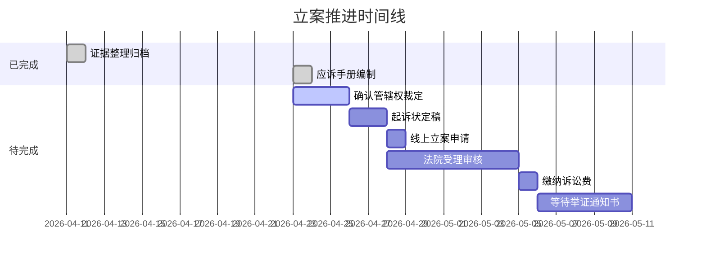

# 诉讼立案进度跟踪与提交时间表

**报告日期**: 2026-04-23 23:00 (Asia/Shanghai)
**案件**: 北京深云智合科技有限公司 vs 包头市九原区政府合作协议纠纷
**对接律师**: 王旭（北京瀛和律师事务所高级合伙人）
**管辖权事宜**: 刘卓律师

---

## 一、项目里程碑总览



---

## 二、当前状态仪表盘

### 整体进展：42%

```
█░░░░░░░░░░░░░░░░░░░░░░░ 42%
```

### 各维度进度

| 维度 | 完成度 | 状态 |
|------|--------|------|
| 🔴 管辖权确认 | 10% | ⏳ 待确认裁定结果（已等12天） |
| 📄 起诉状定稿 | 60% | ⚠️ 需确认最终版本 |
| 📋 证据材料准备 | 85% | ✅ 29份归档 |
| 🏢 主体资格文件 | 90% | ✅ 已找到 |
| 👨‍⚖️ 律师授权文书 | 60% | ⚠️ 需确认是否最新 |
| 💻 线上立案系统 | 0% | ❌ 依赖管辖权确认 |
| 💰 诉讼费缴纳 | 0% | ❌ 受理后缴纳 |

---

## 三、关键里程碑详情

### 里程碑1: ✅ 证据整理归档（已完成）

| 指标 | 值 |
|------|-----|
| 完成日期 | 2026-04-11 |
| 证据总数 | 29份 |
| 证据线 | 3条（刘瑞/交付/关联） |
| 完成度 | 证据线1 100%、线2 90%、线3 60% |

### 里程碑2: ✅ 应诉手册编制（已完成）

| 指标 | 值 |
|------|-----|
| 完成日期 | 2026-04-23 |
| 手册版本 | v1.0 |
| 产出文件 | 案件进展跟踪报告 + 三条论证主线应诉手册 |
| 关联任务 | #1643（已 completed） |

### 里程碑3: 🔴 管辖权裁定确认（当前阻塞点）

| 指标 | 值 |
|------|-----|
| 等待起始 | 2026-04-11 |
| 已过天数 | **12天** |
| 负责律师 | 刘卓 |
| 阻塞性质 | **硬性阻塞**—管辖权未定则无法确定管辖法院 |

### 里程碑4: ⏳ 起诉状定稿

| 指标 | 值 |
|------|-----|
| 前置条件 | 管辖权裁定确认 |
| 现有版本 | `[00157]-[00161]深云ー民事起诉状.pdf`（多版本） |
| 待确认 | 是否为最终版、是否需要根据管辖权调整 |
| 负责人 | 王旭律师 |

### 里程碑5-8: 立案提交→受理→缴费→举证

| 里程碑 | 前置条件 | 预计耗时 |
|--------|---------|---------|
| 线上/线下立案申请 | 管辖权确认+起诉状定稿 | 1天 |
| 法院受理审核 | 申请提交 | 7日内 |
| 缴纳诉讼费 | 受理通知书 | 收到后7日内 |
| 等待举证通知书 | 缴费完成 | 5-15天 |

---

## 四、风险登记册

### 🔴 当前风险

| 风险ID | 描述 | 概率 | 影响 | 等级 | 缓解措施 |
|--------|------|------|------|------|----------|
| R1 | 管辖权裁定结果不利（移送九原区） | 中 | 🔴 高 | 🔴 | 上诉至北京一中院 |
| R2 | 裁定已出但未收到通知 | 高 | 🔴 高 | 🔴 | 立即联系刘卓律师 |
| R3 | 深云智合主体资格异常（已停运） | 中 | 🟡 中 | 🟡 | 与律师确认是否需变更诉讼主体 |
| R4 | 证据时效性：电子证据未公证 | 低 | 🟡 中 | 🟡 | 尽快做可信时间戳认证 |
| R5 | 诉讼时效逾期风险 | 低 | 🔴 高 | 🟡 | 确认合作协议签订日期（约2023-2024） |

### 风险响应策略

| 风险ID | 触发条件 | 响应行动 | 责任人 |
|--------|---------|---------|--------|
| R1 | 收到移送裁定书 | 7日内上诉至北京一中院 | 王旭律师 |
| R2 | 联系后仍无回音 | 直接致电昌平法院立案庭 | 刘宇宙 |
| R3 | 律师确认主体异常 | 变更原告为股东个人或清算组 | 王旭律师 |
| R4 | 开庭前 | 委托公证处做电子证据保全 | 刘宇宙 |
| R5 | 确认临近时效 | 立即推进立案，同时申请延长 | 王旭律师 |

---

## 五、行动清单（按优先级）

### 🔴 立即行动（24小时内）

- [ ] **联系刘卓律师** → 确认昌平法院管辖权裁定结果（首要任务！）
  - 📞 联系方式：需从联系人档案中查找
  - 📋 提供信息：案件名称、案由、立案时间
- [ ] **联系王旭律师** → 同步案件进展，确认起诉状版本和下一步安排
  - 📞 电话/微信
  - 📋 发送应诉手册审阅

### 🟡 本周内

- [ ] 管辖权确认后 → 与王旭律师确定管辖法院和立案方式
- [ ] 更新授权委托书（如需要）
- [ ] 准备线上立案材料（按法院要求格式）
- [ ] 微信电子证据公证/时间戳认证

### 🟢 立案后

- [ ] 法院受理 → 凭受理通知书缴纳诉讼费
- [ ] 收到举证通知书 → 准备正式证据交换
- [ ] 等待开庭传票 → 安排出庭时间

---

## 六、诉讼费用预估

| 费用项目 | 金额预估 | 说明 |
|----------|---------|------|
| 案件受理费 | 根据诉讼标的 | 纠纷金额未知，暂无法准确预估 |
| 财产保全费（如申请） | 最高5000元 | 按标的额比例计算 |
| 公证费 | 约2000-5000元 | 电子证据公证/时间戳 |
| 律师费 | 已含在委托合同 | 王旭律师年度顾问服务 |
| 差旅费 | 视开庭地点 | 如昌平审理则节省，九原区则需差旅 |

---

## 七、沟通记录

| 日期 | 沟通对象 | 内容 | 结果 |
|------|---------|------|------|
| ⏳ | 刘卓律师 | 确认管辖权裁定结果 | **待执行** |
| ⏳ | 王旭律师 | 同步立案进展+应诉手册审阅 | **待执行** |

---

## 八、系统关联信息

| 关联任务 | 状态 | 说明 |
|----------|------|------|
| #1643 深云智合/硅研新材法务官司处理 | ✅ completed | 应诉手册+案件跟踪报告已完成 |
| #1707 诉讼立案推进（当前任务） | 🟢 in_progress | 立案材料审核+进度跟踪 |
| 用户重点待办 | 🚨 高优先级 | 深云智合九原区法务三条论证主线补充应诉手册 |

---

## 九、总结

**当前立案推进最大障碍：管辖权裁定结果未确认。** 自2026-04-11起已等待12天，裁定结果直接影响：

1. **管辖法院**：昌平 vs 九原区 → 决定线上立案平台和材料准备方向
2. **诉讼策略**：不同法院审理风格和地方保护风险差异明显
3. **立案时间**：确认前无法实质性推进立案申请

**建议立即联系刘卓律师确认裁定结果。** 如裁定对我方有利（驳回异议），可在1周内完成全部立案手续；如不利（移送九原区），需在7日内上诉。

---

*本报告由Dudu自动生成于2026-04-23 23:00*
*数据来源：output/诉讼证据/ + memory/ + Files/Projects/深云智合/法律诉讼/*
