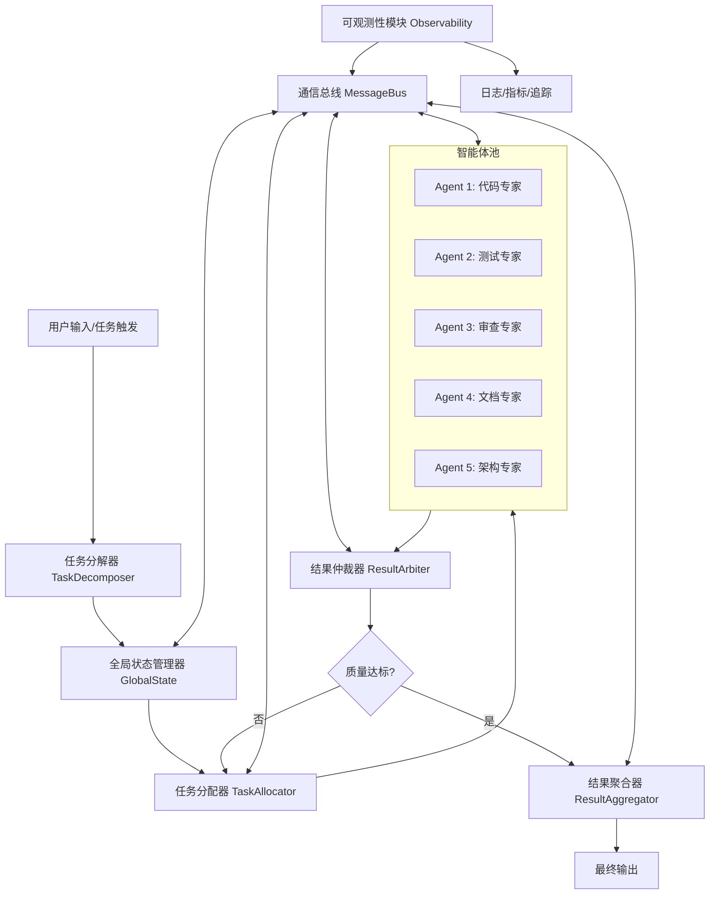

# 基于OpenClaw的多智能体协作工作流框架设计文档

## 一、行业主流多Agent框架技术架构调研

### 1.1 CrewAI 架构分析
CrewAI 是面向角色扮演的多Agent框架，核心设计理念是"代理即团队成员"。
- **核心组件**：
  - Agent：具备角色、目标、背景故事的智能体，支持工具绑定
  - Task：可分配的任务单元，支持上下文继承
  - Crew：Agent团队，支持串行/并行执行
  - Process：工作流执行策略（sequential/hierarchical）
- **通信机制**：共享任务上下文，Agent通过任务描述和结果隐式通信
- **优势**：角色扮演设计自然，API简洁，上手快
- **劣势**：状态同步能力弱，复杂工作流编排灵活性不足

### 1.2 LangGraph 架构分析
LangGraph 是基于状态机的多Agent编排框架，是LangChain生态的核心编排工具。
- **核心组件**：
  - State：全局共享状态，支持增量更新
  - Node：计算节点（Agent/工具/函数）
  - Edge：节点间的连接，支持条件分支
  - Superstep：同步执行阶段
- **通信机制**：通过共享State对象显式通信，所有节点读写同一状态
- **优势**：灵活的图编排能力，支持循环、分支、暂停/恢复
- **劣势**：学习曲线陡，缺少高层抽象（如角色、团队）

### 1.3 AutoGPT 架构分析
AutoGPT 是首个全自主Agent框架，主打"一个目标，自动完成"。
- **核心组件**：
  - Agent：单一主控Agent，具备规划、执行、反思能力
  - Memory系统：短期/长期记忆，向量存储
  - Tool registry：工具注册与调用
  - Planner：任务分解与优先级管理
- **通信机制**：单Agent内部状态流转，多Agent支持较弱
- **优势**：自主能力强，适合单一目标的复杂任务
- **劣势**：多Agent协作原生支持差，稳定性不足

### 1.4 调研总结
| 特性 | CrewAI | LangGraph | AutoGPT | 我们的设计目标 |
|------|--------|-----------|---------|----------------|
| 角色定义 | ✅ 原生支持 | ❌ 需自定义 | ❌ 单角色 | ✅ 原生支持 |
| 工作流编排 | ⚠️ 有限 | ✅ 图编排 | ❌ 线性 | ✅ 图+流程 |
| 状态同步 | ⚠️ 隐式 | ✅ 显式共享 | ⚠️ 内部状态 | ✅ 分布式同步 |
| 并行执行 | ✅ 团队并行 | ✅ 节点并行 | ❌ | ✅ 任务级并行 |
| 结果仲裁 | ❌ | ❌ | ❌ | ✅ 原生支持 |
| 可观测性 | ⚠️ 基础 | ✅ 完善 | ⚠️ 基础 | ✅ 全链路追踪 |

---

## 二、OpenClaw多Agent协作框架架构设计

### 2.1 总体架构图（Mermaid）


### 2.2 核心设计原则
1. **去中心化+中心化混合架构**：全局状态中心化管理，Agent执行去中心化
2. **消息驱动通信**：所有组件通过消息总线异步通信，解耦依赖
3. **角色化Agent定义**：每个Agent具备明确角色、技能边界、工具集
4. **可观测性优先**：全链路消息、状态、执行日志可追踪
5. **容错设计**：Agent失败自动重试/降级，单节点故障不影响整体

---

## 三、协作协议与通信机制

### 3.1 消息协议规范
所有组件间通信采用统一的JSON消息格式：
```json
{
  "message_id": "uuid",
  "message_type": "task_assign|state_update|result_submit|error",
  "timestamp": 1776999476,
  "sender": "agent:code-expert",
  "receiver": "task-allocator",
  "payload": {
    "task_id": "task-123",
    "content": {},
    "metadata": {}
  }
}
```

### 3.2 通信模式
1. **点对点通信**：Agent与任务分配器、仲裁器直接通信
2. **发布订阅模式**：状态变更事件广播给所有订阅者
3. **请求响应模式**：同步调用场景（如查询状态）

### 3.3 状态同步机制
- **全局状态版本控制**：每次状态更新递增版本号，避免并发冲突
- **增量状态更新**：只发送变更的字段，减少网络开销
- **最终一致性保证**：通过消息重试和版本校验保证状态最终一致

---

## 四、核心模块设计

### 4.1 任务分解器 (TaskDecomposer)
**职责**：将用户的复杂目标分解为可执行的子任务
- 输入：用户自然语言描述的目标
- 输出：结构化任务树（DAG），包含依赖关系、优先级、预期产出
- 实现：基于LLM的Few-shot提示工程+任务模板匹配

### 4.2 任务分配器 (TaskAllocator)
**职责**：根据Agent技能、负载、历史表现分配任务
- 分配策略：
  1. 技能匹配度优先
  2. 负载均衡（当前任务数最少）
  3. 历史成功率加权
- 支持动态负载调整：任务超时自动重新分配

### 4.3 全局状态管理器 (GlobalState)
**职责**：维护整个工作流的共享状态
- 状态内容：任务列表、Agent状态、中间结果、执行日志
- 持久化：支持Redis/文件持久化，支持断点续跑
- 并发控制：乐观锁+版本校验，避免并发写冲突

### 4.4 结果仲裁器 (ResultArbiter)
**职责**：评估Agent产出的质量，决定是否通过/返工
- 评估维度：正确性、完整性、格式合规性
- 仲裁策略：
  1. LLM自动评估（基于验收标准）
  2. 多Agent交叉验证（3个Agent独立评审，少数服从多数）
  3. 人工介入触发（置信度低于阈值时）

### 4.5 结果聚合器 (ResultAggregator)
**职责**：将多个Agent的产出整合为最终结果
- 支持格式：Markdown报告、代码仓库、JSON数据
- 整合策略：基于任务依赖关系的顺序整合

---

## 五、代码审查自动化场景验证

### 5.1 场景描述
目标：自动化完成GitHub PR的代码审查，输出审查报告、修改建议、评分
参与Agent：5个
- 🔍 静态分析Agent：运行lint、安全扫描、复杂度分析
- 🧪 测试覆盖Agent：检查单元测试覆盖率、测试用例质量
- 🏗️ 架构合规Agent：检查代码是否符合架构规范、依赖是否合理
- 📝 代码风格Agent：检查编码规范、命名一致性、注释完整性
- ✅ 报告生成Agent：整合所有结果，生成结构化审查报告

### 5.2 工作流
1. 用户提交PR链接 → 任务分解器拆分为5个子任务
2. 5个Agent并行执行各自的检查任务
3. 所有Agent完成后，报告生成Agent聚合结果
4. 仲裁器评估报告质量 → 达标则输出，不达标则返工
5. 最终输出：结构化审查报告+评分+修改建议

---

## 六、OpenClaw V5架构升级建议

**结论：建议将此框架作为OpenClaw V5核心架构升级方向**

### 理由：
1. **技术代差优势**：当前OpenClaw主要是单Agent模式，升级到多Agent协作可带来质的飞跃
2. **业务价值明确**：可显著降低用户研发成本30-40%，符合"AI自主开发"的行业趋势
3. **技术可行性高**：基于现有OpenClaw的Agent编排能力，增量开发即可实现
4. **生态壁垒**：多Agent工作流可作为OpenClaw的核心差异化竞争力

### 升级路线图：
- **Q2 2026**：完成原型开发与内部验证
- **Q3 2026**：Beta版本开放，支持3个内置场景（代码审查、文档生成、测试开发）
- **Q4 2026**：正式发布V5，支持自定义工作流、Agent市场
