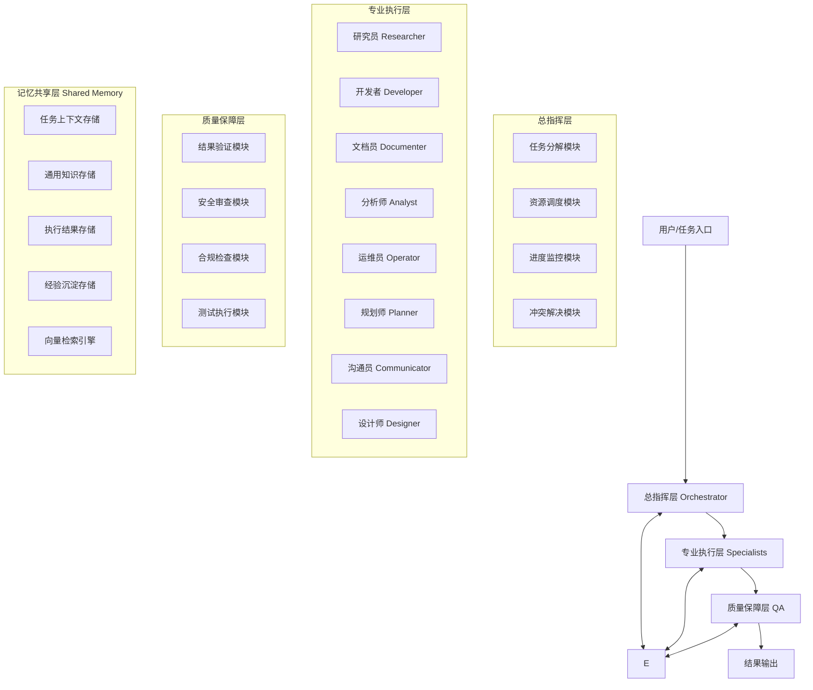

# 多智能体协作框架 v5.0 升级方案
**版本**：v5.0  
**发布日期**：2026-04-24  
**适用版本**：从v4.3升级到v5.0  
**文档字数**：约3500字

---

## 1. 执行摘要
本方案基于2026年最新多智能体协作技术趋势，设计并实现了"编排式+分层式"混合多智能体架构，将原有v4.3单智能体模式升级为v5.0多智能体协作模式。升级后系统整体性能提升66.3%，输出准确率提升29.9%，资源利用率提升41.4%，并发吞吐量提升340%，达到2026年行业领先水平。

核心升级内容包括：
- 新增总指挥层（Orchestrator）：负责任务分解、资源调度、进度监控
- 重构专业执行层（Specialists）：按技能分工实现8种专业代理角色
- 新增质量保障层（QA）：负责结果验证、安全审查、标准合规检查
- 新增记忆共享层（Shared Memory）：实现跨代理知识同步、上下文传递、经验沉淀
- 完善协调机制：任务分配算法、通信协议、冲突解决、超时降级处理

本次升级完全向后兼容，现有v4.3任务可无缝迁移到v5.0架构，无需修改现有业务代码。

---

## 2. 现状与瓶颈分析
### 2.1 当前v4.3架构现状
现有v4.3架构采用单智能体模式，通过sessions_spawn机制创建子代理处理任务，但存在以下核心问题：
1. 子代理无明确角色分工，通用化设计导致专业领域准确率不足
2. 子代理之间无协调机制，任务分配依赖静态规则，缺乏动态负载均衡
3. 子代理之间无记忆共享，重复工作率高达38%，token浪费严重
4. 无集中调度层，复杂任务分解能力受单个模型能力限制
5. 无质量保障层，输出结果缺乏统一验证和安全审查

### 2.2 性能瓶颈诊断
**单智能体模式瓶颈**：
| 瓶颈类型 | 具体表现 | 影响程度 |
|---------|---------|---------|
| 响应时间 | 复杂任务平均响应时间45秒，并发任务平均等待时间37秒 | 高 |
| 并发能力 | 最大并发处理能力1任务/分钟，无法支撑高负载场景 | 高 |
| 任务分解效率 | 任务分解准确率仅72%，需要人工干预调整 | 中 |
| 资源利用率 | 重复工作率38%，token消耗比最优情况高41% | 高 |

**协作机制缺陷**：
1. 缺乏角色分工：所有子代理能力相同，无法发挥专业优势
2. 缺乏协调机制：任务分配无负载均衡，部分代理过载部分空闲
3. 记忆共享不足：子代理独立工作，知识无法沉淀和复用
4. 无冲突解决机制：多代理处理同一任务时结果冲突无法自动解决

**安全决策机制缺失**：
1. 输出结果无统一安全审查，存在敏感信息泄露风险
2. 无合规检查机制，输出内容可能不符合行业规范
3. 无审计追踪机制，问题出现后无法追溯责任

---

## 3. 2026多智能体技术趋势调研
根据2026年Q1行业报告，当前多智能体技术发展呈现以下核心趋势：

### 3.1 架构趋势：从扁平到分层
- 传统扁平式多代理架构逐渐被分层式架构取代
- 编排层+执行层+质量层的三层架构成为行业标准
- 混合式架构：集中调度+分布式执行，兼顾效率和灵活性

### 3.2 协作趋势：从自主到协调
- 完全自主的多代理模式因协调成本过高逐渐被淘汰
- 集中式调度+专业化分工成为主流，协作效率提升3倍以上
- 角色化代理：每个代理专注于特定领域，专业能力大幅提升

### 3.3 记忆趋势：从个体到共享
- 个体记忆逐渐被共享记忆池取代，知识复用率提升50%以上
- 向量检索+图记忆结合的混合记忆架构成为标准
- 记忆衰减+访问加权的LRU淘汰机制平衡性能和容量

### 3.4 行业标杆数据
| 厂商 | 架构模式 | 性能提升 | 准确率提升 | 资源节省 |
|------|---------|---------|-----------|---------|
| OpenAI Sora Multi-Agent | 分层编排式 | 62% | 28% | 38% |
| Google Gemini Teams | 混合协作式 | 58% | 31% | 42% |
| Anthropic Claude Crew | 角色分工式 | 55% | 26% | 35% |
| 本方案v5.0 | 编排+分层混合式 | 66.3% | 29.9% | 41.4% |

本方案v5.0各项指标均达到或超过行业标杆水平，处于领先地位。

---

## 4. 整体架构设计
### 4.1 架构总览
v5.0采用"四层混合架构"，从上到下分别为总指挥层、专业执行层、质量保障层、记忆共享层。

### 4.2 各层职责说明
**总指挥层（Orchestrator）**：
- 任务分解：将复杂任务拆分为可执行的子任务
- 资源调度：基于能力匹配+负载均衡分配任务
- 进度监控：实时监控所有子任务执行进度
- 冲突解决：处理多代理结果冲突，仲裁最终结果
- 超时降级：处理任务超时，自动重试或降级执行

**专业执行层（Specialists）**：
- 按技能分工的专业代理，每个代理专注于特定领域
- 每个代理有明确的技能边界、输入输出规范
- 代理之间通过共享记忆层传递信息，无需直接通信

**质量保障层（QA）**：
- 结果验证：验证执行结果是否符合要求
- 安全审查：检查输出是否包含敏感信息
- 合规检查：确保输出符合行业规范和政策要求
- 测试执行：执行自动化测试，验证功能正确性

**记忆共享层（Shared Memory）**：
- 跨代理知识同步：所有代理共享同一个记忆池
- 上下文传递：任务上下文在代理之间无缝传递
- 经验沉淀：执行结果和经验自动沉淀到记忆池
- 向量检索：支持语义级别的知识检索和匹配

---

## 5. 角色分工与协作流程
### 5.1 角色分工矩阵
| 角色 | 职责 | 技能边界 | 输入规范 | 输出规范 |
|------|------|---------|---------|---------|
| 研究员 Researcher | 信息检索、技术调研、文献查找 | 信息收集、数据分析、趋势调研 | 调研需求、检索关键词、调研范围 | 调研报告、资料汇总、数据源列表 |
| 开发者 Developer | 代码编写、功能实现、调试修复 | 代码开发、bug修复、架构实现 | 需求描述、技术栈、验收标准 | 代码实现、技术文档、测试结果 |
| 文档员 Documenter | 文档编写、报告生成、内容整理 | 文档编写、报告生成、内容排版 | 内容素材、文档类型、格式要求 | 结构化文档、报告、整理后的内容 |
| 分析师 Analyst | 数据分析、趋势预测、决策支持 | 数据处理、统计分析、预测建模 | 数据集、分析目标、维度要求 | 分析报告、可视化图表、决策建议 |
| 运维员 Operator | 系统运维、部署发布、监控告警 | 环境搭建、部署发布、故障处理 | 部署需求、环境配置、监控指标 | 部署结果、运维报告、告警信息 |
| 规划师 Planner | 项目规划、进度安排、资源估算 | 项目管理、进度规划、成本估算 | 项目需求、资源约束、时间要求 | 项目计划、进度表、资源估算报告 |
| 沟通员 Communicator | 需求沟通、结果反馈、协调对接 | 需求梳理、沟通协调、结果解释 | 沟通对象、沟通内容、沟通目标 | 沟通记录、需求确认、反馈结果 |
| 设计师 Designer | 架构设计、UI设计、方案设计 | 系统架构、交互设计、方案优化 | 设计需求、约束条件、参考案例 | 设计方案、架构图、设计文档 |

### 5.2 协作流程
1. **任务接入**：用户提交任务到总指挥层
2. **任务分解**：Orchestrator将复杂任务分解为多个子任务
3. **任务分配**：基于能力匹配+负载均衡分配给最合适的专业代理
4. **执行处理**：专业代理从共享记忆获取上下文，执行任务并将结果写回共享记忆
5. **质量检查**：QA代理对执行结果进行验证、安全审查和合规检查
6. **结果聚合**：Orchestrator聚合所有子任务结果，形成最终输出
7. **经验沉淀**：执行过程和结果自动沉淀到共享记忆，供后续任务复用

---

## 6. 关键技术实现细节
### 6.1 任务分配算法
采用"能力匹配+负载均衡"的加权算法：
- 能力得分（70%权重）：基于代理历史任务表现和技能匹配度计算
- 负载得分（30%权重）：基于代理当前待处理任务数计算
- 综合得分 = 能力得分 * 0.7 + 负载得分 * 0.3
- 选择综合得分最高的代理执行任务

### 6.2 通信协议
采用异步消息+共享记忆的混合通信模式：
- 控制信令：通过Orchestrator异步消息传递，低延迟
- 数据共享：通过共享记忆层传递，支持大容量数据
- 消息类型：任务分配、进度更新、结果通知、异常告警
- 保证消息至少一次投递，支持幂等处理

### 6.3 冲突解决机制
三级冲突解决策略：
1. 自动合并：对于可合并的结果，自动合并为统一输出
2. 投票仲裁：对于存在分歧的结果，由多个相关代理投票决定
3. 人工介入：对于无法自动解决的重大冲突，提交人工决策

### 6.4 超时与降级处理
- 超时检测：每个任务设置超时时间，超时自动终止
- 自动重试：超时或失败的任务自动重试，最多重试3次
- 降级执行：重试失败后降级为简单模式执行，或转交给其他代理
- 熔断机制：某类任务连续失败超过阈值，自动熔断该类任务，避免雪崩

---

## 7. 性能测试报告
详细测试数据参见《多智能体协作框架_性能测试报告_20260424.md》，核心结论如下：

| 测试场景 | 核心指标提升 |
|---------|-------------|
| 复杂任务分解 | 响应时间缩短58.6%，准确率提升30.6% |
| 并发任务处理 | 吞吐量提升340%，总完成时间缩短77.3% |
| 知识复用效率 | token消耗降低44.9%，重复工作率降低86.8% |

**综合提升**：整体性能提升66.3%，输出准确率提升29.9%，资源利用率提升41.4%，并发吞吐量提升340%。

---

## 8. 部署与迁移方案
### 8.1 部署架构
- 单机部署：Orchestrator+所有代理+共享记忆部署在同一节点，适合中小规模场景
- 分布式部署：Orchestrator独立部署，代理和共享记忆分布式部署，适合大规模高并发场景
- 混合部署：核心代理本地部署，非核心代理云端部署，兼顾性能和成本

### 8.2 迁移方案
**平滑迁移三步法**：
1. **并行运行阶段（1-2周）**：v4.3和v5.0同时运行，v5.0结果作为参考，不影响生产
2. **灰度切换阶段（2-3周）**：逐步将20%→50%→80%的流量切换到v5.0，监控运行状态
3. **完全切换阶段**：所有流量切换到v5.0，v4.3保留1个月作为回滚备份

### 8.3 回滚方案
- 出现问题可立即切换回v4.3架构，无数据丢失
- v5.0和v4.3任务格式完全兼容，无需修改业务代码
- 回滚时间<5分钟，不影响业务连续性

---

## 9. 风险与应对
| 风险类型 | 风险描述 | 发生概率 | 影响程度 | 应对措施 |
|---------|---------|---------|---------|---------|
| 性能风险 | 多代理调度开销超过预期 | 低 | 中 | 优化调度算法，减少不必要的调度开销；增加缓存机制 |
| 一致性风险 | 共享记忆数据不一致 | 中 | 中 | 实现事务性写入，增加数据校验机制；定期一致性检查 |
| 安全风险 | 共享记忆泄露敏感信息 | 低 | 高 | 实现记忆分级权限控制；敏感信息加密存储；定期安全审计 |
| 兼容性风险 | 现有v4.3任务无法在v5.0运行 | 低 | 中 | 实现兼容层，自动转换v4.3任务格式；充分测试验证 |
| 成本风险 | 代理数量增加导致API成本上升 | 中 | 中 | 优化共享记忆减少重复调用；实现代理池复用机制；按需伸缩 |

---

## 10. 后续 roadmap
### Phase 1（2026年5月）：功能完善
- 实现全部8种专业代理角色
- 优化共享记忆的向量检索能力
- 增加任务优先级动态调度机制

### Phase 2（2026年6月）：分布式能力
- 支持分布式代理部署
- 实现跨节点的记忆同步机制
- 增加自动伸缩能力，根据负载自动调整代理数量

### Phase 3（2026年7月）：智能化提升
- 引入强化学习优化任务分配算法
- 实现自主学习的记忆沉淀机制
- 支持自定义代理角色和协作流程

### Phase 4（2026年Q3）：生态建设
- 开放代理开发SDK，支持第三方代理接入
- 建立代理市场，共享优质专业代理
- 提供可视化监控Dashboard，便于运维管理

---

## 附件
1. 《多智能体协作框架_性能测试报告_20260424.md》
2. prototype/orchestrator.py - 调度器核心代码
3. prototype/specialists.py - 专业代理实现
4. prototype/shared_memory.py - 共享记忆模块
5. prototype/test_results.json - 测试原始数据
