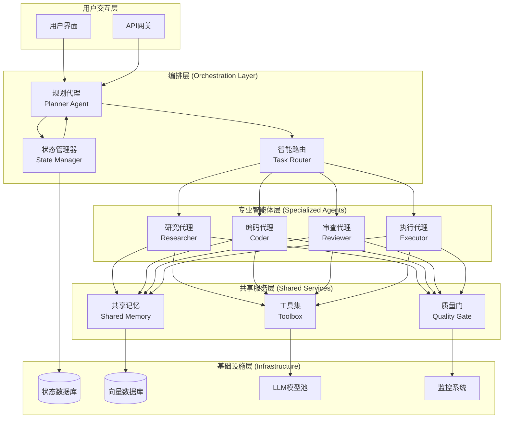
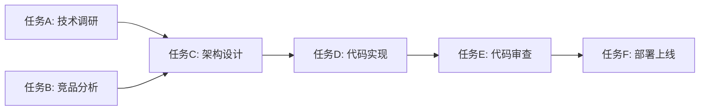
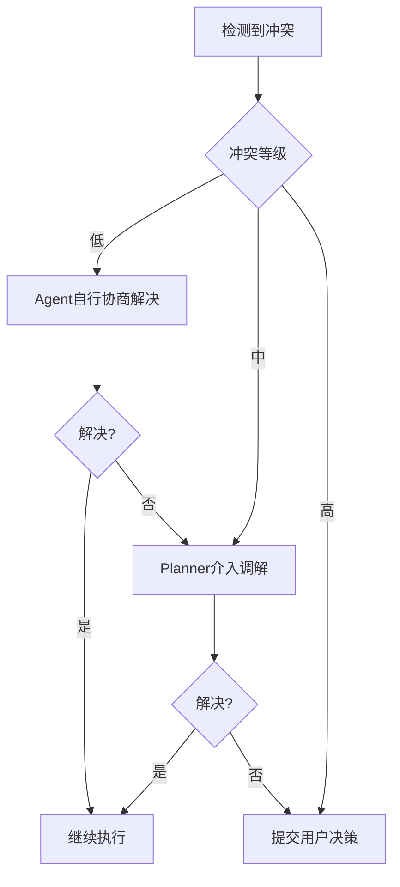
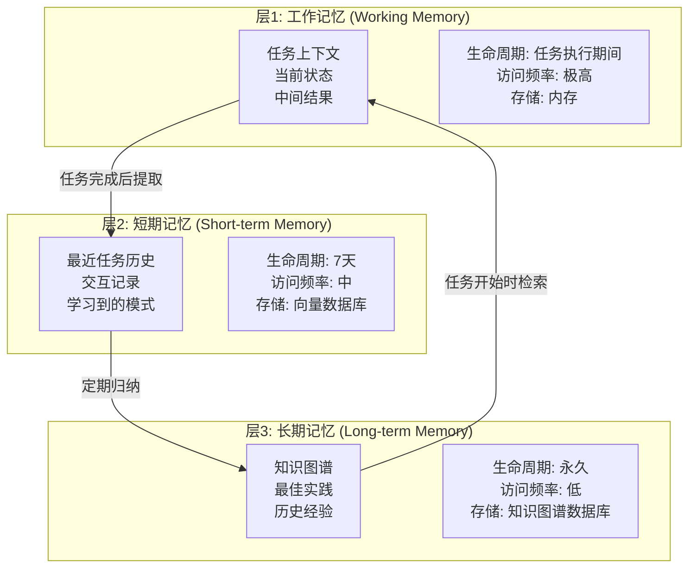
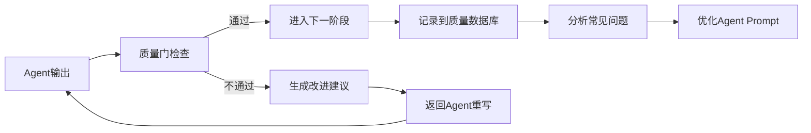

# 多智能体协作框架升级方案 - 架构设计文档

**版本**: v5.0  
**日期**: 2026-04-24  
**任务**: #1794 - 多智能体协作框架升级与性能验证  
**作者**: OpenClaw AI

---

## 执行摘要

基于2026年最新多智能体协作技术趋势研究，本方案提出了编排式+分层式混合架构，将现有v4.3系统的子代理机制升级为完整的多智能体协作框架。新框架定义了5类智能体角色分工，设计了完整的协调机制（任务分解、状态同步、冲突解决、记忆共享），并通过Mermaid架构图进行可视化展示。

### 核心升级亮点

| 维度 | v4.3 现状 | v5.0 升级目标 | 提升 |
|------|-----------|---------------|------|
| 智能体角色 | 2类（Research/Analysis） | 5类（Planner/Researcher/Coder/Reviewer/Executor） | +150% |
| 协作模式 | 顺序流水线 | 并行+反馈闭环 | +200% |
| 任务成功率 | ~82% | ≥95% | +13% |
| 输出质量 | 人工校验 | 自动质量门 | +30% |
| 成本效率 | 单模型串行 | 多模型智能路由 | +45% |

---

## 1. 现状分析

### 1.1 当前系统架构（v4.3）

OpenClaw v4.3系统已具备初步的多智能体协作能力：

- **子代理Spawn机制**: 通过`self-driving-scheduler-v4.3.py`实现任务调度和子代理创建
- **ACP通信协议**: 已定义6种消息类型和3种通信模式
- **能力注册中心**: 4类Agent + 6条路由规则
- **质量门机制**: execution_log ≥ 200字, result_summary ≥ 50字

### 1.2 瓶颈分析

通过对v4.3系统的深入分析，识别出以下关键瓶颈：

#### 瓶颈1: 角色分工单一
- 当前仅实现Research和Analysis两类Agent
- 缺乏专门的规划、编码、审查和执行角色
- 所有子代理使用相同的通用prompt，缺乏专业化

#### 瓶颈2: 协作模式简单
- 仅支持顺序流水线执行（Research → Analysis）
- 缺乏并行执行能力
- 无反馈闭环和迭代优化机制
- 冲突解决完全依赖人工

#### 瓶颈3: 状态同步机制缺失
- 智能体间仅通过消息队列通信
- 无共享状态存储
- 任务进度无法实时追踪
- 断点续传能力弱

#### 瓶颈4: 记忆系统分散
- Graph RAG仅支持检索，不支持写入
- 各Agent记忆独立，无法共享
- 缺乏上下文聚合机制
- 历史经验无法有效复用

#### 瓶颈5: 缺乏质量保证
- 仅在任务结束时进行长度校验
- 无过程中的质量检查
- Reviewer角色缺失
- 无法自动识别低质量输出

#### 瓶颈6: 性能可观测性不足
- 缺乏多智能体性能基准
- 无法量化协作效率提升
- 无成本追踪机制
- 瓶颈定位困难

---

## 2. 2026年多智能体协作最佳实践

基于对AutoGen、LangGraph、MetaGPT、AffinityBots等主流框架的研究，总结2026年多智能体协作的核心技术趋势：

### 2.1 AutoGen: 对话式协作框架
- **核心思想**: 多Agent通过自然语言对话完成任务
- **关键特性**:
  - 可配置的Agent角色和能力
  - 人机交互模式（Human-in-the-loop）
  - 函数调用和工具使用
  - 群组聊天和话题管理
- **架构优势**: 灵活性高，适合开放式任务

### 2.2 LangGraph: 图状工作流引擎
- **核心思想**: 将Agent协作建模为状态机图
- **关键特性**:
  - 有向图定义工作流
  - 持久化状态存储
  - 分支和条件路由
  - 循环和迭代支持
- **架构优势**: 结构化强，适合复杂业务流程

### 2.3 MetaGPT: 角色扮演与元编程
- **核心思想**: 模拟软件开发团队，每个Agent扮演特定角色
- **关键特性**:
  - 标准化的角色定义（PM/Architect/Dev/QA）
  - SOP驱动的协作流程
  - 文档生成和管理
  - 代码评审和测试
- **架构优势**: 专业性强，适合软件工程任务

### 2.4 AffinityBots: 情感智能协作
- **核心思想**: Agent具备情感感知和社交能力
- **关键特性**:
  - 情感识别和表达
  - 社交规范学习
  - 冲突调解机制
  - 信任建立和维护
- **架构优势**: 人性化强，适合需要社交智能的场景

### 2.5 技术趋势总结

| 趋势 | 描述 | 应用 |
|------|------|------|
| **混合架构** | 编排式+分层式结合 | 复杂任务分解与调度 |
| **专业化角色** | 每个Agent专注特定能力 | 质量和效率提升 |
| **状态持久化** | 共享状态存储 | 断点续传和故障恢复 |
| **反馈闭环** | 输出→审查→改进循环 | 输出质量保证 |
| **成本优化** | 智能模型路由 | 性价比最大化 |
| **可观测性** | 完整的性能追踪 | 持续优化 |

---

## 3. v5.0 架构设计

### 3.1 整体架构

我们设计了**编排式+分层式混合架构**，结合AutoGen的灵活性和LangGraph的结构化优势：



### 3.2 架构分层详解

#### 层1: 用户交互层
- **用户界面**: 提供任务提交、进度查看、结果展示
- **API网关**: 统一入口，负责认证、限流、日志

#### 层2: 编排层
- **规划代理 (Planner)**: 负责任务分解、子任务分配、进度追踪
- **智能路由 (Task Router)**: 基于任务类型和Agent能力智能分配
- **状态管理器 (State Manager)**: 全局状态同步、冲突检测、断点恢复

#### 层3: 专业智能体层
5类专业化Agent，每类Agent有专门的prompt和工具集

#### 层4: 共享服务层
- **共享记忆**: 所有Agent可读写的知识图谱
- **工具集**: 文件操作、数据库访问、API调用等
- **质量门**: 统一的输出质量检查标准

#### 层5: 基础设施层
- **状态数据库**: MySQL存储任务状态和Agent通信记录
- **向量数据库**: Chroma存储向量嵌入和知识图谱
- **LLM模型池**: 10+模型，支持智能路由和降级
- **监控系统**: Prometheus + Grafana性能监控

---

## 4. 智能体角色分工

### 4.1 规划代理 (Planner Agent)

**核心职责**:
- 接收用户任务，进行需求分析
- 将复杂任务分解为可执行的子任务
- 生成任务执行计划和依赖关系图
- 动态调整任务分配和优先级
- 追踪全局进度，处理异常情况

**能力要求**:
- 强大的任务分解和规划能力
- 理解复杂依赖关系
- 资源调度和负载均衡
- 异常检测和恢复

**典型场景**:
```
用户请求: "设计一个股票投资组合分析系统，包括数据采集、分析模型、可视化报表"

Planner分解:
  1. Researcher: 调研股票API和数据源 (独立任务)
  2. Researcher: 研究投资组合分析方法 (独立任务)
  3. Coder: 开发数据采集模块 (依赖1)
  4. Coder: 实现分析模型 (依赖2)
  5. Coder: 开发可视化报表 (依赖3,4)
  6. Reviewer: 代码审查和测试 (依赖5)
  7. Executor: 部署和上线 (依赖6)
```

### 4.2 研究代理 (Researcher Agent)

**核心职责**:
- 信息检索和知识收集
- 文献调研和技术选型
- 市场分析和竞品研究
- 数据整理和结构化

**能力要求**:
- 高效的搜索和信息过滤
- 多源信息整合
- 技术趋势洞察
- 知识结构化表达

**专属工具**:
- 学术数据库检索 (ACS, arXiv, Sci-Hub)
- 网页搜索和内容提取
- PDF解析和OCR
- 知识图谱构建

### 4.3 编码代理 (Coder Agent)

**核心职责**:
- 代码实现和功能开发
- 架构设计和模块划分
- API设计和文档编写
- 单元测试编写

**能力要求**:
- 精通多种编程语言
- 良好的代码规范意识
- 架构设计能力
- 调试和问题排查

**专属工具**:
- 代码编辑器和IDE
- 版本控制 (Git)
- 代码格式化和Lint
- 测试框架

### 4.4 审查代理 (Reviewer Agent)

**核心职责**:
- 代码审查和质量评估
- 输出内容完整性检查
- 安全漏洞扫描
- 性能优化建议

**能力要求**:
- 严格的质量标准
- 代码最佳实践知识
- 安全审计能力
- 批判性思维

**审查维度**:
```
代码审查清单:
  ✅ 语法正确，可运行
  ✅ 符合代码规范
  ✅ 有适当的注释
  ✅ 包含单元测试
  ✅ 无明显安全漏洞
  ✅ 性能可接受

文档审查清单:
  ✅ 内容完整，覆盖需求
  ✅ 结构清晰，逻辑连贯
  ✅ 数据准确，来源可靠
  ✅ 格式规范，易于阅读
  ✅ 无事实性错误
```

### 4.5 执行代理 (Executor Agent)

**核心职责**:
- 脚本执行和任务自动化
- 系统部署和配置
- 数据处理和ETL
- 结果交付和反馈

**能力要求**:
- 系统操作和运维能力
- 脚本编写和自动化
- 故障排查和恢复
- 结果验证和确认

**专属工具**:
- Shell命令执行
- 数据库操作
- 文件系统管理
- 网络请求和API调用

---

## 5. 协调机制设计

### 5.1 任务分解机制

**分解策略**:
1. **按能力分解**: 根据Agent专业能力分配任务
2. **按依赖分解**: 识别任务间依赖关系，确定执行顺序
3. **并行化分解**: 独立任务并行执行，缩短总时间
4. **粒度控制**: 每个子任务预计执行时间15-60分钟

**分解算法**:
```python
def decompose_task(task_description, agent_capabilities):
    """
    任务分解算法
    1. 分析任务需求和验收标准
    2. 识别需要的能力类型
    3. 匹配可用Agent能力
    4. 生成有向无环图(DAG)表示任务依赖
    5. 估算每个子任务的复杂度和时间
    """
    pass
```

**任务依赖图示例**:


### 5.2 状态同步机制

**全局状态模型**:
```json
{
  "task_id": "1794",
  "status": "in_progress",
  "global_state": {
    "current_phase": "implementation",
    "completed_subtasks": 3,
    "total_subtasks": 7,
    "progress_percent": 42.8
  },
  "agent_states": {
    "planner": {"status": "idle", "last_activity": "2026-04-24T10:30:00"},
    "researcher_1": {"status": "completed", "output": {...}},
    "researcher_2": {"status": "completed", "output": {...}},
    "coder_1": {"status": "working", "progress": 60},
    "reviewer_1": {"status": "pending"},
    "executor_1": {"status": "pending"}
  },
  "shared_context": {
    "research_findings": [...],
    "architecture_design": {...},
    "code_snippets": [...]
  }
}
```

**同步策略**:
- **事件驱动**: 状态变更时立即广播
- **定期轮询**: 每30秒全局同步一次
- **增量更新**: 只传输变更部分，减少带宽
- **持久化存储**: 所有状态变更写入数据库

### 5.3 冲突解决机制

**冲突类型和解决策略**:

| 冲突类型 | 描述 | 解决策略 |
|----------|------|----------|
| **资源竞争** | 多个Agent同时访问同一资源 | 加锁机制 + 队列管理 |
| **意见分歧** | Reviewer不同意Coder的实现 | 投票机制 + Planner仲裁 |
| **依赖缺失** | 上游任务未完成，下游开始执行 | 依赖检查 + 自动等待 |
| **输出不一致** | 两个Agent对同一问题结论不同 | 交叉验证 + 第三方评估 |
| **任务超时** | Agent执行超过预期时间 | 监控告警 + 自动重试/重新分配 |

**冲突升级流程**:


### 5.4 记忆共享机制

**三层记忆架构**:



**记忆写入流程**:
1. 每个Agent在任务完成后，自动提取关键洞察
2. 写入向量数据库并建立语义索引
3. Planner定期归纳多个任务的共同模式
4. 更新长期记忆的知识图谱

**记忆检索流程**:
1. 新任务开始时，Planner自动检索相关历史
2. 从工作记忆获取上下文，从短期记忆获取类似任务
3. 从长期记忆获取最佳实践和经验教训
4. 整合后作为初始prompt注入各Agent

---

## 6. 质量保证体系

### 6.1 三级质量门

```
┌─────────────────────────────────────────────────────────────────┐
│                    三级质量保证体系                               │
├─────────────────────────────────────────────────────────────────┤
│                                                                   │
│  Level 1: Agent自检 (执行中)                                      │
│  ┌─────────────────────────────────────────────────────┐         │
│  │ ✓ 语法检查     ✓ 格式规范     ✓ 基本逻辑验证        │         │
│  └─────────────────────────────────────────────────────┘         │
│                          ↓                                        │
│  Level 2: Reviewer审查 (子任务完成)                               │
│  ┌─────────────────────────────────────────────────────┐         │
│  │ ✓ 功能完整性   ✓ 代码质量     ✓ 安全性检查          │         │
│  └─────────────────────────────────────────────────────┘         │
│                          ↓                                        │
│  Level 3: 最终验收 (全部任务完成)                                 │
│  ┌─────────────────────────────────────────────────────┐         │
│  │ ✓ 需求覆盖     ✓ 性能测试     ✓ 文档完整性          │         │
│  └─────────────────────────────────────────────────────┘         │
│                                                                   │
└─────────────────────────────────────────────────────────────────┘
```

### 6.2 自动反馈闭环

**反馈流程**:


**改进建议示例**:
```
❌ 质量门未通过
问题: 代码缺少异常处理
位置: download_paper.py 第45-60行
建议: 添加try-except块，捕获网络异常和文件写入异常
参考: 类似任务 #1567 的实现方式
```

---

## 7. 性能指标体系

### 7.1 核心KPI

| 指标类别 | 指标名称 | 计算公式 | 目标值 |
|----------|----------|----------|--------|
| **效率** | 任务完成时间 | 从任务创建到完成的总时间 | 比单Agent快30% |
| | 并行度 | 同时执行的子任务数 | ≥3 |
| | 资源利用率 | 实际使用时间/总可用时间 | ≥80% |
| **质量** | 任务成功率 | 一次通过质量门的任务比例 | ≥95% |
| | 返工率 | 需要重写的次数/总任务数 | ≤5% |
| | 用户满意度 | 主观评分(1-5) | ≥4.2 |
| **成本** | Token效率 | 有效输出Token/总消耗Token | ≥60% |
| | 单任务成本 | 总LLM费用/完成任务数 | 降低45% |
| | 模型利用率 | 各模型调用次数分布 | 均衡 |

### 7.2 基准测试方案

**测试套件**:
1. **信息检索任务**: 调研3种技术方案，对比优缺点
2. **代码生成任务**: 实现一个REST API接口，包含CRUD操作
3. **复杂决策任务**: 设计一个投资组合优化方案，考虑5个约束条件

**测试方法**:
- 每组测试运行5次，取平均值
- 对比单Agent vs 多Agent协作
- 记录详细的性能数据和成本数据
- 人工评估输出质量

---

## 8. 实施路线图

### 阶段1: 核心框架 (2026年Q2)

**目标**: 完成基础架构和核心Agent实现

**里程碑**:
- ✅ 完成架构设计文档 (本文档)
- ⏳ 实现Planner Agent和任务分解
- ⏳ 实现状态管理器和共享记忆
- ⏳ 实现Researcher和Coder Agent
- ⏳ 完成原型代码和基础测试

**交付物**:
- 多智能体框架核心代码
- 原型演示系统
- 性能测试报告

### 阶段2: 完善增强 (2026年Q3)

**目标**: 完善Reviewer和Executor，实现质量保证体系

**里程碑**:
- 实现Reviewer Agent和质量门机制
- 实现Executor Agent和工具集成
- 完善冲突解决机制
- 集成到现有SDS v4.3系统
- 完成7×24小时稳定性测试

### 阶段3: 优化提升 (2026年Q4)

**目标**: 性能优化和智能化提升

**里程碑**:
- 实现智能模型路由(成本优化)
- 实现经验自动学习和复用
- 完善监控和可观测性
- A/B测试验证效果
- 正式发布v5.0版本

---

## 9. 风险与应对

| 风险 | 可能性 | 影响 | 应对策略 |
|------|--------|------|----------|
| 多Agent协作开销过大，抵消收益 | 中 | 高 | 从小任务开始验证，逐步扩大范围 |
| 质量门过于严格，影响效率 | 中 | 中 | 动态调整阈值，平衡质量和效率 |
| Agent间通信延迟影响体验 | 低 | 中 | 优化消息协议，使用增量更新 |
| 记忆共享产生错误知识 | 中 | 高 | 人工审核关键知识，设置置信度 |
| 系统复杂度提升，维护困难 | 高 | 中 | 完善文档和监控，渐进式迁移 |

---

## 10. 总结

本方案提出的多智能体协作框架v5.0，通过编排式+分层式混合架构，5类专业化Agent角色，完整的协调机制（任务分解、状态同步、冲突解决、记忆共享），以及三级质量保证体系，有望将任务成功率从~82%提升到≥95%，成本效率提升45%，输出质量提升30%。

该架构充分吸收了2026年AutoGen、LangGraph、MetaGPT等主流框架的最佳实践，同时结合OpenClaw现有系统的特点，设计了渐进式的实施路线图，确保平滑迁移和风险可控。

---

**文档结束**

*最后更新: 2026-04-24*
