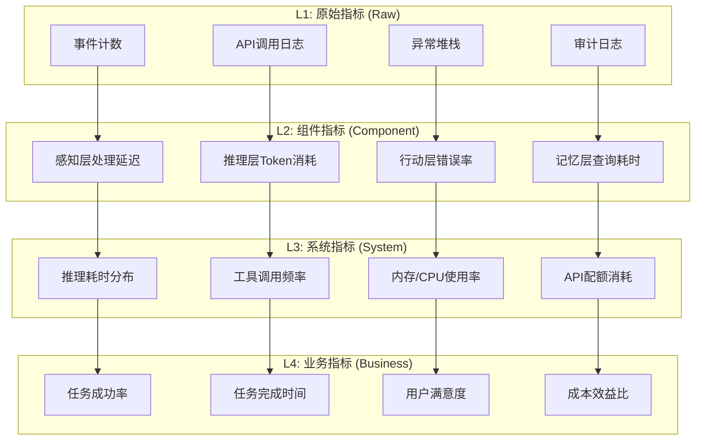
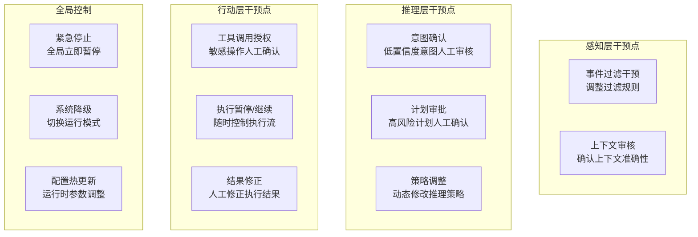

# 自主AI系统可观测性与人工干预机制设计

**日期：** 2026年4月24日  
**版本：** v1.0  
**作者：** AI架构设计团队

---

## 目录
1. [监控指标体系设计](#1-监控指标体系设计)
2. [告警规则与通知机制](#2-告警规则与通知机制)
3. [人工干预断点设计](#3-人工干预断点设计)
4. [权限控制与审计机制](#4-权限控制与审计机制)
5. [监控面板原型说明](#5-监控面板原型说明)

---

## 1. 监控指标体系设计

### 1.1 指标分层架构



### 1.2 核心指标定义

#### 1.2.1 任务执行类指标

| 指标名称 | 定义 | 目标值 | 告警阈值 |
|----------|------|--------|----------|
| **任务成功率** | 成功完成的任务数 / 总任务数 | ≥ 95% | < 90% |
| **任务完成率** | 已完成任务数 / 应完成任务数 | ≥ 98% | < 95% |
| **平均完成时间** | 从创建到完成的平均耗时 | < 5分钟 | > 15分钟 |
| **重试率** | 发生重试的任务占比 | < 10% | > 20% |
| **人工干预率** | 需要人工介入的任务占比 | < 5% | > 15% |

#### 1.2.2 推理性能类指标

| 指标名称 | 定义 | 目标值 | 告警阈值 |
|----------|------|--------|----------|
| **推理平均耗时** | LLM单次推理平均响应时间 | < 3秒 | > 10秒 |
| **Token消耗速率** | 每分钟消耗的Token数量 | 可控 | > 配额80% |
| **推理重试率** | 推理API调用重试比例 | < 5% | > 15% |
| **上下文命中率** | 记忆召回的相关度 | ≥ 85% | < 70% |
| **规划迭代次数** | 单任务平均规划迭代次数 | < 3次 | > 5次 |

#### 1.2.3 工具执行类指标

| 指标名称 | 定义 | 目标值 | 告警阈值 |
|----------|------|--------|----------|
| **工具调用成功率** | 工具成功调用比例 | ≥ 98% | < 90% |
| **工具平均延迟** | 工具响应平均时间 | < 2秒 | > 8秒 |
| **工具可用性** | 工具健康检查通过率 | ≥ 99% | < 95% |
| **超时率** | 工具调用超时比例 | < 2% | > 8% |

#### 1.2.4 系统健康类指标

| 指标名称 | 定义 | 目标值 | 告警阈值 |
|----------|------|--------|----------|
| **事件队列长度** | 待处理事件数量 | < 100 | > 500 |
| **内存使用率** | 系统内存使用比例 | < 70% | > 85% |
| **CPU使用率** | 处理器使用比例 | < 60% | > 80% |
| **错误率** | 系统错误发生频率 | < 1% | > 5% |

### 1.3 指标采集方案

#### 1.3.1 采集层级
```typescript
interface MetricsCollector {
    // 实时采集（秒级）
    realtime: {
        events: EventCounter;
        api_calls: ApiCounter;
        errors: ErrorCounter;
    };
    
    // 聚合采集（分钟级）
    aggregated: {
        task_stats: TaskAggregator;
        performance: PerformanceAggregator;
        resource: ResourceAggregator;
    };
    
    // 摘要采集（小时级）
    summary: {
        daily_report: DailyReporter;
        trend_analysis: TrendAnalyzer;
        anomaly_detection: AnomalyDetector;
    };
}
```

#### 1.3.2 数据存储策略
- **热数据（7天）：** Prometheus + Grafana，用于实时监控
- **温数据（3个月）：** ClickHouse，用于趋势分析
- **冷数据（永久）：** 对象存储，用于合规审计

---

## 2. 告警规则与通知机制

### 2.1 告警分级标准

| 级别 | 名称 | 响应时间 | 通知方式 | 处理要求 |
|------|------|----------|----------|----------|
| **P0** | 紧急故障 | 5分钟内 | 电话 + 短信 + 钉钉 | 立即处理，系统可能停止服务 |
| **P1** | 严重故障 | 15分钟内 | 钉钉 + 短信 | 尽快处理，影响核心功能 |
| **P2** | 一般故障 | 1小时内 | 钉钉群通知 | 工作时间处理，影响非核心 |
| **P3** | 告警通知 | 4小时内 | 邮件通知 | 计划性处理，潜在问题 |
| **P4** | 信息通知 | 24小时内 | 系统日志 | 无需响应，仅记录 |

### 2.2 核心告警规则

#### 2.2.1 P0级告警规则
```yaml
p0_alerts:
  - name: system_critical_failure
    condition: error_rate > 30% AND duration > 2 minutes
    description: 系统错误率超过30%持续2分钟以上
  
  - name: task_success_crash
    condition: task_success_rate < 50% AND duration > 5 minutes
    description: 任务成功率断崖式下跌至50%以下
  
  - name: memory_exhaustion
    condition: memory_usage > 95% AND duration > 1 minute
    description: 内存耗尽，系统可能OOM
  
  - name: all_tools_down
    condition: available_tools_count == 0
    description: 所有工具不可用，系统无法执行任何操作
```

#### 2.2.2 P1级告警规则
```yaml
p1_alerts:
  - name: high_error_rate
    condition: error_rate > 10% AND duration > 5 minutes
    description: 错误率持续偏高
  
  - name: queue_backlog
    condition: pending_tasks > 1000 AND growing
    description: 任务队列严重积压
  
  - name: model_api_failure
    condition: model_api_failure_rate > 20%
    description: 推理API大面积失败
  
  - name: security_breach_attempt
    condition: unauthorized_attempts > 5 in 1 minute
    description: 检测到潜在的安全入侵尝试
```

#### 2.2.3 P2级告警规则
```yaml
p2_alerts:
  - name: performance_degradation
    condition: avg_latency > baseline * 2
    description: 系统性能下降超过基准2倍
  
  - name: tool_degradation
    condition: single_tool_failure_rate > 30%
    description: 单个工具故障率较高
  
  - name: quota_warning
    condition: api_quota_usage > 70%
    description: API配额使用超过70%
```

### 2.3 告警升级与抑制

#### 2.3.1 自动升级机制
- 同一P2告警持续 > 30分钟 → 升级为P1
- 同一P1告警持续 > 1小时 → 升级为P0
- 多个同类告警同时触发 → 升级严重级别

#### 2.3.2 告警抑制规则
- **风暴抑制：** 1分钟内同类告警超过10个自动合并
- **依赖抑制：** 底层故障时，抑制上层告警
- **维护窗口：** 计划维护期间自动抑制相关告警
- **重复抑制：** 相同告警在N分钟内不再重复发送

### 2.4 通知渠道配置

```yaml
notification_channels:
  p0:
    - type: phone_call
      recipients: [on_call_engineer]
    - type: sms
      recipients: [on_call_engineer, tech_lead]
    - type: dingtalk
      at_all: true
  
  p1:
    - type: dingtalk
      at: [on_call_engineer]
    - type: sms
      recipients: [on_call_engineer]
  
  p2:
    - type: dingtalk_group
      channel: tech_alerts
  
  p3:
    - type: email
      recipients: [dev_team]
  
  p4:
    - type: system_log
```

---

## 3. 人工干预断点设计

### 3.1 干预点分布架构



### 3.2 关键干预点详细设计

#### 3.2.1 意图确认干预点
**触发条件：**
- 意图分类置信度 < 0.85
- 意图存在歧义（Top2置信度差 < 0.1）
- 检测到可能的指令注入攻击
- 用户明确要求人工确认

**干预界面：**
```typescript
interface IntentConfirmation {
    taskId: string;
    originalInput: string;
    detectedIntents: Array<{
        intent: string;
        confidence: number;
        description: string;
    }>;
    suggestedAction: string;
    options: [
        'confirm_intent',
        'select_alternative',
        'rewrite_input',
        'escalate_to_human',
        'cancel_task'
    ];
    timeout: number;           // 30秒超时
    timeoutAction: 'hold' | 'auto_confirm' | 'cancel';
}
```

**超时策略：** 高风险任务超时取消，普通任务超时挂起等待。

#### 3.2.2 计划审批干预点
**触发条件：**
- 任务风险评分 ≥ 70分
- 涉及数据删除、修改、对外发送等敏感操作
- 预估成本超过阈值（如 > $10）
- 首次执行的新型任务
- 工具组合可能产生不可预知后果

**审批表单：**
```typescript
interface PlanApproval {
    taskId: string;
    taskDescription: string;
    riskScore: number;
    riskFactors: string[];
    executionPlan: {
        steps: Array<{
            step: number;
            description: string;
            tool: string;
            estimatedCost: number;
        }>;
        totalEstimatedCost: number;
        estimatedTime: number;
    };
    rollbackPlan: string;
    approvalOptions: [
        'approve',
        'approve_with_modification',
        'request_more_info',
        'reject',
        'delegate'
    ];
    requiredApproverRole: 'admin' | 'operator' | 'reviewer';
}
```

#### 3.2.3 工具调用授权干预点
**触发条件：**
- 工具风险等级为 high
- 工具调用将产生不可逆影响
- 工具调用涉及敏感数据访问
- 工具调用超出常规模式

**授权内容：**
- 操作类型和范围
- 影响的数据和系统
- 预期的结果和副作用
- 回滚方案可用性

#### 3.2.4 执行暂停/继续干预点
**设计特点：**
- 支持在任意两个原子操作之间暂停
- 暂停时保留完整上下文和状态
- 支持暂停时查看和修改任务参数
- 支持暂停时切换人工执行模式
- 支持批量暂停/恢复相关任务

**暂停信号处理：**
```typescript
// 收到暂停信号后的行为
onPauseSignal(): void {
    // 1. 完成当前原子操作
    await this.completeCurrentOperation();
    
    // 2. 保存执行状态检查点
    await this.saveCheckpoint();
    
    // 3. 释放非关键资源
    this.releaseTemporaryResources();
    
    // 4. 更新状态为PAUSED
    this.updateTaskStatus('paused');
    
    // 5. 通知监控系统
    this.notifyPauseComplete();
}
```

### 3.3 干预方式设计

#### 3.3.1 主动干预
- **控制面板操作：** 通过监控面板进行暂停、继续、终止等操作
- **API调用：** 通过标准化API进行程序化干预
- **命令行工具：** 运维人员通过CLI进行紧急操作
- **即时消息：** 通过钉钉/微信机器人进行交互式干预

#### 3.3.2 被动干预（系统请求）
- **审批请求：** 系统发起需要人工确认的请求
- **信息补充：** 系统请求缺失的关键信息
- **歧义澄清：** 系统请求澄清模糊的指令
- **异常处理：** 系统遇到无法自动恢复的异常时请求协助

### 3.4 干预超时与降级

| 干预类型 | 超时时间 | 超时策略 |
|----------|----------|----------|
| 紧急停止确认 | 10秒 | 自动执行 |
| 高风险审批 | 5分钟 | 挂起等待 |
| 一般审批 | 30分钟 | 邮件提醒 |
| 信息补充请求 | 1小时 | 任务降级处理 |
| 歧义澄清请求 | 2小时 | 使用最佳猜测继续 |

---

## 4. 权限控制与审计机制

### 4.1 RBAC权限模型

#### 4.1.1 角色定义

| 角色 | 权限范围 | 人员类型 |
|------|----------|----------|
| **SUPER_ADMIN** | 全部权限，包括系统级配置修改 | 技术负责人 |
| **ADMIN** | 任务管理、用户管理、配置查看 | 运维主管 |
| **OPERATOR** | 任务操作、审批、查看监控 | 运维人员 |
| **REVIEWER** | 查看任务、审批，但不能操作 | 业务审核人员 |
| **OBSERVER** | 只读查看权限 | 观察员、审计 |

#### 4.1.2 权限矩阵

| 操作 | SUPER_ADMIN | ADMIN | OPERATOR | REVIEWER | OBSERVER |
|------|-------------|-------|----------|----------|----------|
| 紧急停止系统 | ✅ | ✅ | ✅ | ❌ | ❌ |
| 修改系统配置 | ✅ | ✅ | ❌ | ❌ | ❌ |
| 审批高风险任务 | ✅ | ✅ | ✅ | ✅ | ❌ |
| 暂停/继续任务 | ✅ | ✅ | ✅ | ❌ | ❌ |
| 终止任务 | ✅ | ✅ | ✅ | ❌ | ❌ |
| 修改任务参数 | ✅ | ✅ | ✅ | ❌ | ❌ |
| 查看监控面板 | ✅ | ✅ | ✅ | ✅ | ✅ |
| 查看审计日志 | ✅ | ✅ | ❌ | ❌ | ❌ |
| 用户管理 | ✅ | ✅ | ❌ | ❌ | ❌ |
| 导出数据 | ✅ | ✅ | ✅ | ✅ | ❌ |

### 4.2 最小权限原则

- **临时权限：** 高危操作需要临时申请权限，使用后自动回收
- **权限过期：** 所有权限设置有效期，定期审计回收
- **职责分离：** 审批人和执行人不能为同一人（高风险任务）
- **环境隔离：** 生产环境权限严于测试环境

### 4.3 审计日志系统

#### 4.3.1 审计事件类型

```typescript
enum AuditEventType {
    // 认证授权
    LOGIN = 'auth.login',
    LOGOUT = 'auth.logout',
    PERMISSION_CHANGE = 'auth.permission_change',
    
    // 任务操作
    TASK_CREATE = 'task.create',
    TASK_PAUSE = 'task.pause',
    TASK_RESUME = 'task.resume',
    TASK_TERMINATE = 'task.terminate',
    TASK_MODIFY = 'task.modify',
    
    // 审批操作
    APPROVAL_GRANT = 'approval.grant',
    APPROVAL_REJECT = 'approval.reject',
    APPROVAL_DELEGATE = 'approval.delegate',
    
    // 系统操作
    CONFIG_CHANGE = 'system.config_change',
    EMERGENCY_STOP = 'system.emergency_stop',
    DOWNGRADE = 'system.downgrade',
    
    // 数据操作
    DATA_EXPORT = 'data.export',
    DATA_MODIFY = 'data.modify',
    DATA_DELETE = 'data.delete',
}
```

#### 4.3.2 审计日志结构

```typescript
interface AuditLogEntry {
    id: string;
    timestamp: number;
    eventType: AuditEventType;
    actor: {
        type: 'user' | 'system' | 'api';
        id: string;
        name: string;
        ip?: string;
        userAgent?: string;
    };
    resource: {
        type: string;
        id: string;
    };
    action: string;
    result: 'success' | 'failure' | 'partial';
    details: Record<string, any>;
    reason?: string;           // 操作原因说明
    previousState?: any;       // 操作前状态
    newState?: any;            // 操作后状态
    sessionId?: string;
}
```

#### 4.3.3 审计日志保证

- **不可篡改：** 日志写入后不可修改，使用哈希链保证完整性
- **永久保留：** 审计日志永久存储，满足合规要求
- **加密存储：** 敏感字段加密存储
- **独立存储：** 审计日志独立于业务数据存储

### 4.4 合规与报告

#### 4.4.1 定期审计报告
- **日报：** 当日关键操作汇总、异常事件统计
- **周报：** 权限使用分析、异常模式识别
- **月报：** 合规性评估、改进建议
- **年度审计：** 全面的安全审计和合规检查

#### 4.4.2 合规支持
- 支持GDPR数据访问请求处理
- 支持等保2.0三级要求
- 支持SOC2审计标准
- 支持自定义合规规则

---

## 5. 监控面板原型说明

### 5.1 面板整体布局

监控面板采用三栏布局设计：

```
┌─────────────────────────────────────────────────────────────────┐
│  顶部导航栏  [Logo] [系统状态] [任务] [工具] [告警] [设置]      │
├──────────┬──────────────────────────────────────────┬───────────┤
│          │                                          │           │
│  左侧    │         中央主展示区域                   │  右侧     │
│  快捷    │                                          │  任务     │
│  操作    │  ┌──────────────────────────────────┐   │  队列     │
│  面板    │  │        核心指标仪表盘             │   │           │
│          │  └──────────────────────────────────┘   │  当前     │
│  [紧急   │                                          │  运行     │
│   停止]  │  ┌──────────────────────────────────┐   │  任务     │
│  [暂停  │  │        实时趋势图表               │   │           │
│   全部]  │  └──────────────────────────────────┘   │  最近     │
│  [系统  │                                          │  完成     │
│   降级]  │  ┌──────────────────────────────────┐   │           │
│          │  │        告警列表                   │   │  人工     │
│          │  └──────────────────────────────────┘   │  待处理   │
│          │                                          │           │
└──────────┴──────────────────────────────────────────┴───────────┘
```

### 5.2 核心功能模块

#### 5.2.1 实时指标仪表盘
展示以下关键指标卡片：
- 任务成功率（实时 + 24小时趋势）
- 当前并发任务数
- 平均推理耗时
- 工具可用率
- API配额剩余
- 活跃告警数

每个指标卡片支持：
- 点击查看详细趋势
- 快速设置告警阈值
- 查看历史数据对比

#### 5.2.2 任务执行监控
- 任务列表：实时滚动更新的任务执行情况
- 任务详情面板：点击任务查看完整执行链路
- 任务控制：对选中任务进行暂停/继续/终止操作
- 任务搜索：按ID、类型、状态、时间筛选

#### 5.2.3 人工干预工作台
- 待审批任务列表：显示需要人工确认的任务
- 快速审批：一键批准/拒绝操作
- 批量处理：支持多项任务批量审批
- 干预历史：记录所有人工操作历史

#### 5.2.4 告警中心
- 分级告警展示：P0-P4分级显示
- 告警详情：点击查看告警上下文和处理建议
- 告警操作：确认、关闭、指派、备注
- 告警统计：告警趋势、Top告警类型分析

#### 5.2.5 系统健康面板
- 组件健康状态：感知、推理、行动、记忆各模块健康度
- 资源使用情况：CPU、内存、磁盘、网络实时监控
- 工具健康检查：各工具可用性状态
- 依赖服务状态：数据库、消息队列、外部API状态

### 5.3 交互特性

#### 5.3.1 实时更新
- 数据WebSocket实时推送，无需刷新
- 支持调整刷新频率（1s - 30s）
- 离线自动重连和数据补全

#### 5.3.2 响应式设计
- 支持桌面端、平板、移动端适配
- 关键信息优先展示原则
- 手势操作支持（移动端）

#### 5.3.3 可定制性
- 支持用户自定义仪表盘布局
- 指标卡片可拖拽调整位置
- 支持保存多个视图配置
- 深色/浅色主题切换

### 5.4 技术实现要点

监控面板原型使用以下技术栈：
- **框架：** HTML5 + Vanilla JavaScript
- **图表库：** Chart.js v4.x（轻量级、功能全面）
- **UI组件：** Tailwind CSS v3
- **实时通信：** SSE (Server-Sent Events)
- **数据模拟：** 内置演示数据生成器

详见配套文件：`monitoring_dashboard.html`

---

## 附录

### A. 术语表
- **RBAC**: Role-Based Access Control，基于角色的访问控制
- **SLA**: Service Level Agreement，服务等级协议
- **SSE**: Server-Sent Events，服务器推送事件
- **OOM**: Out of Memory，内存溢出

### B. 参考资料
1. OpenTelemetry 观测性最佳实践 (2026)
2. Prometheus 告警规则设计指南
3. NIST 访问控制标准 (SP 800-53)
4. SOC2 审计合规要求

---

**文档结束**
