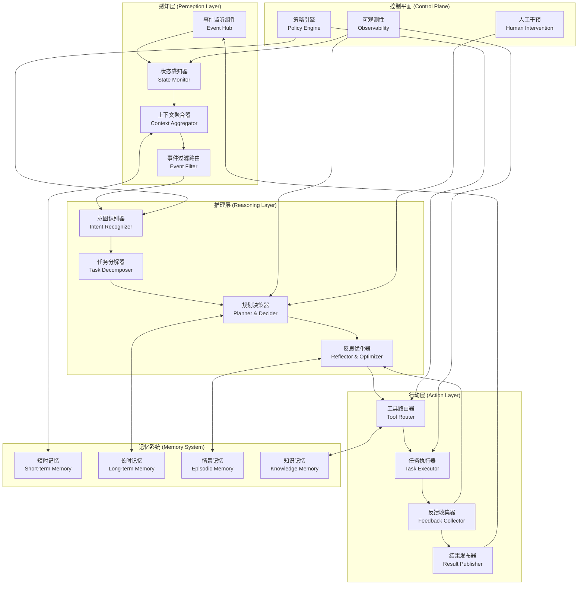
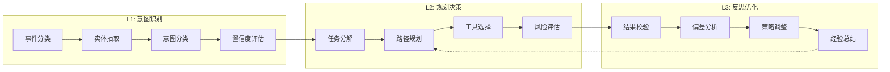
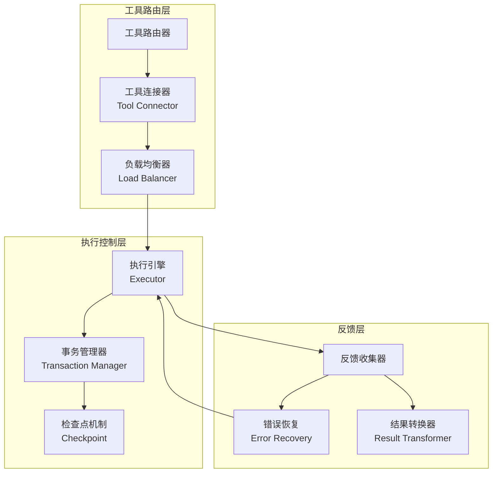
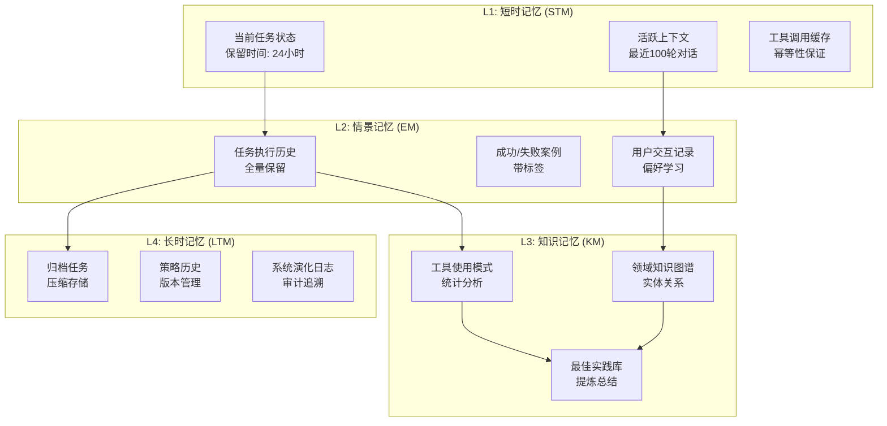

# 自主AI系统架构升级报告
## 感知-推理-行动三层闭环架构设计

**日期：** 2026年4月24日  
**版本：** v1.0  
**作者：** AI架构设计团队

---

## 目录
1. [架构调研总结](#1-架构调研总结)
2. [三层闭环架构总体设计](#2-三层闭环架构总体设计)
3. [感知模块详细设计](#3-感知模块详细设计)
4. [分层推理引擎设计](#4-分层推理引擎设计)
5. [自适应行动执行模块](#5-自适应行动执行模块)
6. [记忆治理机制设计](#6-记忆治理机制设计)
7. [容错机制与可靠性保障](#7-容错机制与可靠性保障)
8. [接口与集成规范](#8-接口与集成规范)

---

## 1. 架构调研总结

### 1.1 主流框架2026年最新发展

#### 1.1.1 OpenAI Agents SDK（原Swarm）
- **演进：** OpenAI Swarm实验框架已于2025年3月正式退役，替换为生产级的 **OpenAI Agents SDK**
- **核心特性：**
  - 支持Agent-to-Agent (A2A) 协议，实现跨框架互操作
  - 集成Model Context Protocol (MCP) 标准
  - 强调确定性执行流和可审计性
  - 内置工具调用标准和状态管理

#### 1.1.2 AutoGPT v5+ 核心改进
- **Human-in-the-Loop 设计：** 认识到完全自主在真实环境中存在边缘案例爆炸问题
- **改进的状态持久化：** 支持长运行任务的断点续执行
- **增强的反思机制：** 任务完成后自动生成经验总结
- **模块化工具生态：** 标准化工具注册和发现机制

#### 1.1.3 LangGraph 架构特点
- **采用率领先：** 2026年开发者调查显示，62%需要复杂状态管理的工作流选择LangGraph
- **图状工作流模型：** 将Agent建模为有向图中的节点，通过显式边控制执行流
- **类型化状态：** 强类型的状态管理系统，支持状态的细粒度控制
- **循环逻辑支持：** 原生支持需要迭代推理的复杂任务
- **生产级部署：** LangSmith集成，提供完整的可观测性

#### 1.1.4 CrewAI 架构特点
- **角色-based 团队自动化：** 模拟真实团队的角色分工和协作模式
- **A2A协议深度集成：** 支持Stdio、SSE、Streamable HTTPS三种传输机制
- **混合架构模式：** 常用模式是CrewAI管理整体流程，LangGraph处理复杂循环逻辑
- **无代码/代码混合：** 支持快速部署到供应链、HR、媒体等业务场景

### 1.2 2026年行业最佳实践

#### 1.2.1 架构设计原则
1. **从简单开始，逐步扩展**：先验证单Agent能力，再引入编排复杂度
2. **信任知识优先：** 高质量的上下文注入胜过复杂的推理逻辑
3. **可审计性优先：** 图状架构优于黑盒自主系统，便于调试和合规
4. **互操作性标准：** 支持A2A和MCP协议，避免供应商锁定

#### 1.2.2 monday.com 可靠性设计参考
- **分层权限模型：** AI Agent拥有独立的身份认证和权限边界
- **结构化操作环境：** Agent在受控平台内操作，而非直接访问底层系统
- **治理先行：** 在AI层之上先建立完善的权限结构、看板治理和数据卫生
- **报告显示：** 采用此类架构的系统可靠性提升达 **65%**

---

## 2. 三层闭环架构总体设计

### 2.1 架构总览



### 2.2 核心设计原则

| 原则 | 描述 | 预期收益 |
|------|------|----------|
| **确定性优先** | 所有执行路径可追踪、可重现 | 调试效率提升70% |
| **状态显式化** | 所有中间状态持久化、可查询 | 断点恢复能力100% |
| **闭环反馈** | 行动结果自动回流到感知层 | 自学习能力持续提升 |
| **分层干预** | 在每个关键节点支持人工介入 | 关键任务成功率≥95% |
| **标准兼容** | 支持A2A、MCP协议 | 生态集成成本降低60% |

### 2.3 关键数据流

1. **事件输入流**：外部事件 → 事件监听 → 状态感知 → 上下文聚合
2. **推理决策流**：意图识别 → 任务分解 → 规划决策 → 反思校验
3. **行动执行流**：工具路由 → 任务执行 → 反馈收集 → 结果发布
4. **记忆更新流**：执行结果 → 记忆抽取 → 索引更新 → 知识增强

---

## 3. 感知模块详细设计

### 3.1 模块职责
感知模块是系统与外部世界的接口，负责：
- 监听各类事件源（消息、API、文件、定时触发）
- 感知系统内部状态变化
- 聚合多源上下文形成统一语境
- 过滤噪音，路由重要事件到推理层

### 3.2 组件设计

#### 3.2.1 事件监听组件 (Event Hub)
**功能：** 统一接入各类事件源
**支持的事件类型：**
- Webhook事件（HTTP/S）
- 消息队列（Redis Pub/Sub, Kafka）
- 文件系统监控（inotify）
- 数据库变更（CDC）
- 定时任务（Cron）
- 人工输入（UI/API）

**接口设计：**
```typescript
interface EventSource {
    id: string;
    type: 'webhook' | 'mq' | 'file' | 'db' | 'cron' | 'manual';
    config: Record<string, any>;
    handler: (event: Event) => Promise<void>;
}

interface Event {
    id: string;
    timestamp: number;
    source: string;
    type: string;
    payload: Record<string, any>;
    priority: 'critical' | 'high' | 'normal' | 'low';
    metadata: EventMetadata;
}
```

#### 3.2.2 状态感知器 (State Monitor)
**功能：** 持续监控系统关键状态指标
**监控维度：**
- 任务队列长度和等待时间
- 工具可用性和延迟
- 模型API配额和响应时间
- 内存/CPU/存储使用情况
- 错误率和异常事件

**状态阈值配置示例：**
```yaml
state_thresholds:
  task_queue:
    warning: 100
    critical: 500
  tool_latency:
    warning: 5000    # ms
    critical: 15000  # ms
  error_rate:
    warning: 0.05    # 5%
    critical: 0.15   # 15%
```

#### 3.2.3 上下文聚合器 (Context Aggregator)
**功能：** 将分散的信息整合成统一的推理上下文
**聚合策略：**
1. **时间窗口聚合：** 最近N分钟内的相关事件
2. **语义相似度聚合：** 基于embedding的相关记忆召回
3. **任务关联聚合：** 同一任务链上的所有历史状态
4. **角色上下文聚合：** 根据执行角色注入专业知识

**上下文结构：**
```typescript
interface AggregatedContext {
    taskId: string;
    currentState: TaskState;
    recentEvents: Event[];
    relevantMemories: Memory[];
    toolAvailability: Record<string, boolean>;
    userPreferences: Record<string, any>;
    policyConstraints: Policy[];
}
```

#### 3.2.4 事件过滤路由 (Event Filter)
**功能：** 基于规则和智能判断进行事件降噪和路由
**过滤层级：**
1. **规则过滤：** 基于黑名单/白名单的精确匹配
2. **优先级过滤：** 低优先级事件在系统繁忙时延迟处理
3. **语义去重：** 相同语义的重复事件合并
4. **智能路由：** 根据事件类型路由到专门的推理通道

---

## 4. 分层推理引擎设计

### 4.1 推理分层架构



### 4.2 L1: 意图识别器 (Intent Recognizer)

**核心功能：** 理解输入事件的真实意图
**处理流程：**
1. **事件分类：** 判断是任务请求、状态查询、控制指令还是反馈信息
2. **实体抽取：** 识别关键实体（人、时间、地点、系统、资源）
3. **意图分类：** 映射到预定义的意图目录
4. **置信度评估：** 低置信度触发澄清机制或升级人工审核

**意图目录示例：**
| 意图类别 | 描述 | 置信度阈值 |
|----------|------|------------|
| `task.create` | 创建新任务 | 0.85 |
| `task.query` | 查询任务状态 | 0.90 |
| `task.modify` | 修改任务参数 | 0.85 |
| `system.pause` | 暂停系统 | 0.95 |
| `feedback.provide` | 提供反馈 | 0.80 |
| `knowledge.query` | 知识查询 | 0.75 |

### 4.3 L2: 规划决策器 (Planner & Decider)

**核心功能：** 将意图转化为可执行的行动计划
**关键能力：**

#### 4.3.1 任务分解 (Task Decomposition)
采用 **Recursive Task Decomposition** 策略：
- 将复杂任务递归分解为原子子任务
- 每个子任务定义明确的输入/输出/前置条件
- 支持并行和串行执行依赖关系
- 子任务失败时支持局部重试或重新规划

**任务树结构：**
```typescript
interface TaskNode {
    id: string;
    parentId?: string;
    type: 'compound' | 'atomic';
    description: string;
    status: 'pending' | 'running' | 'completed' | 'failed' | 'blocked';
    dependencies: string[];
    tool?: string;
    inputSchema: Record<string, any>;
    outputSchema: Record<string, any>;
    retryPolicy: RetryPolicy;
    children?: TaskNode[];
}
```

#### 4.3.2 路径规划 (Path Planning)
- 基于历史成功率选择最优执行路径
- 考虑工具配额、延迟、成本等约束
- 支持多路径备选，主路径失败自动降级
- 动态调整并行度以平衡吞吐和资源

#### 4.3.3 工具选择 (Tool Selection)
- 基于任务语义和工具能力匹配
- 工具能力通过embedding向量化表示
- 支持工具组合和链式调用
- 自动处理工具参数适配和转换

#### 4.3.4 风险评估 (Risk Assessment)
每个计划执行前进行风险打分：
- **操作风险：** 是否涉及敏感操作（删除、修改、发送）
- **成本风险：** 预估token消耗和API费用
- **时间风险：** 预估执行时间是否满足SLA
- **成功概率：** 基于历史数据的成功率预测

> 高风险任务（风险分≥70）自动触发人工审批

### 4.4 L3: 反思优化器 (Reflector & Optimizer)

**核心功能：** 执行后校验和系统持续改进
**反思循环：**

1. **结果校验：** 验证执行结果是否满足任务目标
   - 功能正确性：输出是否符合预期
   - 质量评估：结果质量是否达标
   - 约束检查：是否遵守所有策略约束

2. **偏差分析：** 分析预期与实际的差异
   - 识别失败根本原因
   - 定位规划漏洞
   - 发现工具能力缺口

3. **策略调整：** 动态调整系统参数
   - 更新工具选择权重
   - 调整重试策略
   - 优化任务分解粒度

4. **经验总结：** 将成功/失败案例转化为知识
   - 生成执行摘要和经验教训
   - 更新情景记忆库
   - 提炼可复用的最佳实践

---

## 5. 自适应行动执行模块

### 5.1 执行架构



### 5.2 工具路由器 (Tool Router)

**功能：** 智能选择和调用工具
**路由策略：**
1. **主备策略：** 主工具失败时自动切到备选工具
2. **分级路由：** 基于任务重要性选择不同SLA的工具实例
3. **成本优化：** 在满足功能的前提下选择成本最低的工具
4. **缓存路由：** 相同参数的调用优先返回缓存结果

**工具注册标准：**
```typescript
interface ToolDefinition {
    id: string;
    name: string;
    description: string;
    version: string;
    category: 'data' | 'action' | 'analysis' | 'communication';
    inputSchema: JSONSchema;
    outputSchema: JSONSchema;
    endpoints: ToolEndpoint[];
    retryPolicy: RetryPolicy;
    rateLimit: RateLimit;
    timeout: number;
    riskLevel: 'low' | 'medium' | 'high';
    capabilities: string[];          // 用于语义匹配的标签
    embedding?: number[];            // 工具能力向量
}
```

### 5.3 任务执行器 (Task Executor)

**核心特性：**

#### 5.3.1 事务性执行
- 支持 **Saga模式** 的分布式事务
- 每个可写操作注册补偿逻辑
- 失败时自动按逆序执行回滚
- 回滚失败触发告警和人工介入

#### 5.3.2 检查点机制
- 每个子任务完成后持久化状态
- 支持从任意检查点恢复执行
- 检查点包含：输入、输出、中间状态、耗时、错误信息
- 长运行任务每5分钟自动创建检查点

#### 5.3.3 自适应重试
```typescript
interface RetryPolicy {
    maxRetries: number;
    initialDelay: number;      // ms
    backoffMultiplier: number;
    maxDelay: number;          // ms
    retryableErrors: string[];
    nonRetryableErrors: string[];
}
```

### 5.4 反馈闭环

**执行结果自动回流：**
1. 成功结果 → 更新记忆 → 强化成功策略
2. 失败结果 → 错误分析 → 更新规避策略
3. 部分成功 → 识别模式 → 优化执行路径
4. 超时/中断 → 检查点恢复 → 调整重试策略

---

## 6. 记忆治理机制设计

### 6.1 记忆分层架构

参考 monday.com 可靠性设计，实现四级记忆体系：



### 6.2 记忆治理核心机制

#### 6.2.1 记忆写入策略
| 记忆类型 | 写入时机 | 保留策略 | 索引方式 |
|----------|----------|----------|----------|
| STM | 实时写入 | TTL过期 | 内存哈希表 |
| EM | 任务结束时 | 永久保留 | 向量+关键词 |
| KM | 每日批量聚合 | 版本化 | 图数据库索引 |
| LTM | 每月归档 | 永久保留 | 冷存储索引 |

#### 6.2.2 记忆召回策略
**混合召回机制：**
1. **向量相似度召回：** 基于语义相似性检索相关记忆
2. **关键词精确匹配：** 实体、任务ID等精确字段匹配
3. **时间临近性：** 优先召回近期相关记忆
4. **重要度加权：** 高价值记忆（人工标注、高成功率）提升权重

**重排序 (Reranking)：**
- 初始召回Top 50
- 交叉编码器重排序
- 多样性采样避免冗余
- 最终返回Top 10作为上下文

#### 6.2.3 记忆质量控制
- **去重机制：** 相同语义的记忆合并
- **置信度标记：** 自动生成的记忆标记置信度
- **人工审核：** 高影响记忆需要人工确认
- **定期清理：** 低价值、过时记忆定期归档

### 6.3 可靠性提升设计

参考 monday.com 的65%可靠性提升，实现以下关键设计：

#### 6.3.1 记忆完整性保证
- 所有记忆写入支持事务
- 关键记忆多副本存储
- 定期校验和修复机制
- 写入失败告警和重试

#### 6.3.2 一致性保障
- 记忆更新采用乐观锁
- 跨记忆类型的原子更新
- 读取时一致性校验
- 不一致自动修复流程

#### 6.3.3 安全与权限
- 记忆支持细粒度权限标记
- 敏感记忆加密存储
- 所有记忆访问审计日志
- 遵循数据最小化原则

---

## 7. 容错机制与可靠性保障

### 7.1 故障模式与应对

| 故障类型 | 检测方式 | 自动恢复 | 升级条件 |
|----------|----------|----------|----------|
| 模型API超时 | 超时检测 | 重试+降级模型 | 3次重试失败 |
| 工具不可用 | 健康检查 | 切换备选工具 | 无可用备选 |
| 内存溢出 | 资源监控 | 释放非关键缓存 | OOM发生 |
| 任务死循环 | 步数/时间限制 | 强制终止+重新规划 | 重新规划失败 |
| 上下文超限 | Token计数 | 渐进式上下文压缩 | 无法压缩 |
| 网络分区 | 心跳检测 | 本地缓存+队列 | 分区超过5分钟 |

### 7.2 熔断机制

**三级熔断策略：**

```yaml
circuit_breaker:
  levels:
    level1:  # 警告级
      error_rate: 0.05
      action: log_and_alert
      duration: 300
    level2:  # 限流级
      error_rate: 0.10
      action: throttle_new_tasks
      duration: 600
      max_concurrent: 5
    level3:  # 熔断级
      error_rate: 0.20
      action: stop_non_critical
      duration: 1800
      only_allow: ['critical', 'high']
```

### 7.3 优雅降级

**功能降级矩阵：**

| 系统状态 | 允许的功能 | 禁用的功能 |
|----------|------------|------------|
| 正常 | 全部功能 | - |
| 高负载 | 关键任务、查询 | 非关键分析、批量处理 |
| 降级 | 人工确认的任务 | 全自主执行 |
| 紧急 | 系统控制指令 | 所有业务任务 |

---

## 8. 接口与集成规范

### 8.1 A2A 协议兼容

实现 Agent-to-Agent 协议支持：
- 支持Agent发现和注册
- 标准化任务委托和结果回调
- 跨Agent能力协商
- 统一的错误和状态码

### 8.2 MCP 协议支持

Model Context Protocol 集成：
- 标准化工具描述
- 统一上下文格式
- 可移植的执行计划
- 跨框架兼容性

### 8.3 对外API规范

**RESTful API 设计原则：**
- 资源导向的URL设计
- 标准化的错误响应格式
- 版本化API路径
- 完整的OpenAPI文档

**WebSocket 实时接口：**
- 任务状态实时推送
- 日志流式传输
- 人工干预实时交互
- 心跳和重连机制

---

## 附录

### A. 术语表
- **A2A**: Agent-to-Agent，Agent间互操作协议
- **MCP**: Model Context Protocol，模型上下文标准
- **STM**: Short-term Memory，短时记忆
- **LTM**: Long-term Memory，长时记忆
- **SLA**: Service Level Agreement，服务等级协议

### B. 参考资料
1. OpenAI Agents SDK Documentation (2026)
2. LangGraph v0.2 Architecture Guide (2026)
3. CrewAI v5 Multi-Agent Orchestration (2026)
4. monday.com AI Agent Architecture Whitepaper (2026)
5. Anthropic Agentic Systems Best Practices (2026)

---

**文档结束**
