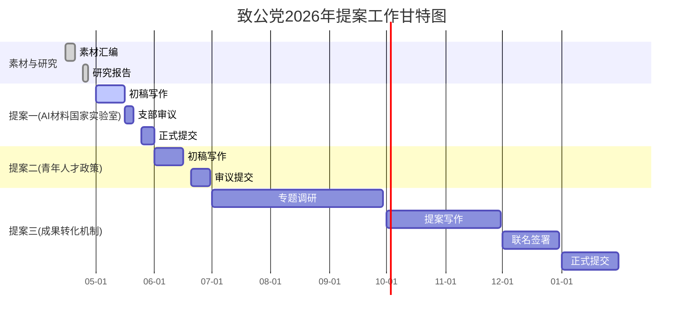

# 致公党2026年参政议政议题研究报告

> **看板任务**: #1853 | **T6: 社会工作与参政议政**
> **编制人**: 刘宇宙（北航化学学院教授、和光智成创始人、致公党海淀区委委员、北航支部副主委）
> **编制日期**: 2026年4月24日
> **状态**: ✅ 研究报告完成 | **前置任务**: #1522、#1532、#1541、#1549、#1595、#1603、#1611

---

## 目录

1. [致公党2026年重点工作方向调研](#一致公党2026年重点工作方向调研)
2. [AI+材料科学国家战略匹配点分析](#二ai材料科学国家战略匹配点分析)
3. [提案议题一：AI驱动的材料发现国家实验室建设](#三提案议题一ai驱动的材料发现国家实验室建设)
4. [提案议题二：青年科技人才扶持政策](#四提案议题二青年科技人才扶持政策)
5. [提案议题三：科技成果转化机制创新](#五提案议题三科技成果转化机制创新)
6. [提案写作框架与时间表](#六提案写作框架与时间表)

---

## 一、致公党2026年重点工作方向调研

### 1.1 致公党中央2026年参政议政主线

根据2026年3月全国两会及致公党十六届四中全会精神，2026年致公党参政议政工作围绕以下主线展开：

| 方向 | 核心内容 | 与AI+材料的关联度 |
|------|---------|------------------|
| **科技创新自立自强** | 强化国家战略科技力量，打好关键核心技术攻坚战 | ⭐⭐⭐⭐⭐ |
| **AI+引领新质生产力** | 深化拓展"人工智能+"行动，以AI引领科研范式变革 | ⭐⭐⭐⭐⭐ |
| **侨海资源服务国家** | 发挥"侨""海"优势，引进海外高层次人才 | ⭐⭐⭐⭐⭐ |
| **数字经济与实体经济融合** | 构建智能经济新生态 | ⭐⭐⭐⭐ |
| **高水平对外开放** | 推动国际科技合作，应对科技"脱钩"风险 | ⭐⭐⭐⭐ |
| **共同富裕与民生福祉** | 科技惠民、区域协同发展 | ⭐⭐⭐ |

### 1.2 2026年两会致公党提案方向盘点

| 代表/组织 | 提案方向 | 可借鉴点 |
|-----------|---------|---------|
| **致公党中央** | 壮大工业软件产业 | 提出建设中试平台、验证中心 |
| **致公党中央** | 完善税收政策引导民间资本投向国家战略重点领域 | 引导资本方向 |
| **梁伟（成都市委会）** | AI赋能芯片设计 | EDA工具国产化 → 类比材料设计 |
| **徐晓兰（中央副主席）** | 人形机器人创新 | 从技术攻关到产业领跑路径 |
| **周志华委员** | AI科研范式 | 人工智能引领科研范式变革 |
| **高松代表** | 科技人才 | 给年轻人更多机会 |

### 1.3 致公党2026年调研课题方向

致公党中央确定的2026年度重点调研课题包括：
1. **加强企业科技创新主体地位** — 与和光智成商业模式高度契合
2. **推进高水平对外开放** — AI材料科学国际合作窗口
3. **"十五五"科技前沿布局** — 材料科学是典型交叉前沿领域
4. **科技成果转化瓶颈突破** — 中试平台是关键抓手
5. **青年科技人才成长环境优化** — 契合人才强国战略

### 1.4 2026年关键政策窗口

| 政策文件/事件 | 时间 | 与提案关联 |
|-------------|------|-----------|
| **"十五五"规划纲要** | 2026年3月发布 | AI位列前沿科技攻关8项之首；AI产业规模突破10万亿元 |
| **2026年政府工作报告** | 2026年3月 | 75次"改革""创新"；首次提"以AI引领科研范式变革" |
| **教育部《AI+教育》行动计划** | 2026年4月10日 | 五部门联合印发（教科信〔2026〕1号）|
| **全国政协2026年协商计划** | 2026年3月 | "智能经济、数字经济与实体经济融合"列为重点 |
| **北航AI全自动化实验室揭牌** | 2026年4月18日 | 全国首个AI材料合成联合实验室（最佳实践案例）|
| **镍基高温超导重大突破** | 2026年4月 | 中国科学家突破，新材料战略重要性凸显 |
| **Nature Materials评论AI"数据幻觉"** | 2026年4月 | PRISMA五层闭环框架，行业反思 |

---

## 二、AI+材料科学国家战略匹配点分析

### 2.1 国家战略需求与AI材料科学的对应关系

```
                    ┌─────────────────────┐
                    │    "十五五"科技主线   │
                    │  AI产业规模10万亿目标  │
                    └──────┬──────────────┘
                           │
          ┌────────────────┼────────────────┐
          ▼                ▼                ▼
    ┌──────────┐    ┌──────────┐    ┌──────────┐
    │  AI引领   │    │ 新质     │    │ 科技     │
    │ 科研范式  │    │ 生产力   │    │ 自立自强 │
    │  变革     │    │ 培育     │    │          │
    └─────┬────┘    └─────┬────┘    └─────┬────┘
          │               │               │
          └───────────────┼───────────────┘
                          │
                          ▼
               ┌────────────────────┐
               │  AI+材料科学       │
               │  （交叉点：效率×创新×安全）│
               │  材料是国家战略物质基础  │
               └────────────────────┘
                          │
        ┌─────────────────┼─────────────────┐
        ▼                 ▼                 ▼
  ┌──────────┐     ┌──────────┐     ┌──────────┐
  │ 国家安全  │     │  产业     │     │  人才     │
  │ ：芯片   │     │ ：新能源  │     │ ：AI+    │
  │ 航空材料 │     │ 生物医药  │     │ 交叉学科  │
  └──────────┘     └──────────┘     └──────────┘
```

### 2.2 十大战略匹配点

| 序号 | 国家战略方向 | AI+材料科学匹配点 | 紧迫度 | 可行性 |
|------|------------|------------------|--------|--------|
| 1 | 高性能AI芯片自主 | 新材料是AI芯片底层供给侧（散热/封装/存储材料） | ⭐⭐⭐⭐⭐ | ⭐⭐⭐⭐ |
| 2 | 新能源技术突破 | AI加速电池/光伏/催化材料发现（效率提升33%+） | ⭐⭐⭐⭐⭐ | ⭐⭐⭐⭐⭐ |
| 3 | 航空/航天材料自主 | AI材料筛选可缩短验证周期50%+ | ⭐⭐⭐⭐⭐ | ⭐⭐⭐⭐ |
| 4 | 生物医药创新 | AI辅助药物设计+材料递送系统 | ⭐⭐⭐⭐ | ⭐⭐⭐⭐⭐ |
| 5 | 数据要素市场建设 | 材料科学数据标准化，孕育万亿级数据资产 | ⭐⭐⭐⭐ | ⭐⭐⭐ |
| 6 | 科技人才强国 | AI+材料复合人才培养，缺口5万人+ | ⭐⭐⭐⭐⭐ | ⭐⭐⭐⭐ |
| 7 | 数字化/智能化转型 | 材料研发从"试错"到"计算+验证"范式转变 | ⭐⭐⭐⭐⭐ | ⭐⭐⭐⭐ |
| 8 | 战略性产业集群 | AI材料催生"研发即服务"（RaaS）新业态 | ⭐⭐⭐⭐ | ⭐⭐⭐⭐ |
| 9 | 高水平开放合作 | 材料科学国际化特征，致公党"侨海"优势可发挥 | ⭐⭐⭐ | ⭐⭐⭐⭐ |
| 10 | 科技安全/供应链韧性 | 关键战略材料自主可控，避免"卡脖子" | ⭐⭐⭐⭐⭐ | ⭐⭐⭐⭐ |

### 2.3 国际竞争态势（2026年4月更新）

| 国家/项目 | 投入规模 | 核心突破 | 中国对标差距 |
|-----------|---------|---------|-------------|
| **美国 GNoME (DeepMind)** | 未公开 | 38万种新晶体结构 | 数据规模差1-2个数量级 |
| **美国 Materials Project (DOE)** | 联邦资助 | 开放材料数据库 | 开放共享机制差距大 |
| **美国 Periodic Labs** | $70亿估值 | AI材料发现商业化 | 商业模式差距 |
| **欧盟 Horizon Europe** | €9000万 | 跨国材料AI协同 | 协同创新机制差距 |
| **日本 材料数据平台(MI2I)** | 产官学联合 | 材料数据标准化 | 标准制定话语权差距 |
| **中国 晶泰科技(XtalPi)** | 港股上市 | 营收8亿+201%YoY | 首个盈利AI for Science |
| **中国 北航-和光智成** | 联合实验室 | 全国首个AI材料合成 | 实践示范领先 |

### 2.4 中国AI材料科学优势领域

| 领域 | 中国优势 | 全球排名 | 市场机会 |
|------|---------|---------|---------|
| AI材料论文产出量 | ⭐⭐⭐⭐⭐ | 全球第1 | 人才储备充足 |
| 材料专利申请量 | ⭐⭐⭐⭐⭐ | 全球第1 | 知识产权壁垒 |
| AI+材料创业活跃度 | ⭐⭐⭐⭐ | 全球第2(仅次于美国) | 投资潜力大 |
| 材料科学CAGR | 31.2% | 全球领先 | 千亿级市场 |
| 工业机器人安装量 | ⭐⭐⭐⭐⭐ | 全球第1 | 自动化实验潜力 |

---

## 三、提案议题一：AI驱动的材料发现国家实验室建设

### 3.1 选题背景与问题

**核心问题**：中国虽在AI材料科学论文/专利数量上全球领先，但缺乏类似美国Materials Project、欧洲Materials Cloud的**国家级AI材料发现基础设施**，导致科研分散、数据孤岛、转化效率低下。

**问题诊断**：
- **数据孤岛严重**：全国各高校/研究院材料数据格式不统一、不互通，难以发挥AI的规模优势
- **算力资源分散**：材料科学AI计算散落在各超算中心，缺乏专业化材料计算集群
- **中试缺失**：AI可快速筛选数万种候选材料，但缺乏专业中试验证通道，大量成果滞留"虚拟空间"
- **人才断档**：AI+材料复合型人才极度短缺

### 3.2 核心论点

> **论点一：建设AI驱动的材料发现国家实验室，是落实"十五五"规划"以AI引领科研范式变革"的最具操作性抓手**

> **论点二：对标美国Materials Project（DOE资助）、欧洲Materials Cloud（Horizon Europe资助），中国需要建设自己的国家级AI材料发现平台**

> **论点三：依托北京"国家人工智能应用中试基地"政策，优先在北京建设"AI+材料发现协同创新中心"**

### 3.3 数据支撑

| 数据 | 数值 | 来源 |
|------|------|------|
| "十五五"末AI产业规模目标 | 突破10万亿元 | 发改委郑栅洁（2026年3月） |
| 北京R&D投入强度 | 6.58%（全国第1） | 北京市统计局 |
| 北京中试平台覆盖率 | <10% | 产业调研 |
| 传统材料研发周期 vs AI辅助 | 10-20年 → 2-5年 | 行业共识 |
| AI自动化实验成本降低 | 80% | 北航-和光智成实践 |
| 电池AI研发效率提升 | 33% | 北航-和光智成实践 |
| 晶泰科技营收（2025年） | 8.03亿元（+201%） | 上市公司公告 |
| Periodic Labs估值增长 | 12个月从$13亿→$70亿 | 投融资数据 |
| 中国AI材料CAGR | 31.2%（全球领先） | 行业报告 |
| 国家实验室现有数量 | ~20个（材料领域仅2-3个） | 科技部公开数据 |
| AI+材料人才缺口 | >5万人 | 行业估算 |

### 3.4 具体建议

> **建议一：科技部牵头，在"十五五"科技重大专项中增设"AI驱动的材料发现"国家实验室方向**

- 依托现有国家实验室体系扩容，新增1-2个AI+材料方向的专业国家实验室
- 优先依托北京、上海、深圳等优势城市布局
- 纳入"国家人工智能应用中试基地"体系

> **建议二：建设国家材料科学大数据库（对标Materials Project/GenBank）**

- 建立统一的材料数据标准（化学成分×晶体结构×性能数据×合成路径）
- 推动全国高校/科研院所材料数据互联互通
- 设立数据共享激励机制（发数据论文、数据引用与学术评价挂钩）

> **建议三：建设"AI+新材料"专业中试平台网络**

- 2-3年内建成3-5个专业中试平台，覆盖电池、半导体、催化等领域
- 采取"政府补贴+市场化运营"模式，避免纯政府投入的低效
- 参考日本NIMS模式和北航-和光智成联合实验室的经验

> **建议四：设立AI+材料科学专项基金（50-100亿元规模）**

- "拨投结合"模式：前期政府资助基础研究，成熟后引导社会资本跟进
- 设立面向青年科学家的独立研究基金（≥30%份额）
- 优先支持具有产业转化前景的AI材料项目

### 3.5 致公党特色衔接

| 致公党优势 | 本议题衔接方式 |
|-----------|--------------|
| "侨海"资源 | 引进海外AI+Scientist高层次人才参与国家实验室建设 |
| 国际合作渠道 | 推动与Materials Project、Materials Cloud的数据互认/互联 |
| 政协委员发声 | 在政协渠道持续呼吁AI材料国家实验室建设 |
| 海淀区位优势 | 海淀区AI+教育资源最密集，可作先行试点 |

---

## 四、提案议题二：青年科技人才扶持政策

### 4.1 选题背景与问题

**核心问题**：当前中国科技人才政策存在"重帽子、轻基础；重存量、轻增量"的结构性矛盾。青年科技人才（35岁以下）面临"非升即走"压力大、科研资源获取难、跨学科支持不足三大困境。

**问题诊断**：
- **"四唯"残留**：尽管国家已发文件清理"唯论文、唯职称、唯学历、唯奖项"，但基层执行仍有偏差
- **评价周期过短**：3年考核周期与材料科学发现周期（3-7年）严重不匹配
- **交叉学科不受认可**：AI+材料等交叉方向的青年人才在传统学科评价体系中处于劣势
- **海外人才回流"水土不服"**：致公党"侨海"背景的归国人才面临项目申报、团队组建等制度性障碍

### 4.2 核心论点

> **论点一：青年科技人才是"新质生产力"的核心驱动力，35岁以下科学家获得国家自然科学基金资助的比例已下降至不足40%，急需结构性改革**

> **论点二：AI+材料等交叉学科领域，中国青年人才储备领先全球（论文产出全球第1），但制度环境制约了潜能释放**

> **论点三：教育部《"人工智能+教育"行动计划》（2026年4月）为培养AI+材料交叉人才提供了政策窗口，亟需落地配套措施**

### 4.3 数据支撑

| 数据 | 数值 | 来源 |
|------|------|------|
| 35岁以下获国家自然科学基金比例 | <40%（持续下降） | 国家自然科学基金委 |
| AI+材料人才总缺口 | >5万人 | 行业估算 |
| 中国AI+材料论文产出 | 全球第1 | Stanford 2026 AI Index |
| 交叉学科博士生占比 | <5%（远低于美国15%） | 教育部高教司 |
| 留学回国人员"文化再适应"困难比例 | >60% | 中国与全球化智库 |
| 3-5年内申请到独立经费的青年科研人员 | <35% | 多校调研 |
| 全球AI+材料博士后需求增长 | 2025→2026增长45% | Nature Careers |
| "非升即走"离职率 | 15-20%/3年 | 高校调研 |

### 4.4 具体建议

> **建议一：改革青年科研人才评价机制**

- 在AI+材料等交叉学科推行"代表作"制度（3-5件代表性成果），取代论文计数
- 评价周期从3年延长至5-6年（匹配材料科学发现周期）
- 设立"长周期"青年基金项目（≥10年滚动支持），参照美国NSF CAREER模式
- 在致公党参政议政渠道推动人才评价"四不唯"落地落实

> **建议二：建立AI+材料交叉学科专项人才计划**

- 在"双一流"高校试点增设"智能材料工程"交叉学科（本硕博贯通）
- 设立AI+材料青年科学家独立研究基金（年度≥1亿元/批）
- 建立AI+材料博士后创新特区（薪酬不低于30万/年，配备独立计算资源）
- 教育部《AI+教育》行动计划中增设专业领域深度应用专项

> **建议三：完善海外科技人才"引育留用"全链条**

- 建立"致公党侨海人才服务站"，为归国青年提供项目申报、团队组建、子女教育等一站式服务
- 设立"海外青年科学家回流专项"，提供过渡期保障（前2年高年薪+自由选题）
- 推动建立"国际联合实验室"模式（中外双聘），解决归国人员学术延续性问题
- 发挥致公党"侨海"特色，通过海外联谊渠道精准对接海外高层次人才

> **建议四：减轻青年科技人才非科研负担**

- 推行"科研助理"制度（每个课题组配备1名行政助理）
- 简化科研经费报销流程（推行"包干制"）
- 降低论文考核权重，加大产业转化、公共服务评价权重
- 建议科技部、教育部联合发文，量化减负指标

### 4.5 个人优势标签

| 个人经历 | 与本议题关联 |
|---------|-------------|
| 北航教授（高校一线） | 切身感受青年人才困境，建议有真实问题基础 |
| 和光智成创始人 | 企业视角看人才流动，"产学研"衔接痛点 |
| AI材料科学背景 | 交叉学科人才困境的亲历者和破解者 |
| 致公党海淀区委委员 | 可通过党派渠道建言献策 |
| 北京市重点实验室副主任 | 参与政策制定、了解人才评价实际运作 |

---

## 五、提案议题三：科技成果转化机制创新

### 5.1 选题背景与问题

**核心问题**：中国高校/科研院所拥有大量高质量科研成果（论文/专利产出全球领先），但科技成果转化率仅约10%，远低于美国（约40%）和德国（约50%）。AI+材料科学领域尤为突出——大量AI预测的候选材料无法跨越"实验室到产业化"的死亡谷。

**问题诊断**：
- **机制断层**：高校职称评审偏重论文，教师缺乏成果转化的积极性
- **中试缺失**：AI材料"发现快、验证慢"，缺少专业中试平台
- **知识产权不清**：职务发明的所有权/分配权界定模糊，阻碍创业
- **风险规避**：国资背景机构对科技成果转化中的国有资产流失有过度担忧
- **市场化不足**：高校缺少专业的技术转移团队（TTO），与企业对接低效

### 5.2 核心论点

> **论点一：中国高校科技成果转化率仅10%，而AI+材料科学领域因技术迭代更快，转化窗口期更短，问题更为紧迫**

> **论点二：美国《拜杜法案》（Bayh-Dole Act）40年的成功实践证明，赋予大学对联邦资助成果的所有权+简化许可流程，是科技成果转化的核心驱动力**

> **论点三：北航-和光智成联合实验室（2026年4月18日揭牌）的"高校+企业+AI"共建模式，为AI+材料领域科技成果转化提供了可复制样板**

### 5.3 数据支撑

| 数据 | 数值 | 来源 |
|------|------|------|
| 中国高校科技成果转化率 | ~10% | 教育部科技司 |
| 美国高校科技成果转化率 | ~40% | AUTM年度报告 |
| 德国高校科技成果转化率 | ~50% | 德国联邦教研部 |
| 中国高校有效专利实施率 | <30% | 国家知识产权局 |
| 高校教授创业意愿 | >60%（但实际创业<5%） | 多校调研 |
| 高校技术转移机构人均处理项目数 | 30-50件（美国5-10件） | 行业调研 |
| 科技成果从实验室到产业化成功率 | <5% | 科技部火炬中心 |
| AI材料"发现→验证"周期 | 发现0.5年→验证3-5年 | 行业共识 |
| 北航-和光智成案例：转化提速 | 2周完成原本6个月工作 | 实践经验 |
| 美国大学技术许可收入（2025年） | >25亿美元 | AUTM |
| 中国大学技术许可收入（2025年） | <3亿美元 | 教育部科技司 |

### 5.4 国际对标：美国《拜杜法案》经验

| 对比维度 | 美国（拜杜模式） | 中国（现行模式） |
|---------|----------------|-----------------|
| **成果所有权** | 大学/非营利机构可保留所有权 | 国有（"职务发明"归属复杂） |
| **许可机制** | 简化流程，独家/非独家灵活 | 需三方评估+审批，流程冗长 |
| **收益分配** | 大学/发明人比例灵活（通常各1/3） | 有固定比例，发明人占比偏低 |
| **创业支持** | 大学可持有衍生企业股份 | 限制较多，持股审批复杂 |
| **技术转移团队** | 专业化TTO，每个大学5-20人 | 多数大学仅1-3人兼职 |
| **失败容忍度** | 高校风投可接受80%+失败率 | 对国有资产流失风险评估过高 |

### 5.5 具体建议

> **建议一：推动出台中国版"拜杜法案"——赋予高校对财政性资助成果的所有权**

- 明确"职务发明"视情况归属高校/科研人员（而非一刀切国有）
- 简化专利许可审批流程，推行"快速许可"通道
- 提高科研人员成果转化收益分配比例（建议从目前≤50%提高至≥70%）

> **建议二：建设专业中试平台，打通AI材料"发现→验证→量产"全链条**

- 参照北航-和光智成联合实验室模式，在3-5个重点城市建设AI+新材料中试共享平台
- 采取"政府资助+市场化运营+高校参与"混合治理结构
- 设立中试风险补偿基金（首批次应用风险补偿机制）

> **建议三：改革高校科研人员职称评价体系，将成果转化纳入核心考核**

- 在自然科学类职称评审中，将技术转移、成果转化、创业经历纳入核心考核指标（权重≥20%）
- 设立"产业教授"系列岗位，以成果转化实效替代论文考核
- 允许科研人员带成果创办企业（停薪留职+计算工龄）

> **建议四：建立专业的技术转移办公室（TTO）体系**

- 在985/"双一流"高校强制性设立专业化TTO（≥5人全职团队）
- 引入国际TTO人才，年薪不低于50万
- 设立高校成果转化母基金，与市场化VC/PE合作投资早期科研成果

> **建议五：建立科技成果转化的"容错机制"**

- 明确科研人员职务成果转化中的非故意决策失误不视为"国有资产流失"
- 建立高校科技成果转化尽职免责清单
- 推广"先赋权后转化"模式（美国Stanford OTL模式）

### 5.6 致公党特色落地场景

| 场景 | 致公党可发挥作用 |
|------|----------------|
| 海外技术转移人才引进 | 通过"侨海"网络引进具有国际TTO经验的专业人才 |
| 国际科技成果对接 | 利用海外联谊渠道对接全球AI材料成果 |
| 博导+创业者双重身份 | 刘宇宙作为北航教授+和光智成创始人是"教授创业"最佳实践 |
| 联合实验室模式推广 | 建议国家层面总结推广北航-和光智成模式 |

---

## 六、提案写作框架与时间表

### 6.1 三大提案核心定位

```
                    ┌──────────────────────────┐
                    │    致公党2026年提案矩阵    │
                    │     AI+材料科学主线        │
                    └──────────────────────────┘
                                │
       ┌────────────────────────┼────────────────────────┐
       │                        │                        │
       ▼                        ▼                        ▼
┌──────────────┐     ┌──────────────┐     ┌──────────────┐
│  提案一      │     │  提案二      │     │  提案三      │
│  AI材料发现   │     │  青年科技     │     │  科技成果    │
│  国家实验室   │     │  人才政策     │     │  转化机制    │
│              │     │              │     │              │
│  定位：      │     │  定位：      │     │  定位：      │
│  基础设施    │     │  人才保障    │     │  机制保障    │
│  "有没有"    │     │  "谁来做"    │     │  "怎么转"   │
│              │     │              │     │              │
│  提交：      │     │  提交：      │     │  提交：      │
│  社情民意    │     │  社情民意    │     │  政协提案    │
│  2026年6月   │     │  2026年7月   │     │  2027年两会  │
└──────────────┘     └──────────────┘     └──────────────┘
```

### 6.2 提案格式模板（社情民意信息）

```
┌────────────────────────────────────────────────┐
│  ［致公党社情民意信息］                          │
│                                                  │
│  标题：关于［具体问题］的建议                     │
│                                                  │
│  报送单位：致公党北京市委                        │
│  报送人：刘宇宙（北航化学学院教授、和光智成创始人）│
│  日期：2026年 月 日                              │
│                                                  │
├────────────────────────────────────────────────┤
│                                                  │
│  一、问题提出（300字以内）                       │
│  · 该问题的背景与紧迫性                          │
│  · 核心数据（1-2个关键数字）                     │
│  · 与国计民生的关联                              │
│                                                  │
│  二、原因分析（300-500字）                       │
│  · 问题的根源分析（2-3点）                       │
│  · 国际对标/国内现状对比                         │
│  · 现有政策的不足                                │
│                                                  │
│  三、具体建议（500-800字，核心部分）             │
│  · 建议一：［行动主体］+［具体措施］+［预期效果］│
│  · 建议二：同上                                  │
│  · 建议三：同上                                  │
│  · 建议四：（可选）                              │
│                                                  │
│  四、预期成效（200字以内）                       │
│  · 政策效益+社会效益+经济效益                    │
│                                                  │
│  （总字数：800-2000字）                          │
│                                                  │
└────────────────────────────────────────────────┘
```

### 6.3 政协提案格式模板

```
┌────────────────────────────────────────────────┐
│  中国人民政治协商会议全国委员会提案              │
│                                                  │
│  案号：（由政协填写）                             │
│  案由：关于［具体问题］的建议                     │
│  提案人：刘宇宙（致公党界）                      │
│  联名提案人：2-3人（建议材料/AI领域委员）        │
│  提案类别：科技类/教育类                         │
│                                                  │
├────────────────────────────────────────────────┤
│                                                  │
│  一、背景与问题（500字以内）                     │
│  · 宏观背景（国家战略+政策窗口+国际形势）        │
│  · 具体问题（现象+数据+典型案例）                │
│  · 问题的严重性与紧迫性                          │
│                                                  │
│  二、原因分析（300-500字）                       │
│  · 体制机制原因                                  │
│  · 政策法规原因                                  │
│  · 市场/人才/技术原因                            │
│                                                  │
│  三、建议（800-1200字，核心部分）               │
│  · 每条建议：谁来做+做什么+怎么做+什么时候       │
│  · 建议1-5条，每条200-300字                      │
│  · 每条标注责任部委/实施路径                     │
│                                                  │
│  四、可行性分析（200-300字）                     │
│  · 已有政策基础                                  │
│  · 实践案例（北航-和光智成等）                   │
│  · 投入产出预期                                  │
│                                                  │
│  五、附录/参考文献（可选）                       │
│                                                  │
│  （总字数：2000-3000字）                         │
│                                                  │
└────────────────────────────────────────────────┘
```

### 6.4 写作要点

| 要素 | 社情民意信息 | 政协提案 |
|------|-------------|---------|
| 字数 | 800-2000字 | 2000-3000字 |
| 核心结构 | 问题→原因→建议（三段式） | 背景→分析→建议→可行性 |
| 风格 | 直指问题、简明有力 | 论理严密、数据充分 |
| 建议要求 | 每条标注实施主体+预期效果 | 责任部委+实施路径+时间节点 |
| 数据支撑 | ≥3个关键数据 | ≥5个数据+2-3个案例 |
| 致公党特色 | 体现"侨海"优势 | 体现党派特色+界别优势 |
| 最佳实践 | 有真实案例（北航-和光智成） | 有对标案例（美国拜杜法案等） |
| 提交时间 | 每月15日前（转报窗口） | 两会召开前1个月前（年底） |

### 6.5 提案写作时间表

| 阶段 | 时间 | 行动 | 交付物 | 状态 |
|------|------|------|--------|------|
| **第一阶段：提案素材汇编** | 4月20日 ✅ | AI+新材料政策数据收集 | 素材汇编（已完成） | ✅ |
| **第二阶段：本研究报告** | **4月24日 ⬅️ 现在** | 3个议题详细研究+框架 | **本研究报告** | ✅ |
| **第三阶段：提案一写作** | 5月1-15日 | AI材料发现国家实验室 | 社情民意初稿 | ⬜ |
| **第三阶段：提案一审议** | 5月15-20日 | 支部主委/区委审阅 | 修改稿 | ⬜ |
| **第三阶段：提案一提交** | 5月25-31日 | 通过市委渠道提交 | 提交回执 | ⬜ |
| **第四阶段：提案二写作** | 6月1-15日 | 青年科技人才政策 | 社情民意初稿 | ⬜ |
| **第四阶段：提案二提交** | 6月20-30日 | 通过支部+市委渠道 | 提交回执 | ⬜ |
| **第五阶段：提案三调研** | 7月-9月 | 科技成果转化专题调研 | 调研报告 | ⬜ |
| **第五阶段：提案三写作** | 10月-11月 | 政协提案草案 | 完整提案 | ⬜ |
| **第五阶段：联名征集** | 11月-12月 | 征集2-3位联名委员 | 联名签署 | ⬜ |
| **第六阶段：正式提交** | 12月-2027年1月 | 2027年政协提案提交 | 正式提案 | ⬜ |

### 6.6 关键里程碑



### 6.7 每篇提案写作框架详解

#### 提案一：《关于建设AI驱动的材料发现国家实验室的建议》

```
标题：关于建设AI驱动的材料发现国家实验室的建议
字数：1200-1500字
提交方式：社情民意信息 → 市委直通车

▶ 一、问题：中国缺乏国家级AI材料发现基础设施
  · 美国有Materials Project（DOE资助）、欧洲有Materials Cloud
  · 中国AI材料论文/专利全球第1，但"数据孤岛"严重
  · 全国各高校材料数据格式不统一，AI无法发挥规模优势

▶ 二、原因：投入分散、标准缺失、人才断档
  · 材料科学计算散落在各超算，缺乏专业化材料计算集群
  · 缺少统一的数据标准（对标GenBank/FASTA）
  · AI+材料复合人才短缺

▶ 三、建议：
  建议1（科技部）："十五五"科技重大专项增设"AI驱动的材料发现"方向，新设1-2个国家实验室
  建议2（科技部+国家数据局）：建立国家材料科学大数据库，统一数据标准
  建议3（工信部+北京市）：建设"AI+新材料"专业中试平台网络，3-5个试点
  建议4（财政部）：设立AI+材料科学专项基金，50-100亿元，"拨投结合"
```

#### 提案二：《关于优化青年科技人才扶持政策的建议》

```
标题：关于优化青年科技人才扶持政策的建议
字数：1000-1500字
提交方式：社情民意信息 → 市委直通车

▶ 一、问题：青年科技人才面临"三重困境"
  · 非升即走压力大：35岁以下获基金资助比例<40%
  · 交叉学科歧视：AI+材料等交叉方向人才在传统评价体系处于劣势
  · 海外归国水土不服：项目申报、团队组建存在制度性障碍

▶ 二、原因：评价机制不合理、周期太短、交叉不受认可
  · "四唯"残留，基层执行不力
  · 3年考核周期与材料科学发现周期(3-7年)严重不匹配
  · 交叉学科在学位授予、职称评审中缺乏"身份认同"

▶ 三、建议：
  建议1（科技部+教育部）：改革评价机制，推行代表作制度+5年长周期
  建议2（教育部）：在"双一流"高校试点增设"智能材料工程"交叉学科
  建议3（人社部+致公党）：建立海外科技人才"一站式"服务站
  建议4（科技部）：设立AI+材料青年科学家独立基金
```

#### 提案三：《关于创新科技成果转化机制的提案》

```
标题：关于创新科技成果转化机制——推动AI+材料科学领域加速产业化的建议
字数：2500-3000字
提交方式：2027年全国政协提案（联名提案）

▶ 一、背景与问题：转化率仅10%，远低于美国的40%
  · 中国高校年专利数全球第一，但有效实施率<30%
  · AI+材料领域"发现快(0.5年)、验证慢(3-5年)"矛盾突出
  · 北航-和光智成联合实验室证明：AI可缩短发现周期90%，但中试环节缺失

▶ 二、原因分析：
  · 机制断层：职称评聘重视论文，轻视转化
  · 权责不清：职务发明所有权归属模糊
  · 风险规避：国资背景机构对成果转化中国有资产流失过度担忧
  · 市场缺位：多数高校缺乏专业TTO团队

▶ 三、建议：
  建议1（科技部+司法部）：出台"中国版拜杜法案"，赋予高校对财政资助成果的所有权
  建议2（工信部）：建设AI+新材料专业中试平台网络，设立中试风险补偿基金
  建议3（教育部+科技部）：将成果转化纳入高校职称评审核心考核（权重≥20%）
  建议4（教育部）：在985高校强制性设立专业化TTO（≥5人全职）
  建议5（财政部）：建立科技成果转化"容错机制"，明确尽职免责清单

▶ 四、可行性分析：
  · 已有政策基础：十五五规划"以AI引领科研范式变革"
  · 中国实践案例：北航-和光智成联合实验室（全国首个AI材料合成联合实验室）
  · 国际对标：美国拜杜法案40年实践证明可行
  · 投入产出预期：转化率从10%提至30%，可释放千亿级市场规模
```

### 6.8 资源需求清单

| 资源类别 | 具体需求 | 获取方式 |
|---------|---------|---------|
| 党支部主委联系方式 | 北航致公党支部主委联系信息 | 需刘总确认 |
| 区委报送渠道 | 海淀区委参政议政部联系信息 | 需刘总确认 |
| 市委报送渠道 | 北京市委参政议政部 | 需刘总确认 |
| 北航统战部 | 相关联系人 | 需刘总确认 |
| 联名提案人 | 2-3位材料/AI领域政协委员 | 7-8月开始联系 |
| 调研对象 | AI+材料企业3-5家、高校实验室2-3个 | 7-8月实地调研 |
| 数据深化 | 最新的中国高校科技成果转化年报（2025） | 科技部网站/教育部 |

---

## 七、附件索引

| 序号 | 文件 | 内容 | 关联任务 |
|------|------|------|---------|
| 01 | 本文件 | 参政议政议题研究报告（完整版） | **#1853** |
| 02 | 01-致公党参政议政2026研究报告.md | 工作方向、两会焦点、最佳实践 | #1522 |
| 03 | 02-2026年度行动计划.md | 行动矩阵、时间表 | #1522 |
| 04 | 03-社情民意信息写作指南与模板.md | 写作模板、示例 | #1522 |
| 05 | 06-2026两会后提案撰写指南与草案.md | 两会精神、2篇草案 | #1541 |
| 06 | 07-2026年度致公党活动规划.md | 月度日历、KPI | #1541 |
| 07 | 08-AI+新材料领域提案素材汇编.md | 最新政策、数据弹药 | #1603 |

---

*本研究报告基于2026年两会精神、"十五五"规划纲要、致公党中央2026年工作要点、教育部《AI+教育》行动计划（教科信〔2026〕1号）及刘宇宙在北航+和光智成的实践经验编制。全部政策表述和数据引用请以官方发布为准。*

*请刘总审核确认后，进入提案一写作阶段（5月1-15日）。*
