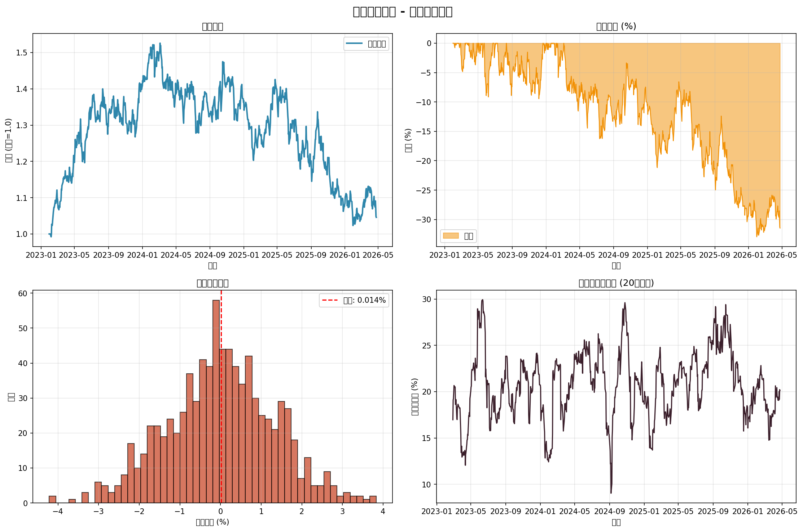

# 行业轮动策略 - 回测报告

> 生成时间: 2026-04-24 23:54:07
> 策略类型: 量化轮动策略

## 核心绩效指标

| 指标 | 数值 |
|------|------|
| 初始资金 | 1000000 |
| 最终资金 | 1045920.26 |
| 累计收益率(%) | 4.59 |
| 年化收益率(%) | 1.4 |
| 年化波动率(%) | 20.89 |
| 夏普比率 | 0.02 |
| 最大回撤(%) | -32.93 |
| 卡玛比率 | 0.04 |
| 胜率(%) | 49.76 |
| 盈亏比 | 1.03 |
| 最大连续亏损天数 | 8 |
| 交易天数 | 845 |
| 回测天数 | 1180 |

## 详细分析

============================================================
量化回测报告 - 行业轮动策略
生成时间: 2026-04-24 23:54:07
回测期间: 2023-01-30 至 2026-04-24
============================================================

【核心绩效指标】
  初始资金: 1000000
  最终资金: 1045920.26
  累计收益率(%): 4.59
  年化收益率(%): 1.4
  年化波动率(%): 20.89
  夏普比率: 0.02
  最大回撤(%): -32.93
  卡玛比率: 0.04
  胜率(%): 49.76
  盈亏比: 1.03
  最大连续亏损天数: 8
  交易天数: 845
  回测天数: 1180

============================================================
【分年度收益统计】
  2023年: 39.81%
  2024年: -3.24%
  2025年: -20.93%
  2026年: -3.52%

============================================================
【策略说明】
  策略类型: 行业轮动策略
  调仓频率: 每周/每5日
  手续费: 未计入(需实盘时添加万3-万5)
  滑点: 未计入(ETF/指数冲击成本较小)

## 策略逻辑说明

### 信号生成
- **动量因子**: 过去20日收益率，衡量趋势强度
- **波动率调整**: 高波动资产适当降权
- **调仓频率**: 每5个交易日调仓一次

### 交易规则
1. 当小盘动量 > 大盘动量 × 1.05时，切换到小盘指数
2. 当大盘动量 > 小盘动量 × 1.05时，切换到大盘指数
3. 差距在5%以内时，持有中盘指数
4. 单次交易成本预估: 0.05% (ETF手续费)

### 风险控制
- 未设置止损: 指数化投资天然分散风险
- 仓位控制: 始终满仓轮动，无空仓期
- 分散化: 通过宽基指数实现个股分散

## 可视化图表

## 实盘建议

### 标的选择
- 大盘: 沪深300ETF (510300.SH)
- 小盘: 中证1000ETF (512100.SH)
- 中盘: 中证500ETF (510500.SH)

### 执行建议
1. 每周五收盘后计算信号
2. 下周一开盘执行调仓
3. 建议使用ETF而非个股，降低冲击成本
