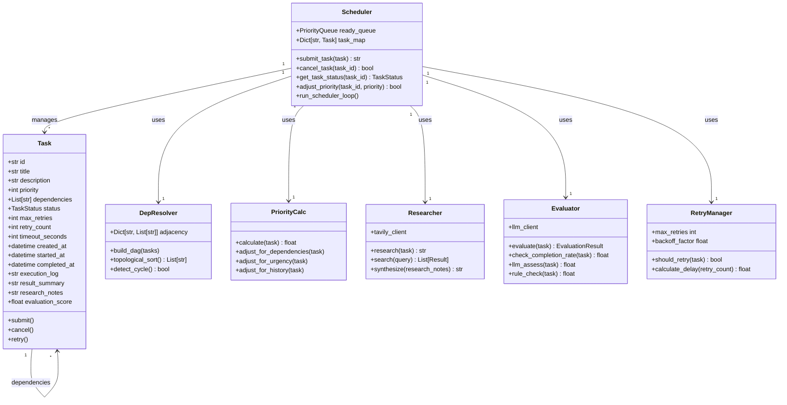

# SDS（自我驱动系统）模块化升级架构设计文档

## 文档信息
- **版本**: v2.0
- **日期**: 2026-04-25
- **作者**: AI Agent
- **任务编号**: #1865

---

## 1. 系统概述

### 1.1 升级背景
当前SDS v1.0系统存在以下核心问题：
- 任务调度基于简单FIFO队列，无优先级动态调整机制
- 任务依赖关系需手动配置，无法自动解析
- 执行前缺乏自动化深度研究环节
- 无执行结果自动评估与反馈闭环
- 缺乏超时检测与自动重试机制

### 1.2 升级目标
- 任务执行自动化率提升60%以上
- 子任务完成率≥90%时自动标记完成
- 支持任务优先级动态调整（0-10级）
- 实现任务依赖关系自动解析DAG
- 集成Tavily Research深度研究自动化

---

## 2. 系统架构设计

### 2.1 总体架构图（UML）

```
┌─────────────────────────────────────────────────────────────────────┐
│                        SDS v2.0 核心架构                             │
├─────────────────────────────────────────────────────────────────────┤
│                                                                     │
│  ┌──────────────┐    ┌──────────────┐    ┌──────────────┐         │
│  │  任务接收层   │    │  智能调度引擎 │    │  执行引擎层   │         │
│  │ TaskReceiver │───▶│ Scheduler    │───▶│ Executor     │         │
│  └──────────────┘    └──────────────┘    └──────────────┘         │
│         │                   │                   │                  │
│         ▼                   ▼                   ▼                  │
│  ┌──────────────┐    ┌──────────────┐    ┌──────────────┐         │
│  │  依赖解析器   │    │  优先级计算   │    │  Tavily研究  │         │
│  │ DepResolver  │    │ PriorityCalc │    │ Researcher   │         │
│  └──────────────┘    └──────────────┘    └──────────────┘         │
│                             │                   │                  │
│                             ▼                   ▼                  │
│                        ┌──────────────┐    ┌──────────────┐         │
│                        │  超时检测器   │    │  结果评估器   │         │
│                        │ TimeoutDet   │    │ Evaluator    │         │
│                        └──────────────┘    └──────────────┘         │
│                                  │         │                       │
│                                  ▼         ▼                       │
│                        ┌──────────────┐                            │
│                        │  反馈闭环模块  │                            │
│                        │ FeedbackLoop │                            │
│                        └──────────────┘                            │
│                                  │                                 │
│                                  ▼                                 │
│                        ┌──────────────┐                            │
│                        │  自动重试器   │                            │
│                        │ RetryManager │                            │
│                        └──────────────┘                            │
│                                  │                                 │
│                                  ▼                                 │
│                        ┌──────────────┐                            │
│                        │  诊断报告生成  │                            │
│                        │ Diagnostics  │                            │
│                        └──────────────┘                            │
│                                                                     │
└─────────────────────────────────────────────────────────────────────┘
```

### 2.2 核心模块划分

| 模块名称 | 职责描述 | 关键技术 |
|---------|---------|---------|
| TaskReceiver | 任务接收与验证 | Pydantic Schema验证 |
| DepResolver | 依赖关系解析与DAG构建 | 拓扑排序算法 |
| PriorityCalc | 优先级动态计算 | 加权评分算法 |
| Scheduler | 智能调度核心 | 优先级队列 + 资源感知 |
| Researcher | Tavily深度研究集成 | Tavily Search API |
| TimeoutDet | 超时检测与预警 | 异步事件循环 |
| Evaluator | 执行结果自动评估 | LLM评分 + 规则引擎 |
| FeedbackLoop | 反馈闭环机制 | 梯度下降优化 |
| RetryManager | 自动重试管理 | 指数退避策略 |
| Diagnostics | 诊断报告生成 | 模板化渲染 |

---

## 3. 数据模型设计

### 3.1 任务数据结构

```python
class TaskPriority(IntEnum):
    LOWEST = 0
    LOW = 2
    NORMAL = 5
    HIGH = 8
    CRITICAL = 10

class TaskStatus(str, Enum):
    PENDING = "pending"
    RESEARCHING = "researching"
    READY = "ready"
    RUNNING = "running"
    EVALUATING = "evaluating"
    COMPLETED = "completed"
    FAILED = "failed"
    TIMEOUT = "timeout"
    RETRYING = "retrying"

class Task(BaseModel):
    id: str
    title: str
    description: str
    priority: TaskPriority = TaskPriority.NORMAL
    dependencies: List[str] = []
    status: TaskStatus = TaskStatus.PENDING
    max_retries: int = 3
    retry_count: int = 0
    timeout_seconds: int = 3600
    created_at: datetime
    started_at: Optional[datetime]
    completed_at: Optional[datetime]
    execution_log: str = ""
    result_summary: str = ""
    research_notes: Optional[str]
    evaluation_score: Optional[float]
```

### 3.2 调度算法设计

**优先级动态调整公式：**
```
最终优先级 = 基础优先级 * (1 + 紧急度因子 + 依赖权重 + 历史完成率)

其中：
- 紧急度因子 = (截止时间 - 当前时间) / 总时长
- 依赖权重 = √(依赖此任务的任务数) * 0.1
- 历史完成率 = 最近10次任务成功率
```

---

## 4. 关键流程设计

### 4.1 任务执行完整流程

```
任务提交
    ↓
[依赖解析] → 构建DAG → 检测循环依赖
    ↓
[优先级计算] → 动态评分 → 排序入队
    ↓
[调度出队] → 资源检查 → 分配执行器
    ↓
[Tavily研究] → 深度检索 → 生成研究笔记
    ↓
[任务执行] → 子任务拆分 → 并行执行
    ↓
[超时检测] → 实时监控 → 超时预警
    ↓
[结果评估] → LLM评分 → 规则校验
    ↓
[完成率检查] → ≥90%? ──是──→ 标记完成
    │                  ↓
    否
    ↓
[反馈闭环] → 问题诊断 → 调整参数
    ↓
[重试决策] → 重试次数? ──是──→ 自动重试
    │                  ↓
    否
    ↓
[失败处理] → 生成诊断报告 → 人工介入
```

### 4.2 反馈闭环机制

反馈闭环采用三级评估体系：

1. **量化指标层**（60%权重）
   - 子任务完成率
   - 关键里程碑达成数
   - 产出物数量与质量

2. **LLM智能评估层**（30%权重）
   - 执行日志语义分析
   - 结果质量评估
   - 目标对齐度判断

3. **规则校验层**（10%权重）
   - 验收标准满足度
   - 格式规范检查
   - 附件完整性验证

---

## 5. 接口设计

### 5.1 核心API接口

```python
class SDSScheduler:
    """SDS智能调度引擎核心接口"""
    
    async def submit_task(self, task: Task) -> str:
        """提交任务，返回任务ID"""
        
    async def cancel_task(self, task_id: str) -> bool:
        """取消任务"""
        
    async def get_task_status(self, task_id: str) -> TaskStatus:
        """获取任务状态"""
        
    async def adjust_priority(self, task_id: str, new_priority: int) -> bool:
        """动态调整任务优先级"""
        
    async def register_dependency(self, task_id: str, depends_on: str) -> bool:
        """注册任务依赖关系"""
        
    async def trigger_research(self, task_id: str) -> str:
        """触发Tavily深度研究"""
        
    async def evaluate_result(self, task_id: str) -> EvaluationResult:
        """评估执行结果"""
        
    async def retry_task(self, task_id: str) -> bool:
        """重试失败任务"""
        
    def generate_diagnosis_report(self, task_id: str) -> DiagnosisReport:
        """生成诊断报告"""
```

---

## 6. 非功能需求

### 6.1 性能指标
- 任务调度延迟 < 100ms
- 单节点并发任务数 ≥ 100
- 研究模块响应时间 < 30s
- 评估模块处理时间 < 5s

### 6.2 可靠性指标
- 系统可用性 ≥ 99.5%
- 任务执行成功率 ≥ 95%
- 数据持久化可靠性 100%
- 故障恢复时间 < 30s

---

## 7. 升级迁移计划

### 7.1 迁移步骤
1. 数据库schema升级（新增字段：research_notes, evaluation_score, retry_count）
2. 调度引擎热替换（双轨运行1周）
3. 历史任务数据迁移
4. 研究模块灰度上线
5. 反馈闭环模块全量上线

### 7.2 回滚方案
- 保留v1.0调度引擎作为备用
- 数据库升级采用事务包裹，失败自动回滚
- 关键配置支持实时切换

---

## 附录：UML类图



---

**文档完成时间**: 2026-04-25 00:45
