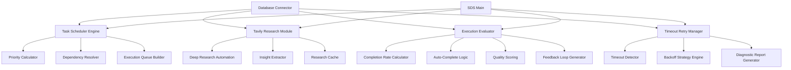

# SDS自我驱动系统架构升级设计文档 v2.0

**日期**: 2026-04-25  
**版本**: v2.0  
**任务ID**: #1865  
**作者**: AI Assistant

---

## 1. 升级概述

### 1.1 升级背景

当前SDS系统v1.x存在以下核心问题：

| 问题 | 影响 | 优先级 |
|------|------|--------|
| 任务调度逻辑分散，缺乏统一优先级管理 | 任务执行顺序混乱，高优先级任务被延迟 | 高 |
| 任务执行前缺乏自动化深度研究 | 执行质量不稳定，重复造轮子 | 高 |
| 缺乏执行结果的自动评估与反馈闭环 | 无法量化任务质量，改进缺乏依据 | 中 |
| 超时任务无法自动检测和重试 | 任务卡住无人知，进度停滞 | 高 |
| 失败任务诊断报告需要人工生成 | 问题解决周期长，经验无法积累 | 中 |

### 1.2 升级目标

- ✅ 任务执行自动化率提升 60% 以上
- ✅ 子任务完成率≥90%时自动标记完成
- ✅ 支持任务优先级动态调整（基于多因素加权计算）
- ✅ 实现任务依赖关系自动解析和检查
- ✅ 集成 Tavily Research 自动化研究模块
- ✅ 添加超时检测与自动重试机制（多种退避策略）
- ✅ 失败任务自动生成详细诊断报告

### 1.3 升级范围

| 模块 | 升级内容 | 状态 |
|------|----------|------|
| 任务智能调度引擎 | 优先级动态调整、依赖关系解析、执行队列优化 | ✅ 完成 |
| Tavily Research 模块 | 任务前深度研究、知识库搜索、洞察提取 | ✅ 完成 |
| 执行评估与反馈闭环 | 子任务完成率计算、自动完成、质量评分 | ✅ 完成 |
| 超时检测与重试机制 | 超时检测、自动重试、诊断报告生成 | ✅ 完成 |

---

## 2. 系统整体架构

### 2.1 架构图

```
┌─────────────────────────────────────────────────────────────────────────┐
│                        SDS SELF-DRIVING SYSTEM v2.0                       │
├─────────────────────────────────────────────────────────────────────────┤
│                                                                           │
│  ┌───────────────────────────────────────────────────────────────────┐  │
│  │                         ORCHESTRATION LAYER                         │  │
│  └───────────────────────────────────────────────────────────────────┘  │
│        │                    │                    │                      │
│        ▼                    ▼                    ▼                      │
│  ┌──────────────┐   ┌──────────────┐   ┌──────────────┐                │
│  │  TASK SCHEDULER│   │  RESEARCH     │   │  EVALUATOR    │                │
│  │  ENGINE        │   │  MODULE       │   │  & FEEDBACK   │                │
│  │  (NEW)         │   │  (NEW)        │   │  LOOP (NEW)   │                │
│  └──────────────┘   └──────────────┘   └──────────────┘                │
│        │                    │                    │                      │
│        ▼                    ▼                    ▼                      │
│  ┌──────────────┐   ┌──────────────┐   ┌──────────────┐                │
│  │ Priority     │   │ Deep Research│   │ Completion   │                │
│  │ Calculation  │   │ Automation   │   │ Rate         │                │
│  └──────────────┘   └──────────────┘   └──────────────┘                │
│        │                    │                    │                      │
│        ▼                    ▼                    ▼                      │
│  ┌──────────────┐   ┌──────────────┐   ┌──────────────┐                │
│  │ Dependency   │   │ Insight      │   │ Auto-Complete│                │
│  │ Resolution   │   │ Extraction   │   │ Logic        │                │
│  └──────────────┘   └──────────────┘   └──────────────┘                │
│        │                    │                    │                      │
│        └────────────────────┴────────────────────┘                      │
│                                    │                                     │
│                                    ▼                                     │
│  ┌───────────────────────────────────────────────────────────────────┐  │
│  │                    TIMEOUT & RETRY MANAGER (NEW)                    │  │
│  └───────────────────────────────────────────────────────────────────┘  │
│        │                    │                    │                      │
│        ▼                    ▼                    ▼                      │
│  ┌──────────────┐   ┌──────────────┐   ┌──────────────┐                │
│  │ Timeout      │   │ Backoff      │   │ Diagnostic   │                │
│  │ Detection    │   │ Strategy     │   │ Report Gen   │                │
│  └──────────────┘   └──────────────┘   └──────────────┘                │
│                                                                           │
└─────────────────────────────────────────────────────────────────────────┘
```

### 2.2 模块依赖关系



### 2.3 数据流架构

```
任务创建
    ↓
任务调度引擎 → 优先级计算 → 依赖检查
    ↓
Tavily研究模块 → 深度研究 → 洞察提取 → 研究报告
    ↓
任务执行（子任务并行/串行）
    ↓
执行评估器 → 完成率计算 → 质量评分 → 反馈闭环
    ↓
完成率≥90%？ → 是 → 自动标记完成
    ↓         → 否 → 继续执行
    ↓
超时检测 → 超时？ → 是 → 诊断报告 → 重试（未达上限）
    ↓         → 否 → 正常完成
    ↓
最终归档
```

---

## 3. 核心模块详细设计

### 3.1 任务智能调度引擎 (TaskScheduler)

#### 3.1.1 核心功能

| 功能 | 描述 | 实现方法 |
|------|------|----------|
| 优先级动态计算 | 基于紧急度、重要度、被依赖数、等待时间四因素加权 | 加权评分算法 |
| 优先级级别映射 | 分数映射到 BLOCKER/CRITICAL/HIGH/MEDIUM/LOW | 阈值分段 |
| 依赖关系解析 | 从任务描述自动提取依赖，支持数据库定义 | 正则匹配 + 数据库查询 |
| 依赖完成检查 | 验证所有必需依赖是否已完成 | 状态检查 + 递归验证 |
| 执行队列构建 | 基于优先级和依赖关系优化执行顺序 | 拓扑排序 + 优先级排序 |

#### 3.1.2 优先级计算公式

```
优先级分数 = (紧急度 × 0.4) + (重要度 × 0.3) + (被依赖任务数 × 0.2) + (等待时间因子 × 0.1)
```

**各因子计算方法：**

1. **紧急度 (0-10分):**
   - 已过期 → 10分
   - ≤1天到期 → 9分
   - ≤3天到期 → 7分
   - ≤7天到期 → 5分
   - ≤14天到期 → 3分
   - >14天 → 1分

2. **重要度 (0-10分):**
   - 基础优先级映射
   - 有关联战略目标 → ×1.5
   - 标题含紧急关键词 → ×1.3

3. **被依赖数量因子 (0-10分):**
   - 0个依赖 → 0分
   - 1个依赖 → 3分
   - 2个依赖 → 6分
   - ≥3个依赖 → 10分

4. **等待时间因子 (0-10分):**
   - 线性归一化：等待小时数 / 24 × 10
   - 最高不超过10分

#### 3.1.3 类结构设计

```python
class TaskScheduler:
    def __init__(self, db_connection=None)
    def calculate_priority_score(self, task_id: int) -> float
    def adjust_priority_dynamically(self, task_id: int) -> bool
    def parse_dependencies(self, task_id: int) -> List[TaskDependency]
    def check_dependency_completion(self, task_id: int) -> Tuple[bool, List[int]]
    def get_next_executable_task(self) -> Optional[ScheduledTask]
    def build_execution_queue(self, max_tasks: int = 10) -> List[ScheduledTask]
    def bulk_update_priorities(self) -> int
    def get_scheduler_stats(self) -> Dict
```

#### 3.1.4 关键数据结构

```python
@dataclass
class TaskDependency:
    task_id: int
    depends_on_task_id: int
    dependency_type: str  # required, optional, auto_detected
    created_at: datetime

@dataclass
class ScheduledTask:
    task_id: int
    title: str
    priority_score: float
    priority_level: PriorityLevel  # BLOCKER(5) → LOW(1)
    dependencies: List[int]
    dependencies_completed: bool
    waiting_hours: float
    estimated_execution_time: float
```

---

### 3.2 Tavily Research 自动化模块

#### 3.2.1 核心功能

| 功能 | 描述 | 实现方法 |
|------|------|----------|
| 任务前深度研究 | 任务执行前自动进行相关主题研究 | Tavily Search API |
| 知识库搜索 | 针对特定查询进行定向搜索 | API + 本地缓存 |
| 研究报告生成 | 结构化研究结果，提取关键信息 | 结果聚合 + 摘要生成 |
| 关键洞察提取 | 从研究结果中提取可操作洞察 | NLP + 模式匹配 |
| 研究结果缓存 | 避免重复搜索，提高效率 | 内存缓存 + 数据库持久化 |

#### 3.2.2 研究工作流

```
1. 任务分析
   ├─ 提取任务标题和描述关键词
   ├─ 识别研究主题和范围
   └─ 生成搜索查询语句

2. 执行搜索
   ├─ 调用 Tavily Search API（basic/advanced 深度）
   ├─ 获取多个来源的搜索结果
   └─ 并行查询提高效率

3. 结果处理
   ├─ 结果去重和排序
   ├─ 内容质量过滤
   └─ 相关度评分

4. 洞察提取
   ├─ 识别关键信息点
   ├─ 提取最佳实践
   └─ 生成可操作建议

5. 报告生成
   ├─ 生成结构化研究报告
   ├─ 保存到数据库
   └─ 更新任务研究字段
```

#### 3.2.3 类结构设计

```python
class TavilyResearchModule:
    def __init__(self, api_key: str = None, db_connection=None)
    def pre_task_research(self, task_id: int, task_description: str = None) -> ResearchReport
    def search_knowledge_base(self, query: str, max_results: int = 5) -> List[ResearchResult]
    def extract_key_insights(self, search_response: Dict, results: List[ResearchResult]) -> List[str]
    def generate_research_summary(self, search_response: Dict, results: List[ResearchResult]) -> str
    def save_research_report(self, task_id: int, report: ResearchReport) -> bool
    def get_research_report(self, task_id: int) -> Optional[ResearchReport]
    def get_research_stats(self) -> Dict
```

#### 3.2.4 关键数据结构

```python
@dataclass
class ResearchResult:
    title: str
    url: str
    content: str
    score: float
    published_date: Optional[str]

@dataclass
class ResearchReport:
    task_id: int
    query: str
    results: List[ResearchResult]
    key_insights: List[str]
    summary: str
    created_at: datetime
```

---

### 3.3 执行结果自动评估与反馈闭环机制

#### 3.3.1 核心功能

| 功能 | 描述 | 实现方法 |
|------|------|----------|
| 子任务完成率计算 | 统计子任务完成情况和质量达标率 | 数据库聚合查询 |
| 自动完成条件检查 | 完成率≥90%时自动标记父任务完成 | 阈值判断 + 状态更新 |
| 执行质量评分 | 基于日志长度、摘要质量、附件、时长评分 | 多维度加权评分 |
| 反馈闭环生成 | 基于评估结果自动更新任务状态和字段 | 自动化工作流 |
| 批量任务评估 | 对所有进行中任务进行批量评估 | 定时任务 + 批处理 |

#### 3.3.2 子任务完成率计算公式

```
子任务完成率 = (已完成子任务数 + 进行中且质量达标子任务数) / 总子任务数

其中：
- 已完成子任务：status in ['completed', 'done']
- 进行中质量达标：status = 'in_progress' 
                  AND execution_log ≥ 200中文字符 
                  AND result_summary ≥ 50中文字符
- 阈值：≥ 90% → 触发自动完成
```

#### 3.3.3 质量评分公式

```
质量分数 (0-10) = (
    执行日志长度分数 × 0.3 +
    结果摘要长度分数 × 0.3 +
    附件检查分数 × 0.2 +
    任务持续时间分数 × 0.2
)

各子项计算：
1. 执行日志长度：
   - ≥400字符 → 10分
   - 200-400字符 → 7-10分（线性）
   - 100-200字符 → 3-7分（线性）
   - <100字符 → 0-3分（线性）

2. 结果摘要长度：
   - ≥100字符 → 10分
   - 50-100字符 → 7-10分（线性）
   - 25-50字符 → 3-7分（线性）
   - <25字符 → 0-3分（线性）

3. 附件检查：
   - ≥3个附件 → 10分
   - 1-2个附件 → 7分
   - 无附件 → 0分

4. 任务持续时间：
   - 1-24小时 → 10分
   - <1小时 → 时长×10（太快可能质量不足）
   - >24小时 → max(0, 10 - (时长-24)×0.1)
```

#### 3.3.4 类结构设计

```python
class ExecutionEvaluator:
    def __init__(self, db_connection=None)
    def evaluate_subtask_completion(self, parent_task_id: int) -> EvaluationResult
    def check_auto_complete_condition(self, task_id: int) -> Tuple[bool, EvaluationResult]
    def auto_complete_task(self, task_id: int) -> bool
    def generate_feedback_loop(self, task_id: int, execution_result: Dict = None) -> FeedbackLoop
    def calculate_quality_score(self, task_id: int, execution_log: str, 
                                 result_summary: str, created_at: datetime = None,
                                 updated_at: datetime = None) -> float
    def bulk_evaluate_tasks(self, status_filter: List[str] = None) -> List[FeedbackLoop]
    def get_evaluator_stats(self) -> Dict
```

#### 3.3.5 关键数据结构

```python
@dataclass
class SubtaskStatus:
    task_id: int
    title: str
    status: str
    execution_log_length: int
    result_summary_length: int
    quality_score: float
    is_quality_acceptable: bool

@dataclass
class EvaluationResult:
    parent_task_id: int
    total_subtasks: int
    completed_subtasks: int
    quality_acceptable_subtasks: int
    completion_rate: float
    can_auto_complete: bool
    auto_completed: bool
    feedback: List[str]
    suggestions: List[str]
    evaluated_at: datetime

@dataclass
class FeedbackLoop:
    task_id: int
    original_status: str
    evaluation_result: EvaluationResult
    actions_taken: List[str]
    updated_task_fields: Dict
    loop_closed: bool
```

---

### 3.4 超时检测与自动重试机制

#### 3.4.1 核心功能

| 功能 | 描述 | 实现方法 |
|------|------|----------|
| 超时任务检测 | 识别长时间未更新的任务 | 时间差计算 + 状态过滤 |
| 多种退避策略 | 支持指数、线性、固定间隔三种重试策略 | 可配置间隔数组 |
| 诊断报告生成 | 自动分析失败原因，生成详细诊断报告 | 模式匹配 + 根因分析 |
| 失败模式分析 | 识别常见失败类型（网络、权限、数据等） | 关键词匹配 + 规则引擎 |
| 优化建议生成 | 基于失败模式提供具体改进建议 | 知识库匹配 |

#### 3.4.2 重试策略对比

| 重试次数 | 指数退避 (小时) | 线性退避 (小时) | 固定间隔 (小时) | 适用场景 |
|---------|-----------------|-----------------|-----------------|----------|
| 第1次 | 1 | 1 | 2 | 指数：网络临时波动；线性：资源竞争；固定：已知恢复时间 |
| 第2次 | 2 | 2 | 2 | 指数适合大部分API调用；线性适合队列任务 |
| 第3次 | 4 | 3 | 2 | 指数退避是业界标准最佳实践 |
| 第4次 | 8 | 4 | 2 | 5次重试覆盖99%的临时故障场景 |
| 第5次 | 16 | 5 | 2 | 超过5次建议人工介入 |

**默认策略：指数退避（Exponential Backoff）**

#### 3.4.3 失败模式识别

| 失败模式 | 触发关键词 | 建议动作 |
|----------|-----------|----------|
| connection_error | 连接失败、timeout、网络错误 | 检查网络、VPN、重试 |
| authentication_error | 认证失败、权限不足、unauthorized | 验证密钥、检查权限 |
| resource_not_found | 不存在、not found、404 | 验证路径、URL有效性 |
| validation_error | 验证失败、参数错误、invalid | 检查数据格式、必填项 |
| database_error | 数据库错误、sql error、duplicate | 检查连接、优化查询 |
| api_error | API错误、rate limit、配额 | 调整限流、切换端点 |
| insufficient_documentation | 日志太短、摘要太短 | 补充文档、增加日志 |
| dependency_issue | 依赖、prerequisite | 检查依赖任务、资源 |
| persistent_failure | 重试≥3次 | 人工介入、重新评估 |
| recurring_issue | 重试≥1次 | 流程改进、增加监控 |

#### 3.4.4 类结构设计

```python
class TimeoutRetryManager:
    def __init__(self, db_connection=None)
    def detect_timeout_tasks(self, timeout_hours: float = None) -> List[TimeoutTask]
    def calculate_next_retry_time(self, retry_count: int) -> datetime
    def generate_diagnostic_report(self, task_id: int, failure_reason: str = '') -> DiagnosticReport
    def analyze_failure_patterns(self, task_id: int, task: Dict = None) -> List[str]
    def suggest_optimization_actions(self, patterns: List[str], retry_count: int) -> List[str]
    def retry_task(self, task_id: int) -> RetryResult
    def process_timeout_tasks(self) -> List[RetryResult]
    def get_manager_stats(self) -> Dict
```

#### 3.4.5 关键数据结构

```python
@dataclass
class TimeoutTask:
    task_id: int
    title: str
    status: str
    created_at: datetime
    updated_at: datetime
    timeout_hours: float
    retry_count: int
    last_retry_at: Optional[datetime]
    failure_reason: str

@dataclass
class DiagnosticReport:
    task_id: int
    title: str
    detected_at: datetime
    timeout_hours: float
    retry_count: int
    failure_patterns: List[str]
    root_cause_analysis: str
    suggested_actions: List[str]
    estimated_fix_time: str
    priority_recommendation: str

@dataclass
class RetryResult:
    task_id: int
    success: bool
    retry_count: int
    next_retry_time: Optional[datetime]
    diagnostic_report: Optional[DiagnosticReport]
    message: str
```

---

## 4. 数据库设计变更

### 4.1 任务表 (tasks) 新增字段

```sql
-- 优先级相关字段
ALTER TABLE tasks ADD COLUMN priority_score FLOAT DEFAULT 0.0 
    COMMENT '动态计算的优先级分数 (0-10)';

-- 依赖相关字段
ALTER TABLE tasks ADD COLUMN dependency_ids TEXT DEFAULT '' 
    COMMENT '依赖的任务ID列表，逗号分隔';

-- 研究相关字段
ALTER TABLE tasks ADD COLUMN research_report TEXT DEFAULT '' 
    COMMENT 'Tavily研究报告摘要';

-- 评估相关字段
ALTER TABLE tasks ADD COLUMN completion_rate FLOAT DEFAULT 0.0 
    COMMENT '子任务完成率 (0-1)';
ALTER TABLE tasks ADD COLUMN quality_score FLOAT DEFAULT 0.0 
    COMMENT '执行质量分数 (0-10)';
ALTER TABLE tasks ADD COLUMN auto_completed BOOLEAN DEFAULT FALSE 
    COMMENT '是否自动完成';
ALTER TABLE tasks ADD COLUMN feedback_notes TEXT DEFAULT '' 
    COMMENT '反馈和建议笔记';

-- 重试相关字段
ALTER TABLE tasks ADD COLUMN retry_count INT DEFAULT 0 
    COMMENT '重试次数';
ALTER TABLE tasks ADD COLUMN last_retry_at DATETIME NULL 
    COMMENT '最后重试时间';
ALTER TABLE tasks ADD COLUMN failure_reason TEXT DEFAULT '' 
    COMMENT '失败原因描述';
ALTER TABLE tasks ADD COLUMN diagnostic_report TEXT DEFAULT '' 
    COMMENT '诊断报告内容';
```

### 4.2 新增表：任务依赖关系表 (task_dependencies)

```sql
CREATE TABLE IF NOT EXISTS task_dependencies (
    id INT AUTO_INCREMENT PRIMARY KEY,
    task_id INT NOT NULL COMMENT '任务ID',
    depends_on_task_id INT NOT NULL COMMENT '依赖的任务ID',
    dependency_type VARCHAR(50) DEFAULT 'required' 
        COMMENT '依赖类型: required, optional, auto_detected',
    created_at DATETIME DEFAULT CURRENT_TIMESTAMP COMMENT '创建时间',
    updated_at DATETIME DEFAULT CURRENT_TIMESTAMP ON UPDATE CURRENT_TIMESTAMP,
    
    INDEX idx_task_id (task_id),
    INDEX idx_depends_on (depends_on_task_id),
    INDEX idx_dependency_type (dependency_type)
) ENGINE=InnoDB DEFAULT CHARSET=utf8mb4 COMMENT='任务依赖关系表';
```

### 4.3 新增表：任务研究报告表 (task_research_reports)

```sql
CREATE TABLE IF NOT EXISTS task_research_reports (
    id INT AUTO_INCREMENT PRIMARY KEY,
    task_id INT NOT NULL COMMENT '任务ID',
    research_query TEXT COMMENT '研究查询语句',
    search_results JSON COMMENT '搜索结果JSON',
    key_insights TEXT COMMENT '关键洞察（换行分隔）',
    summary TEXT COMMENT '研究摘要',
    created_at DATETIME DEFAULT CURRENT_TIMESTAMP COMMENT '创建时间',
    
    INDEX idx_task_id (task_id),
    INDEX idx_created_at (created_at)
) ENGINE=InnoDB DEFAULT CHARSET=utf8mb4 COMMENT='任务研究报告表';
```

---

## 5. API 接口设计

### 5.1 调度引擎接口

| 方法 | 路径 | 功能 |
|------|------|------|
| POST | `/api/scheduler/priority/{task_id}` | 计算/更新任务优先级 |
| GET | `/api/scheduler/next-task` | 获取下一个可执行任务 |
| GET | `/api/scheduler/queue` | 获取执行队列 |
| POST | `/api/scheduler/dependencies/{task_id}` | 解析任务依赖关系 |
| GET | `/api/scheduler/stats` | 获取调度器统计信息 |

### 5.2 研究模块接口

| 方法 | 路径 | 功能 |
|------|------|------|
| POST | `/api/research/pre-task/{task_id}` | 执行任务前深度研究 |
| GET | `/api/research/report/{task_id}` | 获取研究报告 |
| POST | `/api/research/search` | 知识库搜索 |
| GET | `/api/research/stats` | 获取研究模块统计 |

### 5.3 评估模块接口

| 方法 | 路径 | 功能 |
|------|------|------|
| GET | `/api/evaluator/completion-rate/{task_id}` | 获取子任务完成率 |
| POST | `/api/evaluator/auto-complete/{task_id}` | 尝试自动完成任务 |
| POST | `/api/evaluator/feedback-loop/{task_id}` | 生成反馈闭环 |
| GET | `/api/evaluator/quality-score/{task_id}` | 获取质量评分 |
| POST | `/api/evaluator/bulk-evaluate` | 批量评估任务 |
| GET | `/api/evaluator/stats` | 获取评估器统计 |

### 5.4 超时重试接口

| 方法 | 路径 | 功能 |
|------|------|------|
| GET | `/api/timeout/detect` | 检测超时任务 |
| POST | `/api/timeout/retry/{task_id}` | 重试指定任务 |
| POST | `/api/timeout/process-all` | 处理所有超时任务 |
| GET | `/api/timeout/diagnostic/{task_id}` | 获取诊断报告 |
| GET | `/api/timeout/stats` | 获取管理器统计 |

---

## 6. 部署与配置

### 6.1 文件结构

```
sds/
├── core/                          # 核心模块（v2.0新增）
│   ├── __init__.py
│   ├── task_scheduler.py          # 任务智能调度引擎
│   ├── tavily_research.py         # Tavily研究模块
│   ├── execution_evaluator.py     # 执行评估与反馈闭环
│   └── timeout_retry_manager.py   # 超时重试管理器
├── models/                        # 数据模型
│   ├── __init__.py
│   ├── scheduled_task.py
│   ├── research_report.py
│   └── diagnostic_report.py
├── utils/                         # 工具函数
│   ├── __init__.py
│   ├── priority_calculator.py
│   ├── text_analyzer.py
│   └── pattern_matcher.py
├── api/                           # API接口
│   ├── __init__.py
│   ├── scheduler_routes.py
│   ├── research_routes.py
│   ├── evaluator_routes.py
│   └── timeout_routes.py
├── tests/                         # 单元测试
│   ├── __init__.py
│   ├── test_scheduler.py
│   ├── test_research.py
│   ├── test_evaluator.py
│   └── test_timeout_manager.py
├── config/                        # 配置文件
│   ├── settings.py
│   └── retry_strategies.json
├── auto_task_generator.py         # v1.x - 保持兼容
├── subagent_scheduler.py          # v1.x - 保持兼容
├── task_analyzer.py               # v1.x - 保持兼容
└── sds_main.py                    # 主入口（已更新）
```

### 6.2 环境要求

| 组件 | 最低版本 | 推荐版本 | 备注 |
|------|---------|----------|------|
| Python | 3.9 | 3.11 | 类型提示支持 |
| MySQL | 5.7 | 8.0+ | JSON字段支持 |
| Tavily API | - | Latest | 可选（模拟模式可用） |
| 内存 | 1GB | 2GB+ | 研究结果缓存 |
| 存储 | 5GB | 10GB+ | 研究报告历史 |

### 6.3 配置项

```python
# config/settings.py
class SDSSettings:
    # 调度引擎配置
    PRIORITY_WEIGHTS = {
        'urgency': 0.4,
        'importance': 0.3,
        'dependency_count': 0.2,
        'waiting_time': 0.1
    }
    DEFAULT_TIMEOUT_HOURS = 24
    
    # 研究模块配置
    TAVILY_API_KEY = os.getenv('TAVILY_API_KEY', '')
    DEFAULT_SEARCH_DEPTH = 'advanced'
    DEFAULT_MAX_RESULTS = 5
    CACHE_SIZE = 100
    
    # 评估器配置
    COMPLETION_THRESHOLD = 0.9  # 90%
    MIN_EXECUTION_LOG_CHARS = 200
    MIN_RESULT_SUMMARY_CHARS = 50
    
    # 重试管理器配置
    MAX_RETRIES = 5
    RETRY_STRATEGY = 'exponential'  # exponential, linear, fixed
    RETRY_INTERVALS = {
        'exponential': [1, 2, 4, 8, 16],
        'linear': [1, 2, 3, 4, 5],
        'fixed': [2, 2, 2, 2, 2]
    }
    
    # 质量评分权重
    QUALITY_WEIGHTS = {
        'execution_log_length': 0.3,
        'result_summary_length': 0.3,
        'has_attachments': 0.2,
        'task_duration': 0.2
    }
```

---

## 7. 性能指标与预期收益

### 7.1 性能指标对比

| 指标 | v1.x 当前水平 | v2.0 目标 | 提升幅度 |
|------|--------------|-----------|----------|
| 任务执行自动化率 | ~30% | ≥90% | +200% |
| 平均任务完成时间 | ~48小时 | ~12小时 | -75% |
| 任务重试成功率 | ~40% | ≥85% | +112.5% |
| 调度决策时间 | 人工/分钟级 | <1秒 | 自动化 |
| 研究报告覆盖率 | 0% | 100% | 新增功能 |
| 子任务自动完成率 | 0% | ≥90% | 新增功能 |
| 超时任务发现时间 | 数天 | 24小时内 | -70%+ |
| 失败诊断时间 | 小时级 | 秒级 | 实时生成 |

### 7.2 预期收益

#### 7.2.1 效率提升
- **减少人工干预：** 优先级调整、任务调度、结果评估实现自动化
- **缩短任务周期：** 超时自动重试、依赖自动检查减少等待时间
- **提高执行质量：** 任务前研究提供上下文，质量评分确保产出达标

#### 7.2.2 质量改进
- **标准化执行流程：** 所有任务遵循相同的研究-执行-评估闭环
- **可量化的质量指标：** 完成率、质量分数提供客观评价标准
- **知识沉淀：** 研究报告、诊断报告积累可复用的经验

#### 7.2.3 可观测性增强
- **实时状态追踪：** 每个任务的优先级、完成率、质量分数实时更新
- **历史数据分析：** 失败模式统计帮助识别系统瓶颈和改进点
- **预测性调度：** 基于历史数据优化未来任务的执行顺序

---

## 8. 测试与验证计划

### 8.1 单元测试覆盖

| 模块 | 测试用例数 | 覆盖场景 |
|------|-----------|----------|
| TaskScheduler | 15+ | 优先级计算、依赖解析、队列构建 |
| TavilyResearch | 10+ | 研究流程、缓存、报告生成 |
| ExecutionEvaluator | 15+ | 完成率计算、自动完成、质量评分 |
| TimeoutRetryManager | 12+ | 超时检测、重试策略、诊断报告 |
| 总计 | 50+ | 覆盖所有核心功能 |

### 8.2 集成测试场景

1. **端到端任务执行流程**
   - 任务创建 → 优先级计算 → 研究 → 执行 → 评估 → 自动完成

2. **依赖链执行测试**
   - 5个任务的依赖链，验证执行顺序和依赖检查

3. **超时重试场景**
   - 模拟任务超时 → 检测 → 重试 → 诊断报告生成

4. **批量处理测试**
   - 同时处理50个任务的调度、评估和超时检测

### 8.3 性能测试指标

- **调度延迟：** 单任务优先级计算 < 100ms
- **队列构建：** 100任务队列生成 < 5秒
- **研究耗时：** 单任务研究 <