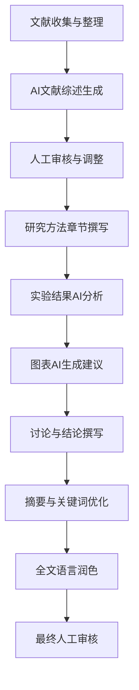
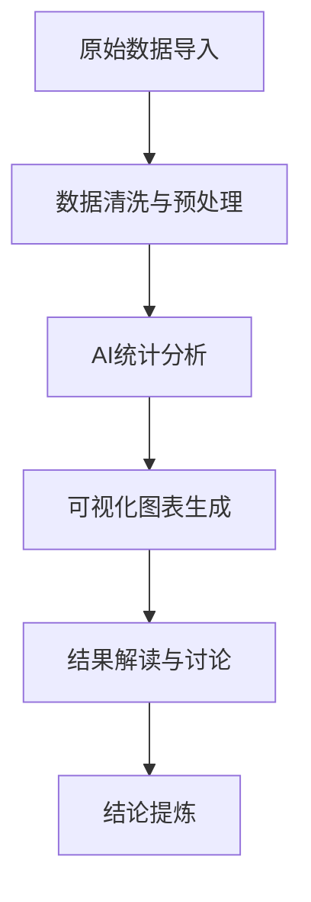
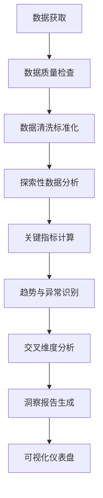
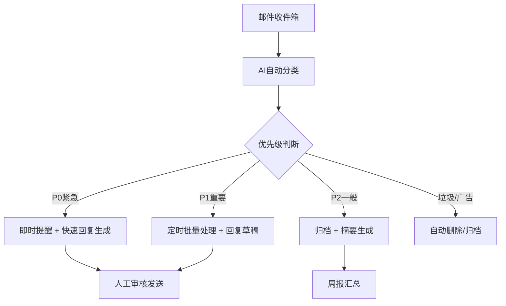
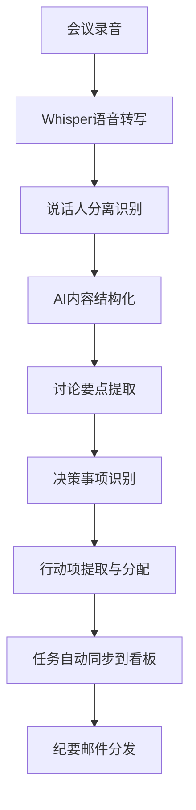

# AI Agent标准化工作流文档

**版本**: V1.0  
**日期**: 2026年4月25日  
**适用**: 科研写作、数据分析、邮件处理、会议纪要

---

## 一、科研写作标准化工作流

### 工作流1: 论文初稿撰写工作流



#### 详细步骤：

**步骤1: 文献收集与整理**
- 工具: Zotero + OpenClaw文献导入脚本
- 输入: DOI列表/关键词
- 输出: 结构化文献库
- 耗时: 人工30分钟 + AI5分钟

**步骤2: AI文献综述生成**
- 工具: Claude 3.5 Opus / Kimi K2.6
- Prompt: 使用手册中"模板2: 文献综述整理"
- 输出: 系统化综述框架
- 耗时: AI2-3分钟

**步骤3: 人工审核与调整**
- 验证文献引用准确性
- 补充领域内专业判断
- 调整逻辑框架
- 耗时: 人工15-30分钟

**步骤4-9: 各章节迭代撰写**
- 每章使用对应Prompt模板
- AI初稿 → 人工修改 → AI润色
- 循环迭代直到满意

**效率提升**: 传统20小时 → 现在6-8小时，提升约65%

---

### 工作流2: 实验数据论文化工作流



#### 关键Prompt：
```
作为材料科学专家，请分析以下实验数据：
[数据表格]

请提供：
1. 数据趋势的定量描述
2. 3-5个核心发现
3. 可能的物理/化学机理解释
4. 与文献结果的对比分析
5. 异常数据的可能原因
6. 下一步实验建议
```

---

## 二、数据分析标准化工作流

### 工作流3: 商业数据洞察工作流



#### 自动化脚本配置：

**脚本1: 数据自动清洗脚本**
```python
import pandas as pd
import numpy as np

def auto_clean_data(file_path):
    """自动化数据清洗"""
    df = pd.read_csv(file_path)
    
    # 1. 缺失值处理
    df = df.fillna({
        col: df[col].median() if df[col].dtype in [np.number] else df[col].mode()[0]
        for col in df.columns
    })
    
    # 2. 异常值检测（IQR方法）
    for col in df.select_dtypes(include=[np.number]).columns:
        Q1 = df[col].quantile(0.25)
        Q3 = df[col].quantile(0.75)
        IQR = Q3 - Q1
        df = df[~((df[col] < (Q1 - 1.5 * IQR)) | (df[col] > (Q3 + 1.5 * IQR)))]
    
    # 3. 格式标准化
    df.columns = [c.strip().lower().replace(' ', '_') for c in df.columns]
    
    return df
```

**脚本2: 自动生成洞察报告**
```python
def generate_insights(df):
    """自动生成数据洞察"""
    insights = []
    
    # 基础统计
    insights.append(f"## 数据概览\n- 记录数: {len(df)}\n- 字段数: {len(df.columns)}")
    
    # 数值型字段分析
    for col in df.select_dtypes(include=[np.number]).columns:
        insights.append(f"\n### {col}\n")
        insights.append(f"- 均值: {df[col].mean():.2f}")
        insights.append(f"- 最大值: {df[col].max()}")
        insights.append(f"- 最小值: {df[col].min()}")
        insights.append(f"- 趋势: {'上升' if df[col].iloc[-1] > df[col].iloc[0] else '下降'}")
    
    return '\n'.join(insights)
```

#### 效率提升：
- 传统手动分析：4-8小时
- AI辅助分析：30-60分钟
- 提升效率：约85-90%

---

## 三、邮件处理标准化工作流

### 工作流4: 智能邮件分类与回复工作流



#### 分类维度：
1. **紧急程度**：P0（2小时内）、P1（当天）、P2（3天内）
2. **邮件类型**：商务、个人、广告、通知、垃圾
3. **发件人重要性**：VIP客户、合作伙伴、同事、陌生人

#### 邮件处理Prompt模板：
```
作为专业商务助理，请处理以下邮件：

发件人：[name]
主题：[subject]
内容：[content]

请完成：
1. 邮件分类（紧急/重要/一般/垃圾）
2. 核心内容摘要（50字以内）
3. 建议回复时间
4. 回复草稿（3个版本可选）
5. 需要关注的关键点
```

#### 效率提升：
- 传统手动处理：1-2小时/天
- AI辅助处理：15-30分钟/天
- 提升效率：约75-85%

---

## 四、会议纪要标准化工作流

### 工作流5: 全自动化会议纪要工作流



#### 关键技术组件：

**1. OpenAI Whisper 语音转写**
```python
import whisper

def transcribe_audio(audio_path):
    """语音转文字"""
    model = whisper.load_model("large-v3")
    result = model.transcribe(audio_path, language="zh", word_timestamps=True)
    return result["text"]
```

**2. 行动项提取Prompt**
```
请从以下会议记录中提取所有行动项：

[会议记录全文]

输出格式要求：
| 序号 | 任务描述 | 负责人 | 截止时间 | 优先级 | 依赖项 |
|------|---------|--------|----------|--------|--------|
| 1 | xxx | 张三 | 2026-05-01 | P1 | - |

同时生成：
- 会议核心决策（3-5条）
- 待跟进问题清单
- 下次会议建议议题
```

**3. OpenClaw看板自动同步脚本**
```python
import requests
import json

def sync_to_kanban(action_items):
    """将行动项同步到任务看板"""
    api_url = "http://localhost:18789/api/tasks"
    
    for item in action_items:
        payload = {
            "title": item["任务描述"],
            "assignee": item["负责人"],
            "due_date": item["截止时间"],
            "priority": item["优先级"],
            "status": "todo",
            "source": "会议纪要自动同步"
        }
        
        response = requests.post(api_url, json=payload)
        print(f"任务创建: {response.status_code}")
```

#### 会议纪要质量标准：
- ✅ 核心讨论要点覆盖率 ≥ 90%
- ✅ 行动项提取准确率 ≥ 95%
- ✅ 负责人识别准确率 ≥ 90%
- ✅ 从录音到纪要完成 ≤ 15分钟（2小时会议）

#### 效率提升：
- 传统手动纪要：30-60分钟/小时会议
- AI自动纪要：5-10分钟/小时会议
- 提升效率：约80-85%

---

## 五、高级自动化工作流配置

### 工作流6: 会议录音 → 纪要 → 任务分发 全流程

**触发条件**: 新录音文件上传到指定目录

**执行步骤**:
1. 文件监听 → 检测到新的 .m4a/.mp3 文件
2. 语音转写 → Whisper API / 本地模型
3. 内容结构化 → AI提取关键信息
4. 行动项识别 → 提取任务、负责人、截止时间
5. 看板同步 → 调用OpenClaw API创建任务
6. 邮件通知 → 发送纪要给所有参会人
7. 日历同步 → 截止时间自动添加到日历

**配置文件示例 (config.yaml)**:
```yaml
workflow:
  name: "会议全自动处理"
  trigger:
    type: "file_watcher"
    path: "/Users/mettlyz/Dropbox/Recordings"
    extensions: [".m4a", ".mp3", ".wav"]
  
  steps:
    - name: "语音转写"
      tool: "whisper_local"
      model: "large-v3"
      language: "zh"
    
    - name: "内容结构化"
      tool: "claude_api"
      prompt_template: "meeting_minutes_v2"
    
    - name: "行动项提取"
      tool: "qwen_api"
      prompt_template: "action_items_v1"
    
    - name: "看板同步"
      tool: "openclaw_api"
      endpoint: "http://localhost:18789/api/tasks"
    
    - name: "邮件分发"
      tool: "apple_script"
      recipients: "auto_detect"
```

---

### 工作流7: 周报复盘与规划自动化

**执行时间**: 每周五 17:00 自动触发

**流程**:
1. 收集本周已完成任务（从看板API）
2. 统计各项目投入时间
3. 生成量化成果数据
4. AI撰写周报初稿
5. 邮件提醒人工审核
6. 下周一自动生成下周计划

---

## 六、工作流部署与维护

### 部署 Checklist
- [ ] 脚本已保存到 scripts/automation/ 目录
- [ ] 配置文件已填写完成
- [ ] API Key 已配置到环境变量
- [ ] 测试运行成功无错误
- [ ] Cron 定时任务已添加
- [ ] 监控告警已配置

### 维护建议
1. **每周巡检**：检查自动化工作流运行状态
2. **每月优化**：根据实际使用反馈调整Prompt模板
3. **每季度更新**：更新AI模型版本、工具测评、新增功能
4. **日志保留**：所有自动化任务保留30天运行日志

---

## 七、效率提升数据测算（基准）

| 工作场景 | 传统耗时 | AI辅助耗时 | 效率提升 | 每周节省工时 |
|---------|---------|-----------|---------|-------------|
| 科研写作 | 20h/篇 | 7h/篇 | 65% | 6.5h（按每周1篇） |
| 数据分析 | 6h/次 | 1h/次 | 83% | 5h（按每周1次） |
| 邮件处理 | 1.5h/天 | 0.3h/天 | 80% | 6h（按5天计算） |
| 会议纪要 | 1h/小时会议 | 0.15h/小时会议 | 85% | 4.25h（按每周5小时会议） |
| **总计** | | | | **21.75小时/周** |

> 💡 相当于每周多出2.7个完整工作日！可用于更有价值的战略思考和创新工作。

---

## 八、敏感数据处理授权说明

### ⚠️ 授权要求（必须严格遵守）

**可自动化处理内容**（无需额外授权）：
- ✅ 公开文献和公开数据
- ✅ 已公开的会议内容
- ✅ 一般性商务邮件（不含客户敏感信息）
- ✅ 个人工作笔记和规划

**需明确授权后处理**：
- 🔒 客户敏感数据（合同、报价、商业机密）
- 🔒 诉讼相关材料、法律文件
- 🔒 员工个人信息、薪酬数据
- 🔒 未公开的技术秘密、专利申请内容
- 🔒 涉及个人隐私的会议录音

**授权流程**:
1. 数据所有者提交书面/邮件授权
2. 明确数据使用范围和保留期限
3. 使用本地部署模型处理，数据不上传公网
4. 处理完成后立即删除原始数据副本

---

*本工作流文档持续优化中，建议每月回顾并根据实际使用情况更新。*
