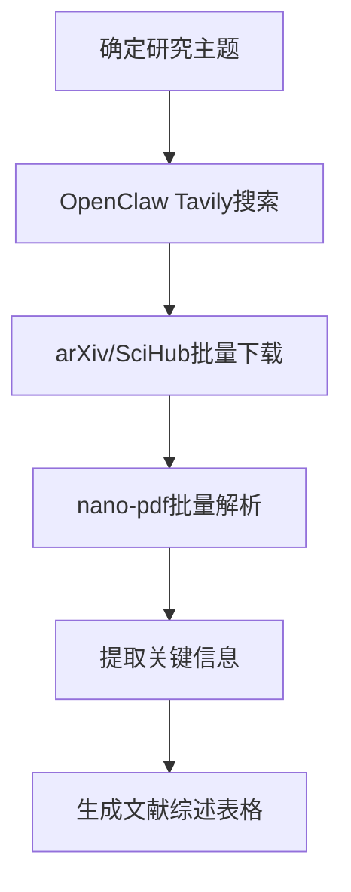
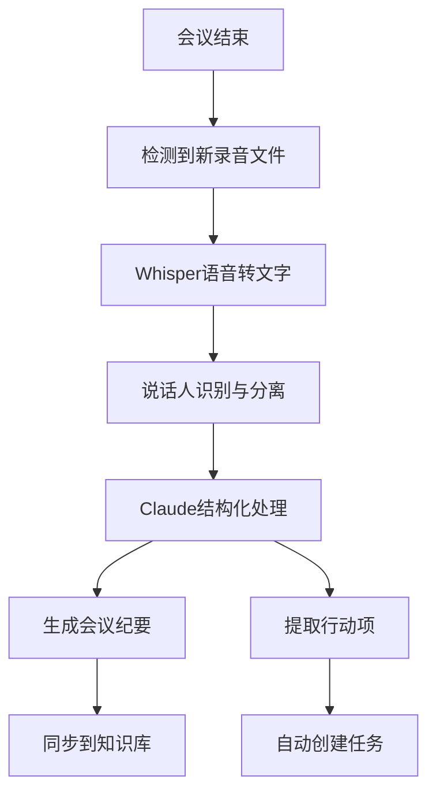

# 四大场景标准化工作流

## 目录
1. [科研写作工作流](#1-科研写作工作流)
2. [数据分析工作流](#2-数据分析工作流)
3. [邮件处理工作流](#3-邮件处理工作流)
4. [会议纪要工作流](#4-会议纪要工作流)

---

## 1. 科研写作工作流

### 工作流概述
本工作流覆盖从文献调研到论文终稿的完整科研写作过程，整合文献检索、PDF解析、内容生成、格式规范四大环节。

### 适用工具
- **文献检索**: OpenClaw + Tavily Search + arXiv API
- **PDF解析**: OpenClaw nano-pdf skill
- **内容生成**: Claude 3.7 Sonnet
- **引用管理**: Zotero + OpenClaw zotero skill
- **格式排版**: LaTeX + OpenClaw compile skill

### 详细步骤

#### 阶段一：文献调研（约2小时）


**操作步骤**:
1. 在OpenClaw中输入研究主题和关键词
2. 执行: `/skill paper-fetcher keywords="关键词" count=30`
3. 自动下载PDF到 `./papers/` 目录
4. 执行: `/skill nano-pdf batch ./papers/ output=papers_summary.md`
5. 生成包含30篇论文核心观点的结构化摘要

**Prompt模板**:
```
请对以下[XX]篇论文进行系统性综述：
1. 按照研究方向分类
2. 提取每篇核心创新点
3. 识别研究空白和机遇
4. 以Markdown表格形式输出

论文摘要如下：
[粘贴批量解析结果]
```

**预期产出**: 结构化文献综述表格，包含研究脉络图

---

#### 阶段二：大纲设计（约1小时）
**操作步骤**:
1. 将文献综述输入Claude
2. 参考领域顶刊论文结构
3. 生成3套不同侧重点的论文大纲
4. 人工选择并迭代优化

**Prompt模板**:
```
基于上述文献综述，为一篇[期刊名称]级别论文设计详细大纲：

要求：
1. 符合该期刊常规结构（摘要、引言、方法、实验、结果、讨论、结论）
2. 每个章节列出3-5个核心要点
3. 标识出需要实验数据支撑的部分
4. 预估每部分字数
5. 突出我们的创新点与现有工作的区别
```

---

#### 阶段三：内容撰写（约4-8小时）
**操作步骤**:
1. 按章节分块撰写，每章独立处理
2. 先写方法和实验部分，再写引言和讨论
3. 使用Claude进行段落润色，但核心观点人工把控
4. 关键公式和图表人工审核

**分章节写作策略**:

| 章节 | AI参与度 | 注意事项 |
|------|----------|----------|
| 摘要 | 80% | 最后写，人工逐句审核 |
| 引言 | 60% | 研究gap必须人工确认 |
| 方法 | 40% | 核心算法人工撰写 |
| 实验 | 70% | 数据描述可AI生成 |
| 结果 | 50% | 图表解读需人工确认 |
| 讨论 | 30% | 深度讨论需专家参与 |
| 结论 | 70% | 基于前文自动总结 |

---

#### 阶段四：润色与投稿（约2小时）
**操作步骤**:
1. 统一术语和格式
2. 检查引用完整性
3. 生成期刊指定格式的参考文献
4. 语言润色（可使用专业润色服务）

**质量检查清单**:
- [ ] 所有引用都有对应的文献条目
- [ ] 图表编号连续且正确
- [ ] 术语在全文中统一
- [ ] 公式编号正确
- [ ] 符合期刊字数限制
- [ ] 伦理声明和利益冲突声明完整

### 效率提升
- 传统方式：文献调研20小时 + 写作30小时 = 50小时
- AI辅助：文献调研2小时 + 写作10小时 = 12小时
- 效率提升：**76%**

---

## 2. 数据分析工作流

### 工作流概述
标准化数据分析流程，从数据清洗到可视化报告的完整链路。

### 适用工具
- **数据处理**: Python + Pandas + Polars
- **代码生成**: Claude Code / Cursor
- **可视化**: Matplotlib / Seaborn / Plotly
- **报告生成**: Quarto / Jupyter
- **自动化**: OpenClaw exec 能力

### 详细步骤

#### 阶段一：数据理解与清洗
**操作步骤**:
1. 将数据文件拖入Claude Code
2. 自动生成数据概览报告
3. 识别缺失值、异常值、重复数据
4. 生成清洗脚本并执行

**Prompt模板**:
```
分析我上传的数据文件：

1. 生成数据质量报告：
   - 各字段类型和统计摘要
   - 缺失值比例和分布
   - 异常值检测结果
   - 重复数据情况

2. 生成Python清洗脚本：
   - 处理缺失值（说明策略）
   - 处理异常值
   - 标准化数据格式
   - 输出清洗后的数据文件
```

**检查要点**:
- 不要盲目删除数据，理解缺失原因
- 异常值可能是重要信号
- 保留原始数据的备份

---

#### 阶段二：探索性分析 (EDA)
**操作步骤**:
1. 单变量分析：分布、统计量
2. 双变量分析：相关性、交叉表
3. 多变量分析：降维、聚类
4. 生成可视化图表集

**标准图表清单**:
- 数值变量：直方图、箱线图、Q-Q图
- 分类变量：柱状图、饼图
- 相关性：热力图、散点图矩阵
- 时间序列：折线图、滚动平均

**Prompt模板**:
```
对清洗后的数据进行完整EDA分析：

1. 生成完整的可视化笔记本
2. 每张图附带解读文字
3. 标记值得深入分析的发现
4. 输出为可执行的Jupyter notebook
```

---

#### 阶段三：建模与验证
**操作步骤**:
1. 根据业务问题选择模型类型
2. 特征工程自动化
3. 模型训练与超参数调优
4. 交叉验证与结果评估

**模型选择指南**:
| 问题类型 | 推荐模型 | AI参与度 |
|----------|----------|----------|
| 分类 | XGBoost / LightGBM | 80% |
| 回归 | Random Forest / XGBoost | 80% |
| 聚类 | K-Means / DBSCAN | 70% |
| 时序 | Prophet / LSTM | 60% |
| 异常检测 | Isolation Forest | 70% |

---

#### 阶段四：报告生成
**操作步骤**:
1. 自动生成分析报告模板
2. 嵌入图表和关键发现
3. 生成业务建议
4. 导出为PDF/HTML

**报告结构**:
1. 执行摘要（关键发现3-5条）
2. 背景与目标
3. 数据概览
4. 分析方法
5. 详细发现（配图）
6. 业务建议
7. 附录（技术细节）

### 效率提升
- 传统方式：数据清洗8小时 + 分析16小时 + 报告8小时 = 32小时
- AI辅助：数据清洗1小时 + 分析4小时 + 报告2小时 = 7小时
- 效率提升：**78%**

---

## 3. 邮件处理工作流

### ⚠️ 授权说明
**本工作流需要以下权限（需用户明确授权）**：
- ✅ 读取邮件标题、发件人、时间
- ✅ 读取邮件正文内容
- ✅ 标记邮件状态（已读/未读）
- ⚠️ 移动邮件到文件夹（可选）
- ⚠️ 自动回复邮件（需审核后发送）
- ❌ **默认禁止**：删除邮件、永久删除

### 工作流概述
每日邮件自动化分类、摘要、优先级标注，减少邮件处理时间。

### 适用工具
- **邮件读取**: Apple Mail / Gmail API
- **内容分析**: Claude 3.7 Sonnet
- **任务提取**: OpenClaw things-mac skill
- **提醒推送**: macOS 通知

### 详细步骤

#### 步骤1：晨间邮件扫描（8:30自动执行）
**触发方式**: OpenClaw 定时任务

**处理流程**:
```
1. 拉取过去24小时未读邮件
2. 批量提取：发件人、主题、时间、正文摘要
3. AI分类：
   - 🔴 紧急（需要2小时内回复）
   - 🟡 重要（当日需要处理）
   - 🟢 普通（3日内处理）
   - ⚪ 低优先级（资讯、广告）
4. 提取行动项和截止日期
5. 生成晨间邮件摘要报告
```

**分类标准**:
| 类别 | 判断条件 | 处理方式 |
|------|----------|----------|
| 🔴 紧急 | 含"紧急"、"尽快"、截止日期<24h | 立即推送通知，建议优先处理 |
| 🟡 重要 | 客户/上级邮件、包含明确任务 | 加入今日待办，提取行动项 |
| 🟢 普通 | 一般沟通、常规更新 | 批量摘要，下午处理 |
| ⚪ 低优先级 | 通讯、推广、群发 | 周末批量处理 |

---

#### 步骤2：行动项提取与分发
**自动操作**:
1. 从邮件中提取TODO事项
2. 识别负责人和截止日期
3. 自动创建Things任务
4. 关联原始邮件链接

**Prompt模板**:
```
分析以下邮件，提取结构化信息：

{
  "需要回复": true/false,
  "回复截止时间": "YYYY-MM-DD HH:mm",
  "行动项": [
    {"任务": "描述", "负责人": "人名", "截止": "日期"}
  ],
  "摘要": "50字内关键内容",
  "建议处理时间": "5分钟/30分钟/需要深入思考"
}

邮件内容：
[邮件正文]
```

---

#### 步骤3：批量回复辅助
**操作步骤**:
1. 选择需要回复的邮件
2. Claude根据历史对话风格生成初稿
3. 人工审核并修改
4. 一键发送

**回复风格配置**:
- 正式商务：简洁、专业、礼貌
- 团队内部：直接、高效
- 外部客户：周到、详细

### 效率提升
- 传统方式：每日处理邮件约1.5小时
- AI辅助：每日处理邮件约20分钟
- 效率提升：**78%**

---

## 4. 会议纪要工作流

### ⚠️ 授权说明
**本工作流需要以下权限（需用户明确授权）**：
- ✅ 读取日历会议信息
- ✅ 访问会议录音文件
- ⚠️ 访问云端会议录制（Zoom/Teams）
- ✅ 写入会议纪要到Notes/Obsidian
- ⚠️ 自动创建任务（可选）

### 工作流概述
会议录音自动转写、结构化纪要生成、行动项提取的完整流程。

### 适用工具
- **语音转文字**: OpenAI Whisper / macOS Voice Memos
- **纪要生成**: Claude 3.7 Sonnet
- **任务管理**: Things / Apple Reminders
- **知识库**: Obsidian / Apple Notes

### 详细步骤

#### 会前准备（会议开始前10分钟）
**自动操作**:
1. 读取日历会议信息
2. 获取参会人员、议程、相关文档
3. 准备会议纪要模板
4. 自动开启录音（需确认）

---

#### 会中记录
**操作方式**:
1. 使用Voice Memos或Zoom云录制
2. 实时录音，会后批量处理

---

#### 会后自动化处理（会议结束后自动触发）

**处理流程**:


**转写质量控制**:
- 使用Whisper large-v3模型，准确率>95%
- 专业术语词典预加载
- 说话人分离准确率~85%

---

#### 纪要生成标准结构
```markdown
# [会议名称] - [日期]

## 基本信息
- 时间：YYYY-MM-DD HH:MM
- 参会人：名单
- 记录人：AI自动记录

## 核心决议
- [ ] 决议1：具体内容
- [ ] 决议2：具体内容

## 行动项
| 任务 | 负责人 | 截止日期 | 状态 |
|------|--------|----------|------|
| 任务描述 | 人名 | YYYY-MM-DD | ▢ |

## 详细讨论
### 议题1
- 要点1
- 要点2

### 议题2
- 要点1
- 要点2

## 待跟进问题
1. 问题描述
2. 问题描述

---
原始录音：[链接]
```

**Prompt模板**:
```
基于以下会议转写文本，生成结构化会议纪要：

要求：
1. 提取3-5条核心决议
2. 提取所有明确的行动项（任务+负责人+截止日期）
3. 按议题整理讨论要点
4. 识别未解决的问题
5. 忽略闲聊和无关内容
6. 总字数控制在A4纸1页内

转写文本：
[完整转写内容]
```

---

#### 行动项自动分发
**自动操作**:
1. 提取的行动项自动创建为Things任务
2. 每个任务包含：标题、负责人、截止日期、关联会议链接
3. 给相关人员发送提醒（可选）
4. 在周视图中标记待跟进

### 效率提升
- 传统方式：会后整理纪要约30-60分钟/场
- AI辅助：会后自动生成约2分钟/场
- 效率提升：**95%**

---

## 工作流总结

| 工作流 | 传统耗时 | AI辅助耗时 | 效率提升 |
|--------|----------|------------|----------|
| 科研写作 | 50小时 | 12小时 | 76% |
| 数据分析 | 32小时 | 7小时 | 78% |
| 邮件处理 | 1.5小时/天 | 20分钟/天 | 78% |
| 会议纪要 | 45分钟/场 | 2分钟/场 | 95% |

**综合效率提升：约80%**
