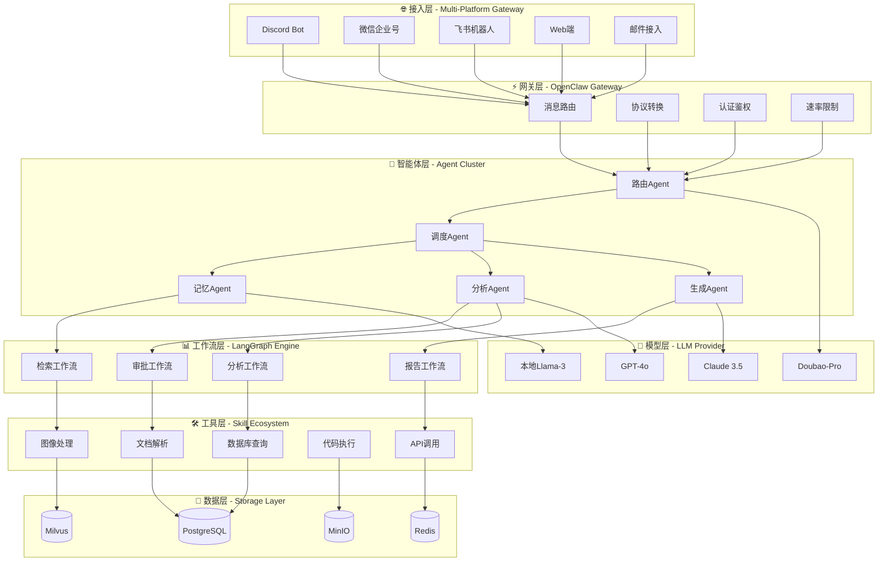
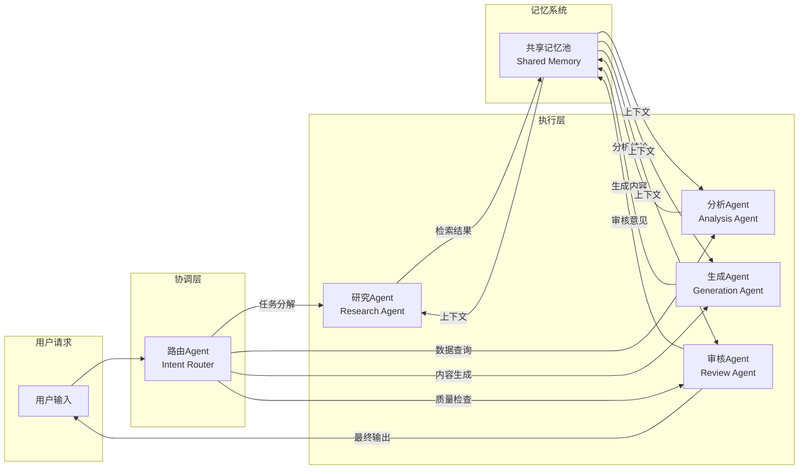
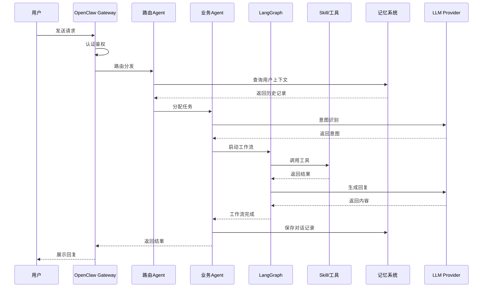
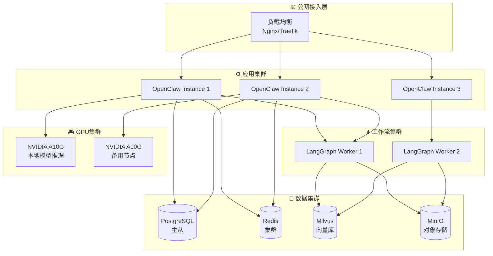
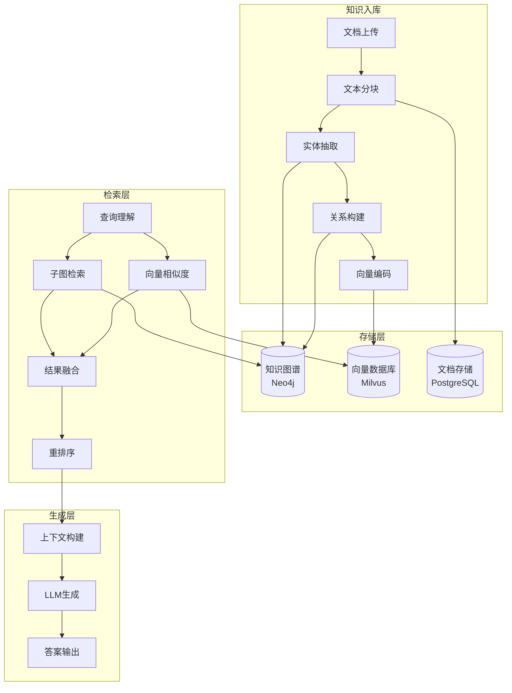
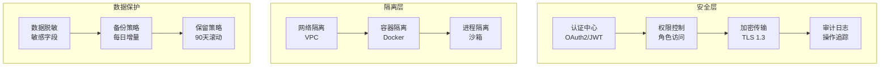

# AI Agent框架技术架构图

**文档版本**: v1.0  
**编制日期**: 2026-04-25  
**配套文档**: AI_Agent框架选型与部署方案_2026-04-25.md

---

## 1. 系统总体架构图

---

## 2. 多Agent协作架构图

---

## 3. 框架对比架构图

```mermaid
graph TB
    subgraph OpenClaw["OpenClaw - 平台优先架构"]
        OC1[Gateway<br/>统一接入]
        OC2[Skills<br/>200+工具生态]
        OC3[Agents<br/>多平台智能体]
        OC1 --> OC2 --> OC3
    end

    subgraph LangGraph["LangGraph - 工作流优先架构"]
        LG1[StateGraph<br/>状态图引擎]
        LG2[Nodes<br/>处理节点]
        LG3[Edges<br/>状态转移]
        LG1 --> LG2 --> LG3
    end

    subgraph AutoGen["AutoGen - 对话优先架构"]
        AG1[ConversableAgent<br/>可对话Agent]
        AG2[GroupChat<br/>群组对话]
        AG3[CodeExecutor<br/>代码执行]
        AG1 --> AG2 --> AG3
    end

    subgraph MetaGPT["MetaGPT - 流程优先架构"]
        MG1[Role System<br/>角色系统]
        MG2[SOP Engine<br/>标准流程]
        MG3[Shared Memory<br/>共享记忆]
        MG1 --> MG2 --> MG3
    end
```

---

## 4. 数据流架构图

---

## 5. 部署拓扑图

---

## 6. Graph RAG记忆系统架构

---

## 7. 安全架构图

---

*架构图采用Mermaid语法，可在支持Mermaid的Markdown渲染器中查看。*
