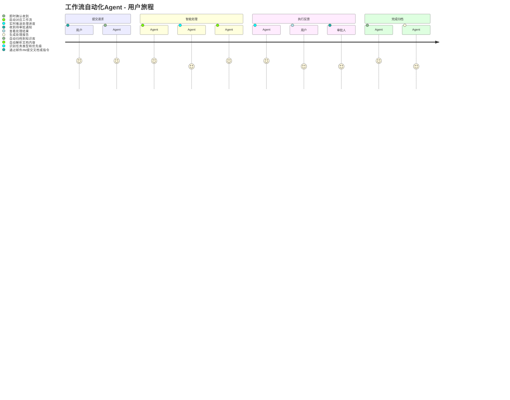
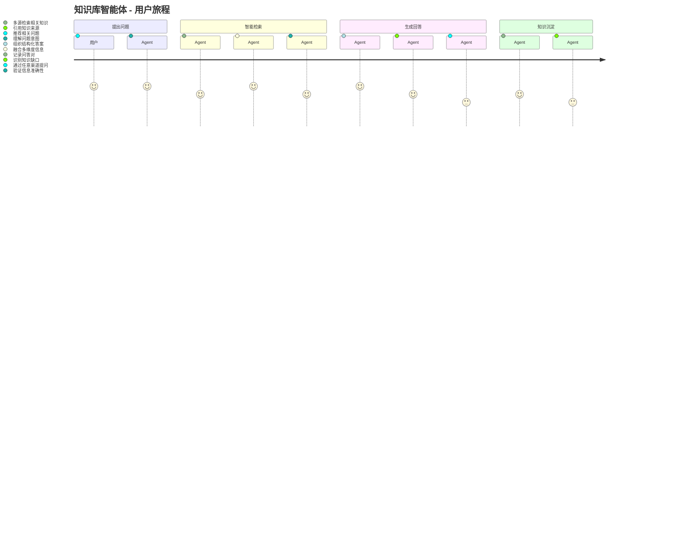
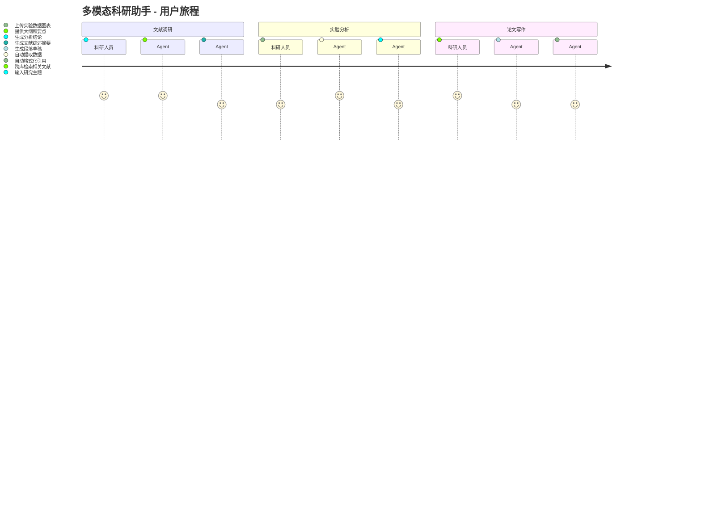

# 应用场景原型设计文档

**文档版本**: v1.0  
**编制日期**: 2026-04-25  
**配套文档**: AI_Agent框架选型与部署方案_2026-04-25.md

---

## 目录

1. [场景一：工作流自动化Agent](#1-场景一工作流自动化agent)
2. [场景二：知识库智能体](#2-场景二知识库智能体)
3. [场景三：多模态科研助手](#3-场景三多模态科研助手)
4. [通用技术规范](#4-通用技术规范)
5. [原型验证计划](#5-原型验证计划)

---

## 1. 场景一：工作流自动化Agent

### 1.1 场景概述

**场景名称**: 智能办公助手 - Workflow Automation Agent  
**目标用户**: 行政人员、项目经理、研发团队  
**核心痛点**: 
- 日常审批流程繁琐，人工转发易出错
- 周报月报数据汇总耗时，格式不统一
- 文档信息提取依赖人工，效率低

**预期价值**:
- 审批效率提升60%
- 报告生成时间从2小时缩短至10分钟
- 文档信息提取准确率达到95%

### 1.2 用户旅程



### 1.3 功能模块设计

#### 模块1：智能收件箱（Smart Inbox）

**功能描述**: 
自动接收和分类来自邮件、IM、表单等多渠道的待处理请求。

**输入**:
- 邮件附件（PDF、Word、Excel）
- IM消息文本和文件
- 表单提交数据

**处理流程**:
```
接收请求 → 内容解析 → 意图识别 → 优先级评估 → 任务分类 → 入队处理
```

**核心算法**:
- 意图识别：基于LLM的零样本分类
- 优先级评估：规则引擎 + LLM辅助判断
  - 紧急关键词（"加急"、"今天"、" deadline"）→ P0
  - 上级领导发起 → 自动升一级
  - 涉及金额 > 10万 → P1

**输出**:
- 分类标签（审批/报告/查询/其他）
- 优先级（P0-P3）
- 建议处理人

#### 模块2：文档智能解析（Document Parser）

**功能描述**:
自动提取各类文档中的关键信息，生成结构化数据。

**支持格式**:
| 格式 | 解析能力 | 准确率 |
|------|---------|--------|
| PDF | 文本、表格、图片OCR | 92% |
| Word | 全文结构、目录、批注 | 95% |
| Excel | 多Sheet、公式、图表 | 90% |
| 图片 | OCR文字、图表识别 | 88% |

**信息提取项**:
- 文档类型（合同、发票、报告、申请表）
- 关键字段（金额、日期、当事人、项目名）
- 待办事项和截止日期
- 相关人员和部门

**技术实现**:
```python
# 伪代码示例
def parse_document(file_path, doc_type_hint=None):
    # 1. 文档预处理
    raw_content = extract_raw(file_path)
    
    # 2. 文档类型识别（如果未提供）
    if not doc_type_hint:
        doc_type = llm_classify(raw_content, categories=["contract", "invoice", "report", "application"])
    
    # 3. 结构化提取
    schema = get_schema_for_type(doc_type)
    structured_data = llm_extract(raw_content, schema=schema)
    
    # 4. 验证和修正
    validated_data = validate_and_correct(structured_data, rules=VALIDATION_RULES[doc_type])
    
    return validated_data
```

#### 模块3：智能审批路由（Approval Router）

**功能描述**:
根据文档内容和组织规则，自动路由到正确的审批人。

**路由规则**:
```yaml
routing_rules:
  - name: "采购审批"
    condition: "doc_type == 'purchase_request'"
    approvers:
      - role: "部门经理"
        if: "amount < 50000"
      - role: "财务总监"
        if: "amount >= 50000 and amount < 200000"
      - role: "总经理"
        if: "amount >= 200000"
    
  - name: "合同审批"
    condition: "doc_type == 'contract'"
    approvers:
      - role: "法务经理"
        always: true
      - role: "财务总监"
        if: "amount >= 100000"
      - role: "总经理"
        if: "amount >= 500000 or duration > 1_year"
```

**异常处理**:
- 审批人休假 → 自动转交代理人
- 审批超时 → 自动升级提醒
- 规则冲突 → 转人工判定

#### 模块4：报告自动生成（Report Generator）

**功能描述**:
根据模板和数据源，自动生成日报、周报、月报。

**支持模板**:
| 报告类型 | 数据源 | 生成频率 | 交付方式 |
|---------|--------|---------|---------|
| 项目日报 | 任务管理系统 | 每日18:00 | 邮件+IM |
| 销售周报 | CRM系统 | 每周一9:00 | 邮件 |
| 财务月报 | ERP系统 | 每月3日 | 邮件+归档 |
| 研发进度 | Git+项目管理 | 每周五 | 邮件+看板 |

**报告生成流程**:
```
定时触发 → 数据抽取 → 数据分析 → 内容生成 → 格式渲染 → 审核发送
```

**智能增强**:
- 异常数据自动标注（同比/环比波动 > 20%）
- 自动生成趋势图表
- 智能总结关键发现
- 自动生成下周/下月建议

### 1.4 交互原型

#### 界面1：Dashboard看板

```
┌─────────────────────────────────────────────────────────────┐
│  🤖 智能办公助手 Dashboard                    [设置] [退出]  │
├─────────────────────────────────────────────────────────────┤
│                                                             │
│  📊 今日概览                    ⚡ 待处理任务               │
│  ┌──────────────────┐          ┌──────────────────────┐    │
│  │ 接收请求: 23     │          │ P0 紧急: 2           │    │
│  │ 已完成: 18       │          │ P1 重要: 5           │    │
│  │ 处理中: 4        │          │ P2 普通: 8           │    │
│  │ 异常: 1          │          │ P3 低优: 3           │    │
│  └──────────────────┘          └──────────────────────┘    │
│                                                             │
│  📋 最近处理                                                  │
│  ┌─────────────────────────────────────────────────────┐   │
│  │ ✅ 采购申请审批 - 已路由到张经理 (5分钟前)           │   │
│  │ ✅ 月度报告生成 - 已发送给李总监 (30分钟前)          │   │
│  │ 🔄 合同解析处理 - 提取关键条款中 (进行中)            │   │
│  │ ⚠️ 异常发票识别 - 需要人工复核 (待处理)              │   │
│  └─────────────────────────────────────────────────────┘   │
│                                                             │
└─────────────────────────────────────────────────────────────┘
```

#### 界面2：审批详情页

```
┌─────────────────────────────────────────────────────────────┐
│  📄 审批详情 - 采购申请 #PO-2026-0425-001                   │
├─────────────────────────────────────────────────────────────┤
│                                                             │
│  申请人: 王小明          申请日期: 2026-04-25                │
│  金额: ¥45,000           紧急程度: P1                       │
│                                                             │
│  📎 附件: 采购申请单.pdf (已解析)                            │
│                                                             │
│  🤖 AI分析结果:                                             │
│  ┌─────────────────────────────────────────────────────┐   │
│  │ • 文档类型: 采购申请单 ✓                             │   │
│  │ • 金额识别: ¥45,000 ✓                                │   │
│  │ • 供应商: 北京xx科技有限公司 (信用等级A)             │   │
│  │ • 预算检查: 在Q2预算范围内 ✓                         │   │
│  │ • 历史采购: 该供应商合作3次，无异常                  │   │
│  │ • 建议: 符合常规审批条件，建议通过                   │   │
│  └─────────────────────────────────────────────────────┘   │
│                                                             │
│  审批路径: 王小明 → 张经理(部门经理) → [待审批]             │
│                                                             │
│           [✅ 通过]    [❌ 驳回]    [📝 转交]               │
│                                                             │
└─────────────────────────────────────────────────────────────┘
```

### 1.5 技术实现要点

| 技术点 | 实现方案 | 备注 |
|--------|---------|------|
| 文档解析 | OpenClaw nano-pdf Skill + 自研OCR | 支持多格式 |
| 工作流引擎 | LangGraph StateGraph | 支持复杂分支 |
| 审批路由 | 规则引擎 + LLM辅助 | 可配置 |
| 报告生成 | Jinja2模板 + ECharts图表 | 可定制 |
| 消息推送 | OpenClaw Gateway统一推送 | 多平台 |

### 1.6 成功指标

| 指标 | 基线 | 目标 | 测量方式 |
|------|------|------|---------|
| 审批处理时效 | 2天 | < 4小时 | 系统日志 |
| 报告生成时间 | 2小时 | < 10分钟 | 计时 |
| 文档解析准确率 | 70% | > 95% | 抽样质检 |
| 用户满意度 | - | > 4.5/5 | 问卷 |

---

## 2. 场景二：知识库智能体

### 2.1 场景概述

**场景名称**: 企业知识助手 - Knowledge Base Agent  
**目标用户**: 全体员工、新员工、管理层  
**核心痛点**:
- 企业知识分散在多个系统，查找困难
- 新员工培训依赖老员工，知识传承不足
- 重复问题占用大量人力解答时间

**预期价值**:
- 知识检索效率提升5倍
- 重复问题解答减少70%
- 新员工上手周期缩短50%

### 2.2 用户旅程



### 2.3 功能模块设计

#### 模块1：多源知识接入（Knowledge Ingestion）

**接入源清单**:
| 数据源 | 接入方式 | 更新频率 | 内容类型 |
|--------|---------|---------|---------|
| 飞书文档 | API + Webhook | 实时 | 文档、表格 |
| Confluence | REST API | 每小时 | 技术文档 |
| 企业网盘 | 文件扫描 | 每日 | PDF、Office |
| 邮件归档 | IMAP同步 | 每日 | 邮件、附件 |
| Git仓库 | Webhook | 实时 | 代码、文档 |
| 会议录音 | 定时上传 | 每次 | 音频、转录 |

**数据Pipeline**:
```
数据源 → 采集器 → 格式转换 → 内容分块 → 实体抽取 → 向量编码 → 索引构建
```

**内容分块策略**:
```python
chunking_config = {
    "document": {
        "strategy": "semantic",
        "chunk_size": 512,
        "overlap": 128,
        "separators": ["\n## ", "\n### ", "\n\n", "\n", "。", " "]
    },
    "spreadsheet": {
        "strategy": "row_based",
        "chunk_size": 20,  # 行数
        "include_header": True
    },
    "code": {
        "strategy": "function_based",
        "chunk_size": 1,  # 函数/类级别
        "include_docstring": True
    }
}
```

#### 模块2：Graph RAG检索（Intelligent Retrieval）

**检索管道**:
```
用户查询 → 查询理解 → 查询扩展 → 并行检索 → 结果融合 → 重排序 → 上下文构建
                ↓           ↓           ↓
            意图识别    同义词扩展    向量检索
            实体抽取    关联实体      图谱检索
            关系识别    时间约束      关键词检索
```

**三阶段检索**:

**阶段1：向量相似度检索**
- 将查询编码为向量
- 在Milvus中检索Top-K相似段落
- 相似度阈值：0.75

**阶段2：知识图谱检索**
- 抽取查询中的实体
- 在Neo4j中检索相关实体和关系
- 构建子图上下文

**阶段3：混合排序**
- 融合向量检索和图谱检索结果
- 使用Cross-Encoder重排序
- 选择最相关的N个段落作为上下文

**检索示例**:
```
用户问题: "去年Q3华东区的销售额是多少？"

查询理解:
  - 意图: 查询销售额
  - 实体: ["华东区", "去年Q3"]
  - 时间范围: 2025-07-01 至 2025-09-30

向量检索结果:
  1. "2025年Q3各区域销售报告..." (相似度: 0.89)
  2. "华东区年度销售总结..." (相似度: 0.82)

图谱检索结果:
  1. (华东区)-[销售额]->(2025-Q3: ¥12,500,000)
  2. (华东区)-[同比增长]->(2025-Q3: +15%)

最终答案:
  "根据2025年Q3销售报告，华东区销售额为1,250万元，
   同比增长15%。数据来源：销售部Q3季度报告.pdf"
```

#### 模块3：多模态问答（Multimodal QA）

**功能描述**:
支持图文混合的问答交互。

**支持场景**:
| 场景 | 用户输入 | Agent处理 | 输出 |
|------|---------|----------|------|
| 图表解读 | 上传柱状图+"分析趋势" | 图表OCR+数据提取+分析 | 趋势分析报告 |
| 流程确认 | 上传流程图+"这个对吗" | 流程图解析+规则检查 | 合规性判断 |
| 表格查询 | 上传表格+"找出异常" | 表格解析+异常检测 | 异常项标注 |
| 图纸识别 | 上传CAD图+"找第3视图" | 图纸解析+视图匹配 | 对应视图 |

**技术栈**:
- 图表解析：GPT-4o Vision API
- OCR：PaddleOCR + 自研微调
- 表格解析：Camelot + 自定义规则

#### 模块4：知识缺口识别（Knowledge Gap Detection）

**功能描述**:
自动识别用户频繁提问但知识库覆盖不足的领域。

**检测逻辑**:
```
1. 收集高频问题（周统计Top-50）
2. 检索知识库覆盖度（检索结果为空/低相关）
3. 聚类未覆盖问题主题
4. 生成知识补充建议
5. 推送给知识管理员
```

**输出示例**:
```json
{
  "week": "2026-W16",
  "gap_analysis": [
    {
      "topic": "新客户 onboarding 流程",
      "query_count": 23,
      "current_coverage": "15%",
      "suggested_action": "补充客户成功部 onboarding SOP",
      "priority": "高"
    },
    {
      "topic": "API 限流规则",
      "query_count": 18,
      "current_coverage": "30%",
      "suggested_action": "更新开发文档 v2.3",
      "priority": "中"
    }
  ]
}
```

### 2.4 交互原型

#### 界面1：知识问答界面

```
┌─────────────────────────────────────────────────────────────┐
│  🧠 企业知识助手                               [💬] [🔍]    │
├─────────────────────────────────────────────────────────────┤
│                                                             │
│  ┌─────────────────────────────────────────────────────┐   │
│  │                                                     │   │
│  │  💬 你可以问我任何问题，例如：                       │   │
│  │  • "新员工入职需要准备什么？"                        │   │
│  │  • "解释一下这张流程图"（上传图片）                  │   │
│  │  • "去年Q3的销售额趋势如何？"                        │   │
│  │                                                     │   │
│  └─────────────────────────────────────────────────────┘   │
│                                                             │
│  ┌─────────────────────────────────────────────────────┐   │
│  │ 🤖 知识助手                                         │   │
│  │                                                     │   │
│  │ 去年Q3（2025年7-9月）华东区销售额为1,250万元，        │   │
│  │ 同比增长15%，环比增长8%。                           │   │
│  │                                                     │   │
│  │ 📊 关键数据：                                        │   │
│  │ • 总销售额：¥12,500,000                             │   │
│  │ • 同比增长：+15%                                    │   │
│  │ • 主要产品：A产品线(60%)、B产品线(40%)              │   │
│  │                                                     │   │
│  │ 📎 来源：                                            │   │
│  │ 1. 《2025年Q3销售报告》第3页                        │   │
│  │ 2. 《华东区年度总结》图表5                          │   │
│  │                                                     │   │
│  │ 🔗 相关问题：                                        │   │
│  │ • 其他区域Q3表现如何？                              │   │
│  │ • Q4销售目标是什么？                                │   │
│  └─────────────────────────────────────────────────────┘   │
│                                                             │
│  [📎 附件]  [🎤 语音]  [请输入问题...              ] [发送]│
│                                                             │
└─────────────────────────────────────────────────────────────┘
```

### 2.5 技术实现要点

| 技术点 | 实现方案 | 备注 |
|--------|---------|------|
| 知识抽取 | LangChain Document Loader | 多格式支持 |
| 向量编码 | BGE-large-zh | 中文优化 |
| 向量检索 | Milvus 2.3 | 分布式支持 |
| 知识图谱 | Neo4j | 关系推理 |
| 重排序 | bge-reranker-large | 精度提升 |
| 多模态 | GPT-4o Vision | 图文理解 |

### 2.6 成功指标

| 指标 | 基线 | 目标 | 测量方式 |
|------|------|------|---------|
| 检索准确率 | 60% | > 85% | 人工评估 |
| 回答满意度 | - | > 4.2/5 | 用户反馈 |
| 知识覆盖率 | 40% | > 80% | 自动检测 |
| 平均响应时间 | - | < 3秒 | 系统监控 |

---

## 3. 场景三：多模态科研助手

### 3.1 场景概述

**场景名称**: ChemClaw 科研助手 - Multimodal Research Assistant  
**目标用户**: 科研人员、研究生、实验室技术员  
**核心痛点**:
- 文献检索耗时，跨数据库操作繁琐
- 实验数据（图表、光谱）分析依赖专业软件
- 论文写作中翻译、润色、引用管理效率低

**预期价值**:
- 文献检索效率提升5倍
- 数据分析时间缩短70%
- 论文初稿生成时间缩短60%

### 3.2 用户旅程



### 3.3 功能模块设计

#### 模块1：智能文献检索（Literature Intelligence）

**检索范围**:
| 数据库 | 内容类型 | 检索方式 |
|--------|---------|---------|
| arXiv | 预印本论文 | API |
| PubMed | 生物医学文献 | API |
| Web of Science | 核心期刊 | 代理检索 |
| 知网(CNKI) | 中文学术资源 | API |
| 万方 | 中文学位论文 | API |
| 自建文献库 | 团队积累 | 本地检索 |

**智能检索功能**:

**功能A：主题扩展检索**
```
输入: "AI辅助材料发现"

扩展检索:
  - 同义词: "机器学习材料设计", "AI材料科学", "计算材料学"
  - 上位词: "材料信息学"
  - 下位词: "分子生成", "性质预测", "实验设计优化"
  - 相关领域: "药物发现", "催化剂设计"

检索结果: 合并去重，按相关性排序
```

**功能B：文献摘要生成**
```
输入: 10篇相关论文PDF

输出:
  📋 文献综述摘要（500字）
  ┌─────────────────────────────────────────────────────┐
  │ 研究背景: AI在材料科学中的应用近年来快速增长...      │
  │                                                     │
  │ 主要方法:                                            │
  │ 1. 生成式模型（如GNN、Diffusion Model）用于分子生成  │
  │ 2. 监督学习用于性质预测                               │
  │ 3. 主动学习用于实验设计优化                           │
  │                                                     │
  │ 关键发现:                                            │
  │ • 生成模型在逆向设计中表现突出（Smith et al., 2025） │
  │ • 多任务学习提升预测精度（Zhang et al., 2026）       │
  │                                                     │
  │ 研究空白: 实验验证与计算预测的闭环优化仍待探索        │
  └─────────────────────────────────────────────────────┘
```

**功能C：研究趋势分析**
- 基于文献发表时间轴分析研究热度
- 识别新兴研究方向和退潮领域
- 推荐潜在合作研究者

#### 模块2：实验数据智能分析（Experiment Data Analysis）

**支持数据类型**:
| 数据类型 | 文件格式 | 分析能力 |
|---------|---------|---------|
| 光谱数据 | .csv, .txt | 峰识别、基线校正、定量分析 |
| 色谱图 | .pdf, 图片 | 保留时间识别、峰面积计算 |
| XRD图谱 | .xy, .csv | 物相鉴定、晶胞参数计算 |
| 电化学曲线 | .mpt, .csv | CV分析、阻抗拟合 |
| SEM/TEM图像 | .tif, .jpg | 粒径统计、形貌描述 |
| 实验照片 | .jpg, .png | 现象识别、变化对比 |

**分析流程示例（光谱分析）**:
```
上传光谱文件
    ↓
数据预处理（去噪、平滑、基线校正）
    ↓
峰识别与标注
    ↓
与标准库比对（如有）
    ↓
生成分析报告
    ↓
输出：处理后的数据 + 分析结论 + 可视化图表
```

**输出示例**:
```
📊 光谱分析报告

文件: UV-Vis_20260425.csv
波长范围: 200-800 nm

🔍 分析结果:
• 最大吸收峰: λmax = 342 nm (吸光度: 0.85)
• 肩峰: 280 nm (可能为苯环特征吸收)
• 半峰宽: 45 nm

📐 计算结果:
• 带隙估算: Eg ≈ 3.2 eV (通过Tauc plot)
• 浓度估算: C ≈ 1.2 × 10⁻⁵ M (通过Beer-Lambert定律)

📈 图表:
[原始光谱图] [基线校正后] [导数光谱] [Tauc plot]

💡 建议:
• 建议在300-350 nm范围内优化检测条件
• 与标准品对比，纯度约95%
```

#### 模块3：论文写作辅助（Writing Assistant）

**功能列表**:

**A. 段落生成**
```
输入:
  章节: 实验方法
  要点: 
    - 材料: TiO2纳米颗粒
    - 方法: 水热法
    - 条件: 180°C, 12h
    - 表征: XRD, TEM, BET

输出:
  "TiO2纳米颗粒通过水热法合成。具体而言，将一定量的
   钛酸四丁酯溶解于无水乙醇中，随后缓慢加入去离子水
   并搅拌30分钟。将混合溶液转移至聚四氟乙烯内衬的不
   锈钢反应釜中，在180°C下反应12小时。待自然冷却至
   室温后，收集白色沉淀，分别用去离子水和乙醇洗涤三次，
   最后在60°C下真空干燥12小时。所得样品通过X射线衍射
   (XRD)、透射电子显微镜(TEM)和比表面积分析(BET)进行
   表征。"
```

**B. 学术翻译与润色**
```
输入: 中文学术段落
输出: 
  - 英文学术翻译（遵循ACS格式）
  - 语法检查标记
  - 用词优化建议
  - 学术表达改进
```

**C. 引用管理**
```
功能:
  - 自动识别文中引用位置
  - 从DOI/标题自动生成引用格式
  - 支持格式: ACS, APA, GB/T 7714
  - 检测遗漏引用和重复引用
```

#### 模块4：实验设计优化（Experiment Design）

**功能描述**:
基于主动学习和贝叶斯优化，辅助设计最优实验方案。

**输入**:
- 研究目标（如"最大化催化活性"）
- 变量范围（温度、压力、配比等）
- 约束条件（成本、时间、安全性）

**输出**:
```
🧪 实验设计建议

目标: 优化TiO2光催化降解RhB的效率

变量空间:
  - 煅烧温度: 300-600°C
  - 保温时间: 2-6h
  - 掺杂比例: 0-5% (Fe)

建议实验方案（基于贝叶斯优化）:

| 实验编号 | 温度(°C) | 时间(h) | 掺杂(%) | 预期效率 |
|---------|---------|---------|---------|---------|
| Exp-1   | 450     | 4       | 2.5     | 85%     |
| Exp-2   | 500     | 3       | 1.8     | 82%     |
| Exp-3   | 400     | 5       | 3.2     | 80%     |

💡 策略建议:
• 先进行Exp-1（预期最优）
• 根据结果更新模型，迭代优化
• 预计3-4轮实验收敛到最优条件
```

### 3.4 交互原型

#### 界面：科研助手工作台

```
┌─────────────────────────────────────────────────────────────┐
│  🔬 ChemClaw 科研助手          [文献] [数据] [写作] [设计]  │
├─────────────────────────────────────────────────────────────┤
│                                                             │
│  ┌──────────────┐  ┌──────────────────────────────────────┐│
│  │ 📚 文献检索    │  │ 🔍 检索结果                          ││
│  │              │  │                                      ││
│  │ 关键词:      │  │ 1. [PDF] AI-driven materials...     ││
│  │ ┌──────────┐ │  │    Nature, 2026 - 相关度: 95%       ││
│  │ │AI材料科学 │ │  │    [摘要] [引用] [收藏]              ││
│  │ └──────────┘ │  │                                      ││
│  │              │  │ 2. [PDF] Machine learning for...    ││
│  │ 数据库:      │  │    Science, 2026 - 相关度: 92%      ││
│  │ ☑ arXiv      │  │    [摘要] [引用] [收藏]              ││
│  │ ☑ 知网       │  │                                      ││
│  │ ☑ PubMed     │  │ 3. [PDF] Generative models...       ││
│  │              │  │    JACS, 2026 - 相关度: 88%         ││
│  │ [🔍 开始检索] │  │    [摘要] [引用] [收藏]              ││
│  │              │  │                                      ││
│  │ 📊 趋势分析   │  │ [生成文献综述] [导出引用列表]        ││
│  └──────────────┘  └──────────────────────────────────────┘│
│                                                             │
│  ┌──────────────────────────────────────────────────────┐  │
│  │ 📎 快速操作                                          │  │
│  │ [📤 上传数据文件]  [📝 开始写作]  [🧪 实验设计]        │  │
│  └──────────────────────────────────────────────────────┘  │
│                                                             │
└─────────────────────────────────────────────────────────────┘
```

### 3.5 技术实现要点

| 技术点 | 实现方案 | 备注 |
|--------|---------|------|
| 文献检索 | Tavily API + 数据库直连 | 跨库检索 |
| PDF解析 | nano-pdf + 自研学术PDF解析器 | 保留公式 |
| 图表分析 | mol-vision Skill + PlotDigitizer | 数据提取 |
| 光谱分析 | scipy + 自研峰识别算法 | 专业分析 |
| 论文生成 | GPT-4o + 学术语料微调 | 学术风格 |
| 引用管理 | 自建引用数据库 + CSL样式 | 多格式支持 |
| 实验设计 | scikit-optimize + Ax | 贝叶斯优化 |

### 3.6 成功指标

| 指标 | 基线 | 目标 | 测量方式 |
|------|------|------|---------|
| 文献检索覆盖度 | 单库 | 6+数据库 | 系统记录 |
| 数据提取准确率 | 70% | > 90% | 人工校验 |
| 翻译质量评分 | - | > 4.0/5 | 专家评估 |
| 实验优化收敛轮数 | 10+ | < 5轮 | 实验记录 |

---

## 4. 通用技术规范

### 4.1 API设计规范

所有场景共享统一的API网关：

```yaml
openapi: 3.0.0
info:
  title: Agent API Gateway
  version: 1.0.0

paths:
  /api/v1/chat:
    post:
      summary: 通用对话接口
      requestBody:
        content:
          application/json:
            schema:
              type: object
              properties:
                message:
                  type: string
                session_id:
                  type: string
                context:
                  type: object
                attachments:
                  type: array
                  items:
                    type: object
                    properties:
                      type:
                        enum: [image, document, audio]
                      url:
                        type: string
      responses:
        200:
          description: 成功响应
          content:
            application/json:
              schema:
                type: object
                properties:
                  reply:
                    type: string
                  sources:
                    type: array
                  actions:
                    type: array
```

### 4.2 数据安全规范

| 安全级别 | 处理方式 | 示例 |
|---------|---------|------|
| 公开 | 可直接使用云端LLM | 通用知识问答 |
| 内部 | 使用企业级LLM API | 内部流程查询 |
| 机密 | 本地模型处理 | 财务数据、人事信息 |
| 绝密 | 隔离环境+本地模型 | 核心技术资料 |

### 4.3 性能基准

| 指标 | 目标值 | 测试方法 |
|------|--------|---------|
| 接口响应时间(P95) | < 3秒 | 压力测试 |
| 并发用户数 | > 100 | 负载测试 |
| 系统可用性 | 99.5% | 监控统计 |
| 错误率 | < 0.1% | 日志分析 |

---

## 5. 原型验证计划

### 5.1 验证阶段

| 阶段 | 周期 | 验证内容 | 通过标准 |
|------|------|---------|---------|
| PoC-1 | 1周 | 单场景核心功能 | 功能可用 |
| PoC-2 | 1周 | 多场景串联 | 流程通顺 |
| Alpha | 2周 | 内部用户测试 | 满意度>4.0 |
| Beta | 2周 | 小范围生产测试 | 可用性>99% |

### 5.2 验证用例

**工作流自动化验证用例**:
```
用例: 采购申请自动审批
输入: 采购申请单.pdf（金额：¥80,000）
预期: 
  1. 自动解析出金额、申请人、采购物品
  2. 识别需要部门经理+财务总监两级审批
  3. 自动发送审批通知给对应人员
  4. 记录审批日志
```

**知识库验证用例**:
```
用例: 跨文档知识问答
输入: "去年Q3华东区销售额"
预期:
  1. 正确识别时间范围（2025年7-9月）
  2. 从销售报告和区域总结中找到数据
  3. 返回准确的销售额数字
  4. 标注数据来源
```

**科研助手验证用例**:
```
用例: 光谱数据分析
输入: UV-Vis光谱数据文件
预期:
  1. 正确识别吸收峰位置
  2. 计算带隙能量
  3. 生成可视化图表
  4. 输出结构化分析报告
```

---

*本文档为原型设计文档，具体实现细节将在开发阶段细化。*
