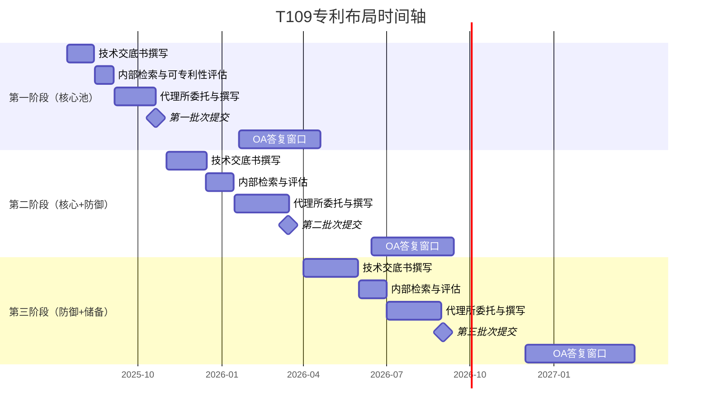
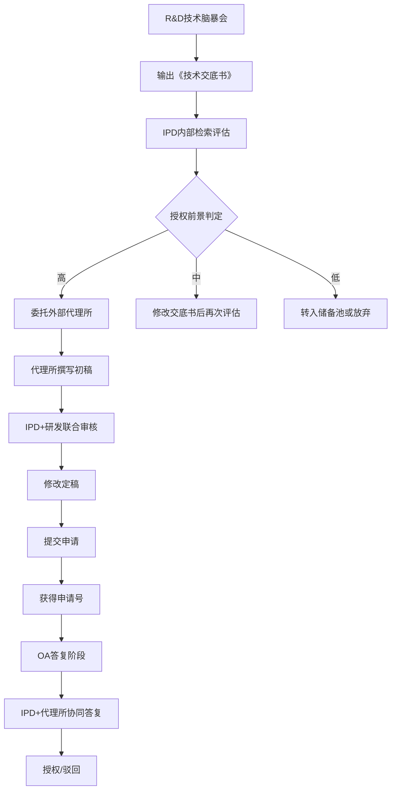

# T109专利申请布局与执行推进计划

> 任务: T109核心技术专利点挖掘与筛选 [04291922]
> 附件类型: 专利布局执行计划
> 生成时间: 2026-05-04 14:21

# T109核心技术专利布局执行计划

**文档编号**: PL-T109-2025-001  
**版本**: V1.0  
**日期**: 2025年7月15日  
**密级**: 内部机密  
**负责部门**: 知识产权部（IPD）  
**协同部门**: 研发中心（R&D）、法务部、财务部、市场部  

---

## 1. 总体布局策略与申报批次划分

### 1.1 布局原则
本计划围绕T109核心技术（涉及人工智能驱动的边缘计算优化算法与硬件协同架构），采用“三层防御+进攻型”布局策略，确保核心技术点的全面覆盖与商业转化潜力最大化。

### 1.2 专利池划分

| 专利池类型 | 定义 | 技术覆盖范围 | 专利数量目标 | 预算占比 | 策略目标 |
|-----------|------|-------------|-------------|---------|---------|
| **核心池** | 基础性、不可绕过的发明专利 | T109核心算法（模型压缩、动态推理调度）、专用芯片架构 | 15-20件 | 45% | 构建技术壁垒，形成标准必要专利（SEP） |
| **防御池** | 外围改进、替代方案、应用场景专利 | 算法优化变体、硬件接口、系统集成方案 | 25-30件 | 35% | 防止竞争对手绕道，扩大保护范围 |
| **储备池** | 前瞻性技术、未来应用方向的专利 | 量子计算兼容、新型存储介质适配、跨领域应用（医疗、自动驾驶） | 10-15件 | 20% | 抢占未来技术制高点，为后续许可谈判储备弹药 |

**总目标**: 50-65件专利申请，其中至少20件为PCT国际申请，5件为美国申请，3件为欧洲申请。

### 1.3 批次申报优先序
- **第一批次（核心池，Q3-Q4 2025）**: 立即启动10件核心算法专利，包括模型轻量化、推理时延优化、动态精度控制。
- **第二批次（核心池+防御池，Q1-Q2 2026）**: 追加15件，覆盖芯片架构、散热管理、系统集成。
- **第三批次（防御池+储备池，Q3-Q4 2026）**: 20-25件，包括外围改进和前瞻性技术。

---

## 2. 分阶段申报时间轴与关键里程碑

### 2.1 整体时间轴（2025年7月 - 2027年6月）

### 2.2 关键里程碑详细表

| 里程碑编号 | 时间节点 | 交付物 | 责任部门 | 验收标准 |
|-----------|---------|--------|---------|---------|
| M1 | 2025-08-15 | 第一批次技术交底书（10份） | R&D | 每份包含技术背景、创新点、实施例、权利要求草案 |
| M2 | 2025-09-05 | 可专利性检索报告（10份） | IPD | 检索覆盖中国、美国、欧洲、WIPO，引用对比文件≤5件 |
| M3 | 2025-10-20 | 第一批次申请文件（10件） | IPD+外部代理 | 提交至CNIPA，获得申请号和受理通知书 |
| M4 | 2026-03-15 | 第二批次申请文件（15件） | IPD+外部代理 | 同上，且至少5件为PCT申请 |
| M5 | 2026-09-01 | 第三批次申请文件（25-30件） | IPD+外部代理 | 同上，且至少3件为美国申请 |
| M6 | 2027-06-30 | 全部OA答复完成 | IPD+外部代理 | 无驳回决定，或已启动复审/分案 |

### 2.3 各阶段详细任务分解

**第一阶段（核心池，2025年7月-2026年1月）**  
- **第1-2周（7月15日-7月28日）**: R&D负责人组织技术骨干进行“发明点脑暴会”，识别出10个核心算法创新点，输出《技术交底书模板-核心池》。  
- **第3-4周（7月29日-8月11日）**: 每个创新点由1名研发人员撰写交底书初稿，IPD指派专利工程师进行形式审查。  
- **第5-6周（8月12日-8月25日）**: IPD利用商业专利数据库（如智慧芽、Derwent Innovation）进行可专利性检索，生成《可专利性评估报告》，标注授权前景（高/中/低）。  
- **第7-10周（8月26日-9月22日）**: 委托3家外部代理所（A所负责算法、B所负责硬件、C所负责系统）并行撰写，每周召开“撰写进度会”。  
- **第11-13周（9月23日-10月13日）**: 内部审核权利要求书，确保保护范围合理且无自相矛盾。  
- **第14周（10月14日-10月20日）**: 提交第一批次10件中国专利申请，同时决定是否提交优先权文件。  

---

## 3. 跨部门协同机制与资源预算

### 3.1 组织架构

| 角色 | 人员 | 职责 |
|------|------|------|
| 项目总负责人 | 王总（VP of IP） | 最终决策、预算审批、跨部门协调 |
| 专利布局经理 | 李经理（IPD） | 日常管理、进度跟踪、质量把控 |
| 研发接口人 | 张博士（R&D Director） | 技术交底、创新点挖掘、技术答疑 |
| 外部代理所协调人 | 赵经理（IPD） | 代理所选择、合同管理、费用结算 |
| 法务顾问 | 刘律师（法务部） | 风险评估、许可合同审查、诉讼预案 |
| 财务支持 | 陈会计（财务部） | 预算执行监控、费用报销 |

### 3.2 协同流程

### 3.3 资源预算

| 费用项目 | 单价（万元/件） | 数量 | 小计（万元） | 备注 |
|---------|----------------|------|-------------|------|
| 内部检索费（数据库） | 0.3 | 65 | 19.5 | 智慧芽年度订阅+单次检索 |
| 代理所撰写费（中国） | 1.2 | 50 | 60.0 | 含权利要求10-20项 |
| 代理所撰写费（PCT） | 2.5 | 20 | 50.0 | 含国际阶段费用 |
| 代理所撰写费（美国） | 5.0 | 5 | 25.0 | 含美国律师费 |
| 代理所撰写费（欧洲） | 4.0 | 3 | 12.0 | 含欧洲律师费 |
| 官方规费（中国） | 0.5 | 50 | 25.0 | 含申请费、实质审查费 |
| 官方规费（PCT） | 1.0 | 20 | 20.0 | 国际申请费+检索费 |
| 官方规费（美国） | 1.5 | 5 | 7.5 | 含申请、检索、审查 |
| 官方规费（欧洲） | 2.0 | 3 | 6.0 | 含申请、检索、审查 |
| OA答复费（中国） | 0.5 | 50 | 25.0 | 平均每次OA |
| OA答复费（海外） | 3.0 | 20 | 60.0 | 平均每次OA |
| 培训与会议费 | - | - | 10.0 | 跨部门培训、外部研讨会 |
| **总计** | | | **320.0** | 两年周期 |

**预算分配比例**:
- 代理所费用: 47%
- 官方规费: 18%
- OA答复费: 27%
- 其他: 8%

---

## 4. 审查风险预案

### 4.1 OA答复策略

| OA类型 | 常见审查意见 | 答复策略 | 时间控制 | 责任人 |
|--------|-------------|---------|---------|--------|
| 缺乏新颖性 | 对比文件D1公开了全部技术特征 | 1. 指出对比文件未公开的区别特征（如具体参数范围、算法步骤顺序） 2. 修改权利要求，增加技术特征（如“其中所述动态精度控制阈值根据实时负载进行调整”） | 4个月内 | 代理所+IPD |
| 缺乏创造性 | 对比文件D1+D2的组合显而易见 | 1. 论证区别特征具有意想不到的技术效果（如“降低推理时延30%以上”） 2. 提交实验数据（如对比测试报告） 3. 修改权利要求，引入“非显而易见”的技术特征 | 4个月内 | 代理所+研发 |
| 不清楚/不支持 | 权利要求得不到说明书支持 | 1. 修改权利要求范围，使其与说明书实施例一致 2. 补充实施例或实验数据 3. 删除过于宽泛的表述 | 2个月内 | 代理所 |
| 单一性缺陷 | 权利要求包含多个发明 | 1. 选择核心发明继续审查 2. 对其他发明提交分案申请 | 3个月内 | IPD决策 |

### 4.2 分案与合并申请规划

- **分案触发条件**:  
  - 审查员发出单一性缺陷通知（概率约15%）  
  - 核心技术点存在多个独立创新方向（如算法+硬件+系统）  
  - 希望通过分案延长保护期限（分案申请享有原申请日）  

- **分案执行流程**:  
  1. IPD收到分案通知后3个工作日内，与研发、代理所共同评估分案价值  
  2. 确定分案数量（通常1件母案分2-3件子案）  
  3. 子案权利要求重新布局，避免重复授权  
  4. 分案申请提交时限：原申请日起2年内（中国）  

- **合并申请适用场景**:  
  - 多个相关发明点可合并为一件申请（节省费用）  
  - 审查意见指出权利要求缺乏单一性时，可主动修改合并  

### 4.3 优先权运用

- **国内优先权**:  
  - 中国申请提交后12个月内，可提交优先权申请（要求优先权日）  
  - 适用场景：需要补充实验数据、修改权利要求、增加实施例  
  - 操作：在首次申请后11个月内完成修改，提交优先权申请  

- **外国优先权**:  
  - 中国申请提交后12个月内，提交PCT或美国/欧洲申请  
  - 适用场景：核心技术点具有全球商业价值  
  - 操作：在首次申请后10个月内完成翻译和海外代理所委托  

- **优先权策略示例**:  
  - 2025年10月20日提交中国申请（优先权日）  
  - 2026年10月19日前提交PCT申请（要求优先权）  
  - 2027年4月19日前进入美国/欧洲国家阶段  

### 4.4 驳回风险应对

| 风险等级 | 概率 | 应对措施 |
|---------|------|---------|
| 高（驳回可能性>50%） | 10% | 1. 提前准备分案申请 2. 启动复审程序（中国专利复审委员会） 3. 考虑外观设计或实用新型作为替代保护 |
| 中（20-50%） | 30% | 1. 强化OA答复质量（聘请资深代理人） 2. 提交辅助性证据（实验数据、专家声明） 3. 缩小保护范围换取授权 |
| 低（<20%） | 60% | 正常答复流程即可 |

---

## 5. 专利资产维护与商业化转化路径规划

### 5.1 专利维护策略

| 维护阶段 | 时间节点 | 行动 | 费用（万元/件） | 责任人 |
|---------|---------|------|----------------|--------|
| 授权后第1-3年 | 每年 | 缴纳年费 | 0.1（中国）/ 0.5（海外） | IPD |
| 授权后第4-6年 | 每半年 | 价值评估（技术相关性、市场潜力、许可收入） | 0.2（评估费） | IPD+市场部 |
| 授权后第7-10年 | 每年 | 决定维持或放弃（放弃需经VP批准） | 0.3（评估费） | VP of IP |
| 授权后第10年后 | 按需 | 仅保留高价值专利（如SEP） | 0.5（评估费） | 董事会 |

**放弃标准**:  
- 连续2年无许可收入或商业化前景  
- 技术已被新一代技术替代  
- 维护成本超过预期收益  

### 5.2 商业化转化路径

| 转化路径 | 适用专利类型 | 时间表 | 预期收益 | 风险 |
|---------|-------------|-------|---------|------|
| **内部实施** | 核心池专利 | 2026-2028年 | 降低产品成本20%，提升性能30% | 技术实施难度高 |
| **许可授权** | 防御池+储备池 | 2027-2030年 | 每件专利年许可费50-200万元 | 许可谈判周期长 |
| **转让出售** | 非核心池专利 | 2028年后 | 一次性收入100-500万元/件 | 买方议价能力强 |
| **诉讼维权** | 被侵犯的核心池专利 | 侵权发生时 | 损害赔偿+许可费 | 诉讼成本高（>500万元） |
| **标准必要专利（SEP）** | 核心池中符合标准的技术 | 2028-2030年 | 每件SEP年许可费500-2000万元 | 标准制定周期长 |

### 5.3 商业化转化执行计划

- **2026年Q1**: 完成核心池专利的价值评估，识别3-5件具有SEP潜力的专利  
- **2026年Q2**: 启动标准制定组织（如ITU、IEEE）的参与流程，提交技术提案  
- **2027年Q1**: 成立专利许可团队（3人），开始与潜在被许可方（如华为、高通）进行初步接触  
- **2028年Q1**: 完成第一件专利许可合同的签署（目标年许可费不低于200万元）  
- **2029年**: 建立专利许可池，年许可收入目标3000万元  

### 5.4 风险控制与应急预案

| 风险类型 | 具体风险 | 概率 | 影响 | 应急预案 |
|---------|---------|------|------|---------|
| 技术风险 | 核心技术被竞争对手绕过 | 20% | 高 | 1. 持续挖掘替代方案专利 2. 构建“专利围墙”（外围专利） 3. 加快标准必要专利布局 |
| 市场风险 | 商业化转化失败 | 30% | 中 | 1. 调整许可策略（降低费率） 2. 考虑专利转让或交叉许可 3. 与高校