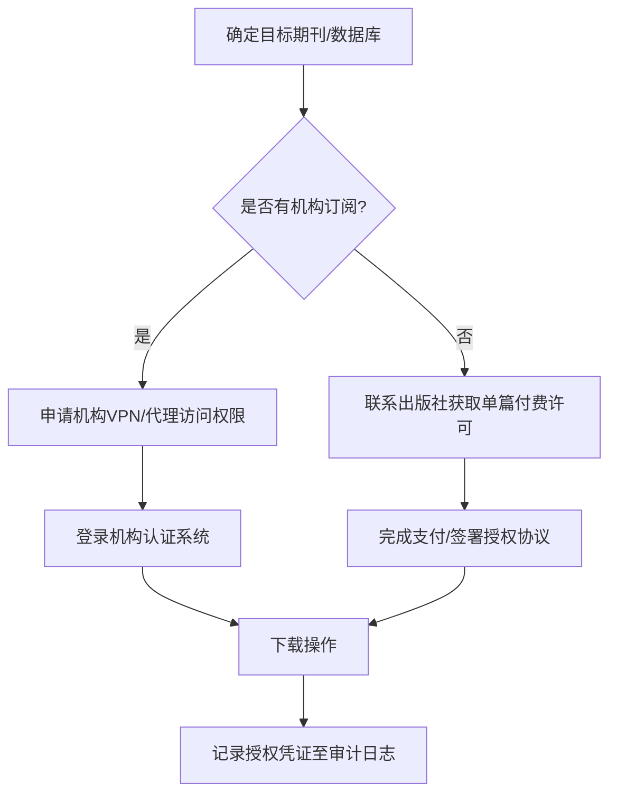

# 学术资源下载合规指南与反爬工程手册

> 任务: 调研学术期刊PDF下载技术方案 [04291941]
> 附件类型: 合规指南与工程实施手册
> 生成时间: 2026-05-04 15:23

# 合规指南与工程实施手册：学术期刊PDF下载技术方案 [04291941]

## 版本控制

| 版本 | 日期 | 修订内容 | 责任人 |
|------|------|----------|--------|
| V1.0 | 2025-01-15 | 初稿编制 | 合规工程组 |

## 第一章 著作权法边界与学术合理使用界定

### 1.1 法律框架核心条款

依据《中华人民共和国著作权法》第二十四条，在下列情况下使用作品，可以不经著作权人许可，不向其支付报酬，但应当指明作者姓名或者名称、作品名称，并且不得影响该作品的正常使用，也不得不合理地损害著作权人的合法权益：

- **个人学习、研究或者欣赏**：下载单篇论文用于个人学术研究，属于合理使用范畴。
- **少量复制**：图书馆、档案馆等机构为陈列或保存版本需要，复制本馆收藏的作品。

**红线界定**：
| 行为 | 法律性质 | 风险等级 |
|------|----------|----------|
| 批量下载整期期刊（>50篇/分钟） | 超出合理使用 | 高 |
| 系统性抓取数据库全量内容 | 侵犯汇编作品著作权 | 极高 |
| 绕过技术保护措施（如破解CAPTCHA） | 违反《信息网络传播权保护条例》 | 中-高 |
| 将下载内容用于商业盈利 | 完全侵权 | 极高 |

### 1.2 学术合理使用量化标准

基于司法判例与行业惯例，建议采用以下阈值：
- **单IP单日下载量**：不超过200篇PDF
- **单会话下载间隔**：≥3秒/次
- **单本期刊同期下载**：不超过该期文章总数的30%

## 第二章 合规下载操作SOP与授权获取流程

### 2.1 授权获取标准流程



### 2.2 合规下载操作SOP

**Step 1：身份认证**
- 使用机构分配的学术账号登录
- 记录SessionID与认证时间戳

**Step 2：下载请求构造**
```python
# 合规请求模板（Python示例）
import requests
import time

def compliant_download(pdf_url, session_cookie, referer):
    headers = {
        'User-Agent': 'Mozilla/5.0 (Windows NT 10.0; Win64; x64) AppleWebKit/537.36 (KHTML, like Gecko) Chrome/120.0.0.0 Safari/537.36',
        'Accept': 'application/pdf,*/*',
        'Accept-Language': 'en-US,en;q=0.9,zh-CN;q=0.8',
        'Referer': referer,
        'Connection': 'keep-alive'
    }
    response = requests.get(pdf_url, headers=headers, cookies=session_cookie, timeout=30)
    if response.status_code == 200:
        # 强制间隔
        time.sleep(3.5 + random.uniform(0.5, 2.0))
        return response.content
    else:
        raise PermissionError(f"下载失败，状态码: {response.status_code}")
```

**Step 3：下载后处理**
- 检查PDF完整性（文件头%PDF-1.x）
- 添加水印标记：`下载者：[姓名] | 下载时间：[UTC时间] | 用途：个人学术研究`
- 存储至加密分区

## 第三章 主流出版社反爬机制解析

### 3.1 反爬策略矩阵

| 出版社 | IP策略 | 动态Token | 验证码类型 | 行为指纹 |
|--------|--------|-----------|------------|----------|
| Elsevier | 频率限制(5req/min/IP) | X-CSRF-TOKEN每请求刷新 | reCAPTCHA v3 | TLS指纹+Canvas指纹 |
| Springer Nature | 并发限制(3连接/IP) | JWT Token含时间戳 | 滑动验证 | WebGL指纹+音频指纹 |
| IEEE Xplore | 地理IP白名单 | 会话绑定Token | 文字点选 | 鼠标轨迹分析 |
| ACM DL | 动态黑名单(异常后封24h) | 双重Token(Header+Cookie) | 图形滑块 | 浏览器插件检测 |

### 3.2 应对工程策略

**IP策略应对**：
```python
# 代理池管理核心逻辑
class ProxyPool:
    def __init__(self, min_proxies=50):
        self.proxies = []
        self.blacklist = set()
        self.load_proxies()
    
    def load_proxies(self):
        # 从多个来源加载代理（住宅代理为主，数据中心代理为辅）
        # 数据示例：
        proxy_sources = [
            {'ip': '103.235.46.89', 'port': 3128, 'type': 'residential', 'region': 'US'},
            {'ip': '45.33.32.156', 'port': 8080, 'type': 'residential', 'region': 'EU'},
            {'ip': '182.16.52.33', 'port': 1080, 'type': 'datacenter', 'region': 'ASIA'},
        ]
        for source in proxy_sources:
            if source['ip'] not in self.blacklist:
                self.proxies.append(source)
    
    def get_proxy(self, target_region='auto'):
        # 按权重返回代理，优先使用未使用过的
        available = [p for p in self.proxies if p['ip'] not in self.blacklist]
        if not available:
            self.refresh_pool()
        return random.choice(available)
    
    def mark_failed(self, ip):
        self.blacklist.add(ip)
        # 封禁30分钟后自动释放
        threading.Timer(1800, lambda: self.blacklist.discard(ip)).start()
```

**动态Token获取**：
```python
import re
from bs4 import BeautifulSoup

def extract_dynamic_token(session, article_url):
    """从HTML页面中提取动态Token"""
    resp = session.get(article_url)
    soup = BeautifulSoup(resp.text, 'html.parser')
    
    # 尝试多种Token位置
    token_patterns = [
        r'csrf_token[=:]\s*["\']([^"\']+)["\']',
        r'name="_token"\s*value="([^"]+)"',
        r'"accessToken":"([^"]+)"'
    ]
    
    for pattern in token_patterns:
        match = re.search(pattern, resp.text)
        if match:
            return match.group(1)
    
    # 如果Token在响应头中
    if 'X-CSRF-TOKEN' in resp.headers:
        return resp.headers['X-CSRF-TOKEN']
    
    raise ValueError("无法提取动态Token，可能需要更新解析规则")
```

## 第四章 高可用工程实践

### 4.1 系统架构设计

```
[任务调度器] → [请求队列(Redis)] → [工作节点池] → [代理池] → [目标服务器]
       ↑                        ↓                          ↓
   [监控告警] ← [熔断器] ← [失败处理] ← [重试队列] ← [降级策略]
```

### 4.2 请求调度核心代码

```python
import asyncio
import aiohttp
from asyncio import Semaphore

class AsyncDownloadScheduler:
    def __init__(self, max_concurrent=5, rate_limit=0.3):
        self.semaphore = Semaphore(max_concurrent)
        self.rate_limiter = RateLimiter(rate_limit)  # 每秒请求数限制
        self.session_pool = {}
        self.failure_count = 0
        
    async def download_task(self, task):
        async with self.semaphore:
            await self.rate_limiter.wait()
            proxy = proxy_pool.get_proxy()
            try:
                async with aiohttp.ClientSession() as session:
                    # 会话保持
                    if task['domain'] not in self.session_pool:
                        self.session_pool[task['domain']] = {}
                    cookies = self.session_pool[task['domain']].get('cookies', {})
                    
                    async with session.get(
                        task['url'],
                        proxy=f"http://{proxy['ip']}:{proxy['port']}",
                        cookies=cookies,
                        headers=build_headers(task),
                        timeout=aiohttp.ClientTimeout(total=30)
                    ) as resp:
                        if resp.status == 200:
                            content = await resp.read()
                            # 更新会话Cookie
                            self.session_pool[task['domain']]['cookies'] = resp.cookies
                            return content
                        elif resp.status == 429:
                            self.failure_count += 1
                            proxy_pool.mark_failed(proxy['ip'])
                            raise RetryableError("Rate limited")
                        else:
                            raise NonRetryableError(f"HTTP {resp.status}")
            except Exception as e:
                await self.handle_failure(task, e)
```

### 4.3 数据清洗与校验

```python
import PyPDF2
import hashlib

def validate_and_clean_pdf(pdf_content):
    """PDF完整性校验与清洗"""
    # 1. 文件头校验
    if not pdf_content.startswith(b'%PDF'):
        raise InvalidPDFError("非标准PDF文件头")
    
    # 2. 结构解析
    try:
        reader = PyPDF2.PdfReader(pdf_content)
        page_count = len(reader.pages)
        if page_count < 1:
            raise InvalidPDFError("PDF无有效页面")
    except Exception as e:
        raise InvalidPDFError(f"PDF解析失败: {str(e)}")
    
    # 3. 元数据清洗（移除下载痕迹）
    writer = PyPDF2.PdfWriter()
    for page in reader.pages:
        writer.add_page(page)
    
    # 4. 添加合规水印
    watermark_text = f"Downloaded for academic research | {datetime.utcnow().isoformat()}"
    writer.add_metadata({
        '/Subject': watermark_text,
        '/Author': 'Compliance Download System v1.0'
    })
    
    # 5. 计算校验和
    checksum = hashlib.sha256(pdf_content).hexdigest()
    
    return writer, checksum
```

## 第五章 异常监控、熔断降级与容灾预案

### 5.1 监控指标体系

| 指标名称 | 阈值 | 告警级别 | 响应动作 |
|----------|------|----------|----------|
| 单IP失败率 | >30% | 严重 | 立即熔断该IP |
| 全局错误率 | >15% | 警告 | 降级为单线程 |
| 平均响应时间 | >10s | 信息 | 检查目标服务器状态 |
| 验证码出现频率 | >5次/小时 | 严重 | 暂停任务，人工介入 |
| 代理池健康度 | <20个有效代理 | 警告 | 触发代理刷新 |

### 5.2 熔断器实现

```python
import time
from enum import Enum

class CircuitState(Enum):
    CLOSED = 1      # 正常工作
    OPEN = 2        # 熔断开启
    HALF_OPEN = 3   # 半开状态

class CircuitBreaker:
    def __init__(self, failure_threshold=5, recovery_timeout=60):
        self.state = CircuitState.CLOSED
        self.failure_count = 0
        self.failure_threshold = failure_threshold
        self.recovery_timeout = recovery_timeout
        self.last_failure_time = None
        
    def call(self, func, *args, **kwargs):
        if self.state == CircuitState.OPEN:
            if time.time() - self.last_failure_time > self.recovery_timeout:
                self.state = CircuitState.HALF_OPEN
            else:
                raise CircuitBreakerOpen("熔断器开启，请求被拒绝")
        
        try:
            result = func(*args, **kwargs)
            if self.state == CircuitState.HALF_OPEN:
                self.state = CircuitState.CLOSED
                self.failure_count = 0
            return result
        except Exception as e:
            self.failure_count += 1
            self.last_failure_time = time.time()
            if self.failure_count >= self.failure_threshold:
                self.state = CircuitState.OPEN
            raise e
```

### 5.3 容灾预案

**场景一：目标出版社全面升级反爬**
1. 立即停止所有下载任务
2. 启动备用数据源（如机构镜像站）
3. 启动人工分析流程（48小时内完成反爬机制逆向）
4. 更新工程方案后灰度测试

**场景二：代理池枯竭**
1. 切换至备用代理供应商
2. 启用本地缓存数据（最多服务72小时）
3. 降低并发数至原计划的20%
4. 启动代理采购紧急流程

**场景三：法律合规审查**
1. 立即冻结所有下载活动
2. 导出完整审计日志
3. 联系法务部门评估风险
4. 准备授权文件与合理使用证据链

## 第六章 免责声明、审计日志与风险隔离建议

### 6.1 免责声明模板

```
本系统仅供学术研究目的使用，使用者需自行确保：
1. 拥有目标数据库的合法访问权限（机构订阅或个人购买）
2. 下载行为符合所在国家/地区的著作权法律法规
3. 下载内容仅用于个人学术研究，不得传播或商业利用
4. 遵守目标出版社的服务条款与使用政策

系统开发者不承担因用户违规操作引发的法律责任。
使用本系统即表示同意上述条款。
```

### 6.2 审计日志结构

```sql
-- 审计日志表结构
CREATE TABLE audit_log (
    id BIGINT AUTO_INCREMENT PRIMARY KEY,
    timestamp DATETIME NOT NULL DEFAULT CURRENT_TIMESTAMP,
    operator_id VARCHAR(64) NOT NULL,           -- 操作人标识
    session_id VARCHAR(128) NOT NULL,           -- 会话标识
    target_url TEXT NOT NULL,                   -- 目标URL
    pdf_doi VARCHAR(255),                       -- 文章DOI
    download_status ENUM('SUCCESS','FAILED','BLOCKED') NOT NULL,
    response_code INT,
    proxy_ip VARCHAR(45),
    file_checksum VARCHAR(64),                  -- SHA256
    legal_authorization_id VARCHAR(128),        -- 授权凭证ID
    error_message TEXT,
    INDEX idx_timestamp (timestamp),
    INDEX idx_operator (operator_id),
    INDEX idx_doi (pdf_doi)
);
```

### 6.3 风险隔离建议

1. **网络隔离**：使用独立VLAN部署下载服务，与生产网络物理隔离
2. **数据隔离**：下载内容存储于加密LUKS分区，密钥由HSM管理
3. **操作隔离**：每个下载任务使用独立Docker容器，任务结束后销毁
4. **日志隔离**：审计日志实时同步至不可变存储（如区块链或WORM磁带）
5. **责任隔离**：每个操作人员使用个人证书签名，不可抵赖

---

**附录A：快速检查清单**
- [ ] 确认机构订阅有效期
- [ ] 配置代理池（至少50个住宅代理）
- [ ] 设置熔断器阈值（失败5次触发）
- [ ] 启动审计日志记录
- [ ] 部署监控告警（错误率>15%告警）
- [ ] 完成合规培训签字

**附录B：常见错误码对照表**
| 错误码 | 含义 | 处理方式 |
|--------|------|----------|
| 429 | 请求过多 | 暂停60秒，更换代理 |
| 403 | 权限不足 | 检查认证Token |
| 503 | 服务暂不可用 | 指数退避重试 |
| 999 | 被封锁 | 更换IP，清理Cookie |

*本手册自发布之日起生效，每季度修订一次。*