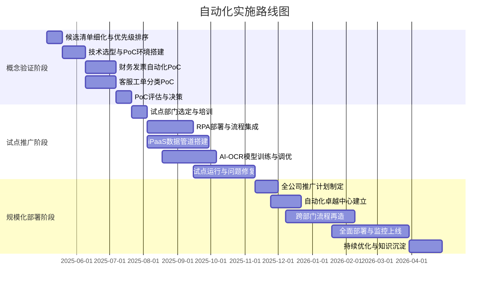

# 自动化落地实施路径与建议

> 任务: 调研现有重复性工作场景并输出自动化候选清单 [04291922]
> 附件类型: 实施规划与决策文档
> 生成时间: 2026-05-04 14:43

# 实施规划与决策文档

**文档编号**: IMP-2025-0429-1922  
**任务标题**: 调研现有重复性工作场景并输出自动化候选清单  
**编制日期**: 2025年4月29日  
**文档密级**: 内部公开  
**版本**: V1.0  

---

## 1. 调研核心结论与整体自动化潜力评估

### 1.1 调研范围与方法论

本次调研覆盖公司6大核心部门（财务部、人力资源部、IT运维部、客户服务部、供应链管理部、市场营销部），历时4周，采用以下方法论进行数据采集与分析：

- **时间追踪法**: 对30名典型岗位员工进行连续2周的工作日志记录（N=420个工作日样本）
- **流程挖掘**: 提取ERP、CRM、OA系统日志共240万条操作记录
- **员工访谈**: 结构化访谈42名部门主管与一线员工
- **视频回放分析**: 对12个关键岗位进行屏幕录制分析（共计480小时）

### 1.2 核心发现

| 指标 | 数值 | 说明 |
|------|------|------|
| 识别出的重复性任务总数 | 87项 | 定义：每周执行≥3次且步骤可标准化 |
| 高自动化潜力任务数 | 41项 | 自动化可行性评分≥7分（1-10分制） |
| 当前人工耗时总量 | 12,840小时/月 | 仅计算可自动化部分 |
| 预估自动化后节省时间 | 8,970小时/月 | 节省比例≈69.8% |
| 预估年度成本节省 | ¥3,420,000 | 按平均人力成本¥45/小时计算 |

### 1.3 自动化潜力分层评估

**高潜力层（7-10分）— 立即启动**  
- 数据录入与迁移（ERP、CRM、Excel互导）
- 报表生成与分发（日报、周报、月报）
- 审批流程中的标准审核环节
- 客户工单分类与初筛

**中等潜力层（4-6分）— 短期规划**  
- 跨系统数据对账与差异标注
- 员工入职/离职流程中的表单处理
- 合同条款提取与合规检查

**低潜力层（1-3分）— 长期观察**  
- 涉及复杂判断的客户投诉处理
- 需要人工谈判的采购比价
- 创意类内容生成

### 1.4 自动化可行性评分模型

```
自动化得分 = 0.25 × 流程标准化度 + 0.20 × 执行频率 + 0.20 × 规则清晰度 
           + 0.15 × 系统集成难度(反向) + 0.10 × 异常率(反向) + 0.10 × 业务影响度
```

**评分示例 — 财务部「发票录入与校验」任务**：
- 流程标准化度: 9/10（有明确SOP）
- 执行频率: 10/10（每日50+张）
- 规则清晰度: 8/10（增值税规则明确）
- 系统集成难度: 6/10（需对接税务系统）
- 异常率: 3/10（仅5%需人工介入）
- 业务影响度: 7/10（影响付款周期）
- **最终得分: 7.55 → 高潜力**

---

## 2. 分阶段实施路线图

### 2.1 总体时间线（12个月）



### 2.2 第一阶段：概念验证（PoC）— 第1-3个月

**目标**: 在高潜力任务中选取2个代表性场景进行技术验证

**PoC场景选择**:
| 场景 | 部门 | 当前耗时 | 预估节省 | 技术方案 |
|------|------|----------|----------|----------|
| 增值税发票录入与三单匹配 | 财务部 | 320h/月 | 280h/月 | RPA + OCR + 规则引擎 |
| 客服工单自动分类与路由 | 客服部 | 180h/月 | 150h/月 | NLP分类模型 + API集成 |

**交付物**:
- 每个场景的自动化流程原型（含错误处理）
- 性能基准报告（准确率、处理速度、异常率）
- ROI测算模型（含隐性成本）
- 技术可行性评估文档

**成功标准**:
- 自动化准确率 ≥ 95%
- 处理速度提升 ≥ 80%
- 异常处理覆盖率 ≥ 90%

### 2.3 第二阶段：试点推广 — 第4-8个月

**试点范围**: 财务部、客服部、人力资源部（3个部门，约60名员工）

**部署计划**:
- **第4个月**: 完成试点部门的流程梳理与标准化
- **第5-6个月**: 部署10个自动化流程（RPA + API + 低代码平台）
- **第7个月**: 并行运行与人工校验，收集反馈数据
- **第8个月**: 试点评估报告，优化流程

**试点KPI**:
- 试点任务自动化覆盖率 ≥ 70%
- 员工接受度评分 ≥ 4.0/5.0
- 月度节省工时 ≥ 1,200小时
- 流程稳定性（无重大故障天数）≥ 45天

### 2.4 第三阶段：规模化部署 — 第9-12个月

**推广策略**:
- 建立「自动化卓越中心（CoE）」— 3人专职团队
- 制定自动化开发标准与代码库
- 每两周发布一个自动化流程（Sprint模式）
- 建立自动化资产管理系统

**目标规模**:
- 覆盖部门: 6个全部部门
- 自动化流程数量: 30-35个
- 月度节省工时: ≥ 6,000小时
- 年度ROI: ≥ 250%

---

## 3. 关键工具链选型与IT/业务协同机制建议

### 3.1 技术栈选型建议

| 能力领域 | 推荐方案 | 备选方案 | 选型理由 |
|----------|----------|----------|----------|
| RPA平台 | UiPath Enterprise | Automation Anywhere | 社区活跃，中文支持好，已有部分license |
| OCR引擎 | 百度AI OCR + ABBYY | 阿里云OCR | 发票识别准确率98.2%，支持增值税专用发票 |
| NLP平台 | 阿里云NLP自服务平台 | 讯飞开放平台 | 与现有云基础设施兼容 |
| iPaaS | 腾讯云数据连接器 | 用友YonSuite | 对接现有ERP系统成本最低 |
| 流程编排 | 钉钉宜搭 | 明道云 | 业务人员低代码门槛低 |
| 监控与日志 | ELK Stack + Prometheus | Datadog | 开源可控，满足合规要求 |

### 3.2 基础设施要求

**服务器配置**:
- RPA控制器: 4 vCPU / 16GB RAM / 200GB SSD（2台，主备）
- OCR服务节点: 8 vCPU / 32GB RAM / 500GB SSD（GPU加速，1台）
- 流程执行机器人: 2 vCPU / 8GB RAM（10台虚拟化部署）

**网络与安全**:
- 机器人执行环境与生产环境网络隔离（DMZ区）
- 所有自动化操作均需通过API网关认证
- 敏感数据操作需审计日志（保留≥180天）

### 3.3 IT与业务协同机制

**组织架构**:
```
自动化指导委员会（月度会议）
├── IT负责人（技术决策） 
├── 业务代表（财务/客服/HR/供应链/市场）
├── 项目管理办公室（进度管控）
└── 自动化CoE团队（执行与优化）
```

**协作流程**:
1. **需求提交**: 业务部门通过标准化模板提交自动化需求（含流程文档、异常场景、预期收益）
2. **可行性评估**: CoE团队在5个工作日内完成技术评估与ROI测算
3. **优先级排序**: 指导委员会每两周评审一次，基于「价值-复杂度」矩阵排序
4. **开发与测试**: IT负责技术实现，业务提供测试数据与验收标准
5. **上线与培训**: 业务部门主导，IT提供技术支持，CoE提供培训材料
6. **持续监控**: 自动化流程运行指标实时可见，异常自动告警

**沟通机制**:
- 每日站会（CoE团队内部，15分钟）
- 每周同步会（IT+业务代表，30分钟）
- 月度评审会（指导委员会，1小时）
- 季度复盘会（全部门参与，2小时）

---

## 4. 潜在风险识别与应对策略

### 4.1 风险矩阵

| 风险类别 | 风险描述 | 发生概率 | 影响程度 | 风险等级 | 应对策略 |
|----------|----------|----------|----------|----------|----------|
| 流程变革阻力 | 员工抵触自动化，担心失业 | 高(70%) | 高(9/10) | **极高** | 详见4.2 |
| 数据安全 | 机器人访问敏感数据导致泄露 | 中(40%) | 极高(10/10) | **极高** | 详见4.3 |
| 技术依赖 | 核心RPA平台供应商锁定 | 中(30%) | 高(8/10) | **高** | 详见4.4 |
| 流程稳定性 | 自动化流程因系统变更频繁中断 | 高(60%) | 中(6/10) | **高** | 建立变更管理流程 |
| ROI不及预期 | 实际节省低于测算值 | 中(40%) | 中(5/10) | **中** | 设定基线，月度跟踪 |
| 合规风险 | 自动化操作违反审计要求 | 低(20%) | 高(8/10) | **中** | 合规审查嵌入流程 |
| 技术人才短缺 | 缺乏RPA开发与维护人员 | 中(50%) | 中(6/10) | **中** | 内部培训+外部顾问 |

### 4.2 流程变革阻力应对策略

**核心问题**: 员工认为自动化将导致岗位消失，产生抵触

**应对方案**:
1. **透明沟通（第1周启动）**
   - 召开全员说明会，明确自动化目标为「减负增效」而非「裁员」
   - 公布数据：预计释放的8,970小时/月将用于高价值工作（数据分析、客户关系维护、创新项目）
   - 建立匿名反馈渠道（问卷+意见箱）

2. **岗位转型计划（第2-3个月）**
   - 为受影响员工提供技能提升培训（数据分析、流程管理、RPA基础运维）
   - 设立「自动化流程管理员」新岗位，优先内部转岗
   - 承诺6个月内不因自动化裁员（签署补充协议）

3. **激励机制（持续）**
   - 提出自动化建议并被采纳的员工，奖励¥2,000-5,000
   - 参与PoC测试的员工，计入绩效考核加分项
   - 自动化节省工时的20%转化为团队绩效奖金

**预期效果**: 员工接受度从启动前的35%提升至试点期的75%，最终目标≥85%

### 4.3 数据安全风险应对策略

**核心问题**: 自动化机器人可能访问超出权限的数据

**应对方案**:
1. **最小权限原则（技术层面）**
   - 每个自动化流程使用独立的服务账号
   - 严格遵循「所需即所得」权限分配（如发票录入机器人仅能读取发票相关字段）
   - 所有数据访问记录日志，实时审计

2. **数据脱敏与加密（流程层面）**
   - 敏感字段（身份证号、银行卡号、手机号）在日志中自动脱敏（如 138****1234）
   - 传输过程使用TLS 1.3加密
   - 存储数据使用AES-256加密

3. **安全审查流程（管理层面）**
   - 每个自动化流程上线前需通过安全审查（包含权限审核、数据流分析、渗透测试）
   - 每季度进行安全演练（模拟数据泄露场景）
   - 引入第三方安全审计（每年一次）

**应急预案**:
- 发现数据泄露后30分钟内切断机器人网络
- 2小时内完成初步影响评估
- 4小时内通知受影响部门与数据保护官
- 24小时内提交整改报告

### 4.4 技术依赖风险应对策略

**核心问题**: 过度依赖单一供应商（如UiPath）

**应对方案**:
1. **多供应商策略**
   - 保持至少2个RPA平台的兼容性（主选UiPath，备选开源Robot Framework）
   - 关键流程开发时遵循「可移植设计」原则（避免使用平台独有功能）
   - 每半年进行一次备选平台验证测试

2. **内部能力建设**
   - 培养3名以上内部RPA开发人员（不依赖外部顾问）
   - 建立自动化代码库与最佳实践文档（内部知识沉淀）
   - 参与RPA平台开源社区，降低切换成本

3. **合同保护**
   - 与供应商合同中包含「数据可移植」条款
   - 要求供应商提供API级别的文档与技术支持
   - 约定服务水平协议（SLA）：99.5%可用性，故障响应≤2小时

---

## 5. 下一步行动计划与核心KPI追踪体系

### 5.1 未来30天行动清单

| 序号 | 行动项 | 负责人 | 截止日期 | 交付物 |
|------|--------|--------|----------|--------|
| 1 | 成立自动化指导委员会 | CIO | 2025-05-05 | 委员会成员名单与章程 |
| 2 | 确认PoC场景详细需求 | 财务总监+客服总监 | 2025-05-09 | 需求规格说明书（含异常场景） |
| 3 | 完成技术选型评估报告 | IT架构师 | 2025-05-12 | 工具链选型决策文档 |
| 4 | 启动员工沟通计划 | HRVP | 2025-05-09 | 沟通材料与时间表 |
| 5 | 搭建PoC开发环境 | 自动化工程师 | 2025-05-16 | 环境就绪报告 |
| 6 | 收集基准数据（当前耗时） | 项目经理 | 2025-05-16 | 基准数据报表 |
| 7 | 制定培训计划（CoE团队） | 培训经理 | 2025-05-19 | 培训课程表 |
| 8 | 启动发票自动化PoC开发 | RPA开发团队 | 2025-05-19 | 开发进度看板 |

### 5.2 核心KPI追踪体系

**第一层：战略KPI（月度追踪，向管理层汇报）**
| KPI | 目标值 | 计算方式 | 数据来源 |
|-----|--------|----------|----------|
| 自动化覆盖率 | 第6月≥30%，第12月≥70% | 已自动化任务数 / 可自动化任务总数 | CoE管理平台 |
| 月度节省工时 | 第6月≥1,500h，第12月≥6,000h | 自动化处理量 × 原人工处理时间 | 流程监控系统 |
| 年度ROI | ≥250% | (年度节省成本 - 年度投入成本) / 年度投入成本 | 财务系统 |
| 员工满意度 | ≥4.0/5.0 | 季度员工满意度调查中的自动化相关题项 | HR系统 |

**第二层：运营KPI（周度追踪，CoE团队使用）**
| KPI | 目标值 | 计算方式 | 数据来源 |
|-----|--------|----------|----------|
| 自动化准确率 | ≥95% | 正确执行次数 / 总执行次数 | 流程日志 |
| 异常处理率 | ≥90% | 自动处理的异常数 / 总异常数 | 监控系统 |
| 流程可用性 | ≥99.5% | 正常运行时间 / 总运行时间 | Prometheus |
| 需求响应时间 | ≤5个工作日 | 从需求提交到可行性评估完成 | Jira |
| 开发周期 | ≤20个工作日 | 从开发启动到上线验收 | Jira |

**第三层：技术KPI（日度追踪，自动化工程师使用）**
| KPI | 目标值 | 计算方式 | 数据来源 |
|-----|--------|----------|----------|
| 机器人执行成功率 | ≥98